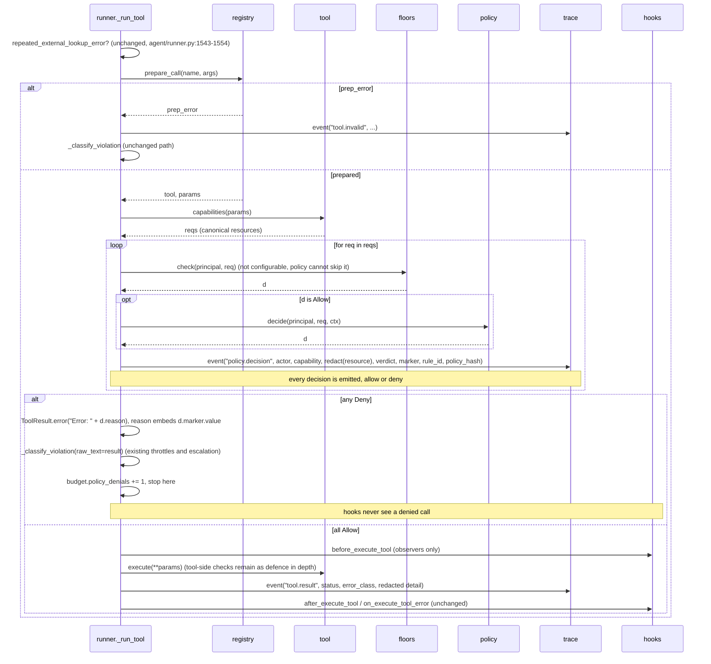

# Host-supplied config, plugins and permissions: design

Status: design spec, 2026-09-26, branch `core-slim` at `f56ec68a`. Nothing here is implemented. Each phase in
section 9 is its own later plan. Citations are `path:line`, relative to `nanobot/` unless they start with
`tests/` or `.agent/`; `awork:` means `~/projects/awork/backend/`. Every citation was checked against the
`f56ec68a` tree with `grep -n`/`sed -n`. Claims not confirmed by reading code or running it are marked
(unverified).

Inputs: the guard audit (distilled in `.superpowers/sdd/exec-guard-and-host-design/guard-audit-findings.md`,
git-ignored), `docs/core-map/`, `.agent/security.md`, `.agent/design.md`, the RSI harness design and
feasibility notes (on branch `rsi-harness-spec`: `.agent/rsi-harness-design.md`, `.agent/rsi-daemon-feasibility.md`), and hive's
design (`~/projects/hive/docs/specs/2026-09-15-hive-design.md`, `hive/trace/redact.py`).

## Contents
1. Principle
2. Threat model and findings
3. Phase 0: quick hardening (no new architecture)
4. The host contract (`CoreEnvironment`)
5. Interfaces sketch
6. Plugin model
7. Permissions
8. Compat shim (awork)
9. Migration phases, acceptance criteria and tests
10. Harness deployment implications
11. Open questions for the owner
12. Verification log

---

## 1. Principle

moeka-core is a small engine: the agent loop, the runner, context assembly, session and turn mechanics, and
*interfaces*. Everything else is a plugin: providers, tools, search backends, sandboxes, the session store, the
vector/memory store, image generation, hooks, skill packs and MCP bridges.

The **host** that constructs the core supplies configuration values, credentials, paths and permission
decisions. The core reads no ambient state: no `os.environ`, no `keys.env`, no `~/.nanobot`, no `load_config()`.
Today it reads all of them (section 2.2). The CLI and the compat package become hosts. They may read files and
env on the core's behalf, but only outside the core.

Three rules follow:
- **Secrets never flow into model-visible or persisted text.** They stay out of prompts, tool results, traces,
  logs and exec child environments.
- **Policy is enforced once, at one choke point, and audited.** The permissive moeka default stays. A small set
  of non-removable floors sits under it.
- **Anything the agent can write, the agent can change.** Config, policy, activation markers and credentials
  must be out of its write reach. Where the agent and the core share a uid, only the host can guarantee this;
  in-process checks cannot.

## 2. Threat model and findings

### 2.1 Adversaries and what they control

| Adversary | Controls | Typical goal |
|---|---|---|
| Injected text: web pages (`web_fetch`, `web_search` snippets), files the agent reads, tool output, MCP tool descriptions and results, messages from other sessions (`send_session_message`) | Text in the model's context | Make the agent exfiltrate secrets, widen its own permissions, persist the injection (skills, `SOUL.md`), or attack another session |
| A careless small model (the RSI target: 7-32B local) | Tool calls | Nothing malicious. It loops, retries denied actions, writes into internal state, runs expensive commands. This is the June 2026 incident class (`.agent/gotchas.md:16-18`) |
| A compromised or buggy plugin (entry-point tool, workspace Agent Plugin, MCP server) | Code running in the core process or as a child | Read secrets from process memory or env, shadow built-in tools, run unsandboxed |
| The RSI mutator | Edits to skills, prompts, tool descriptions and config in `core/` | Raise its score by weakening the gate, the policy, the sandbox or the evaluator (DGM/STOP behaviour, `.agent/rsi-harness-design.md` section 3, branch `rsi-harness-spec`) |

Out of scope: a malicious host, and kernel escapes. The owner's own CLI input is trusted.

### 2.2 What the agent can reach today with the default config

| Resource | Default reach | Evidence |
|---|---|---|
| Any file the uid can read or write | Yes. `restrict_to_workspace` is False, so `allowed_dir=None` | config/schema.py:413; agent/tools/filesystem.py:59-92 |
| Process env: every secret loaded by systemd `EnvironmentFile` (keys.env) | Yes. `read_file /proc/self/environ` returned a planted variable in a probe run with the current tree (section 12). Exec children get a minimal env (agent/tools/shell.py:933-960) but can `cat /proc/$PPID/environ` (unverified by run) | agent/tools/filesystem.py:199-257 blocks only `/dev/*` and fds 0-2 |
| `config.json`, OAuth token stores, plugin activation markers | Inside the workspace, because workspace == state home == config dir by default | config/schema.py:121; config/paths.py:15-48,87-97; config/loader.py:45-49; agent/tools/mcp_oauth.py:101-102; providers/xai_oauth.py:256-258; agent/plugins.py:397-413 |
| Session database | Outside the workspace (`<workspace>-sessions/<id>/sessions.db`), but same uid, so readable while unrestricted | session/sqlite_store.py:115-134,158-162,176-181 |
| Network | Any public host through `web_fetch`, exec and MCP. Loopback and private ranges are blocked only for `http(s)://` strings and `web_fetch` | security/network.py:16-44,351-372 |
| Other sessions | Read any session; post into any session as a user message | agent/tools/sessions.py:173-230; agent/tools/session_messages.py:255-265 |
| Tools | All discovered tools, plus entry-point plugins and modules dropped into the package dir | config/schema.py:161; agent/tools/loader.py:36-90 |

### 2.3 Findings

Layer key: **G** = policy gate in the runner (section 7). **T** = tool-side argument scoping. **H** = host-side
isolation (separate uid, container mounts, netns/firewall, rlimits/cgroups, OS privileges). **O** = design
decision for the owner (section 11). The "Phase" column uses the numbering in section 9 (P0 = section 3).

| ID | Sev | Finding (current tree) | Evidence | Capability | Layer | Phase |
|---|---|---|---|---|---|---|
| S1 | Crit | Workspace == state/config dir, and restriction is off by default. Config, OAuth tokens, `plugin-data/`, `media/` and `logs/` are all "inside the workspace". The same uid means file modes do not help. Pinned by `tests/tools/test_exec_security.py:309` | config/paths.py:15-48,66-84,87-97; config/schema.py:121,413; agent/tools/filesystem.py:59-92 | fs.read, fs.write, secret.read | T (P0.1a; file tools only, exec can still reach these paths) + H (separate `Paths`, P1; harness mounts) + O (Q5, Q6) | P0, P1 |
| S2 | Crit | `/proc/self/environ` is readable through `read_file` (**verified by probe**). Bedrock copies its key into `os.environ` | agent/tools/filesystem.py:199-257; providers/bedrock_provider.py:75 | secret.read, fs.read | T (P0.1a) + H (no secrets in the process env: resolver, P1) | P0, P1 |
| S3 | Crit | Guard config is agent-writable. `${VAR}` expansion copies any env var into any config string, so exfiltration works through `mcpServers.*.headers` or `apiBase`. Edits apply on the next start (live reload is unwired in the slim tree, 2.4) | config/loader.py:45-49,99,155,213-217,268-437 | fs.write, secret.read | H (`ConfigSource` outside agent reach, P1) + T interim (P0.1b; file tools only, `exec` can still write config) + O (Q13) | P0, P1 |
| S4 | Crit | Plugin self-enable leads to an unsandboxed stdio MCP server. The activation marker lives in `<config dir>/plugin-data/...`. Its content is a JSON of `{fingerprint, root}` that the agent can compute. The legacy marker `str(plugin.root)` was auto-upgraded until 197b118, which removed that branch (a legacy marker is now deleted, not honoured). `permissions` is parsed but never read | agent/plugins.py:56,209,397-413,416-441,446-455; agent/tools/mcp.py:1071-1077; tests/agent/test_agent_plugins.py:420 | plugin.load, exec.run | G (`plugin.load` is host-only; host-authenticated activation, P3) + T interim (P0.5 + P0.1a; file tools only, `exec` can still write the marker) + O (Q12) | P0, P3 |
| S5 | Crit | No central gate. Both paths call `tool.execute` directly, and hooks cannot veto. Violation handling is substring matching. Default allow-all. A plugin-vs-plugin name collision overwrites the earlier tool | agent/tools/registry.py:187-201; agent/runner.py:1582-1592,1647-1669; agent/hook.py:107; agent/tools/loader.py:117-139; config/schema.py:161 | all | G | P2, P3 |
| E1 | High | `exec_session` stdin is never guarded. `exec bash` with a yield, then `input:"<anything>\n"`, bypasses the floor, sudo and SSRF checks. Tests cover only the start command | agent/tools/exec_session.py:143-150,337-360; tests/tools/test_exec_session_tools.py:638 | exec.session_input | T (P0.2) + G (P2) + H (sandbox, rlimits) | P0, P2 |
| E2 | Med | The internal-state patterns are regexes and can be evaded (`truncate`, `rm`, `python -c`, `ln -s`, `perl -i`). The allow-pattern exemption was fixed in f56ec68a | agent/tools/shell.py:283-299,982-1101 | fs.write | T (resolved-path floor in fs tools, P0.1a) + H (sandbox) | P0, P2 |
| E3 | High | The exec SSRF check only sees `http(s)://` strings (`curl 127.1`, `nc` and scheme-less `wget` pass). The blocklist lacks 192.0.0.0/24, 198.18/15, 224/4, 240/4, NAT64, 6to4 and fec0::/10. bwrap has no `--unshare-net` | security/network.py:16-44,351-372; agent/tools/sandbox.py:84-100 | net.fetch | H (netns/firewall) + T (P0.6) | P0, harness |
| E4 | Med | Sudo detection is a regex and misses `sh -c "sudo id"` and `/usr/bin/sudo`. `su`, `doas`, `pkexec` and `docker run -v /:/h` are not covered. The "inline safety justification" comment was never implemented | agent/tools/shell.py:279,1139-1150,1154-1186 | exec.run | H (no NOPASSWD, no docker group) + O | host |
| E5 | Med | Exec `restrict_to_workspace` is best-effort: it checks only absolute paths and `../`. The sandbox is off by default. `_WORKSPACE_BOUNDARY_NOTE` calls it a "hard policy boundary" | agent/tools/shell.py:164-171,596-621,982-1085 | exec.run, fs.* | H (sandbox/container) + T (P0.4 wording) | P0, P2 |
| E6 | Med | No rlimits on spawn. One-shot `communicate()` buffers all output before truncating. Session timeouts are only checked lazily. The 8-session cap is shared with subagents | agent/tools/shell.py:107-160,437-440,495-520; agent/tools/exec_session.py:290-316; agent/subagent.py:158 | budget.exec_sessions, budget.output_bytes | H (rlimits/cgroups) + T (P0.8) + G (P2) | P0, P2 |
| F1 | High | File tools can write internal state, `~/.ssh`, rc files, systemd units and the package dir, which the loader auto-imports at the next start. No size limits. Writes are not atomic | agent/tools/filesystem.py:607-617,948-998; agent/tools/apply_patch.py:122,129,170; agent/tools/loader.py:43-63 | fs.write | T (P0.1a, P0.8; file tools only, exec writes need G/H) + G (P2) + H | P0, P2 |
| F2 | Low | `grep` compiles a model regex on the event loop (ReDoS, unverified). `read_file` loads up to 100 MiB | agent/tools/search.py:532-830,1043; agent/tools/filesystem.py:325,372 | budget.* | T (P0.8) | P0 |
| W1 | Med | `web_fetch` reads whole bodies and `maxChars` is uncapped. The untrusted banner covers only `web_fetch`, not `web_search` or MCP results. It is an exfiltration channel (data in URLs) with no host allowlist | agent/tools/web.py:34-35,305-330,1099-1101,1179-1197,1247,1258-1300; agent/tools/mcp.py:630-680 | net.fetch | T (P0.7, P0.8) + G (optional host rules, P2) | P0, P2 |
| W2 | Med | Pinned-DNS holes: the proxy path skips pinning, pinning monkey-patches the global `socket.getaddrinfo` under a lock, and `validate_resolved_url` fails open | agent/tools/web.py:128-144; security/network.py:195-218,236-280,312-350 | net.fetch | H (egress firewall) + T (P0.6) | P0, P4 |
| W3 | Low | The Jina reader is on by default and forwards URLs to a third party | agent/tools/web.py:75,153-184,1204-1205 | net.fetch | O (Q8) | P4 |
| M1 | Med | MCP `enabled_tools` defaults to `["*"]`, which includes resources and prompts. Descriptions are unsanitised model-visible text. One auto-retry even for non-idempotent calls | config/schema.py:387; agent/tools/mcp.py:630-680 | mcp.call | G (P2) + manifest/hash pin (P3) + T banner (P0.7) | P0, P2, P3 |
| M2 | Med | Persistent injection: `AGENTS.md`/`SOUL.md`/`USER.md` are injected every turn and `always` skills every prompt. Both are agent-writable (F1). Dream is well scoped | agent/context.py:102,149; agent/skills.py:391-399; agent/memory.py:667-708 | fs.write | G (bootstrap/skills paths as a principal-scoped `fs.write` rule, P2) + O | P2 |
| M3 | Low | `my` tool: with `allow_set`, `max_iterations` up to 100 and the preset switch are cost levers | agent/tools/self.py:30-33,122-126 | budget.* | G | P2 |
| A1 | Med | No per-turn token or cost budget. The `spawn` queue is unbounded (semaphore admission only). 200 iterations | config/schema.py:131-132; agent/subagent.py:156 | budget.* | G + H (harness budgets) | P2 |
| A2 | High | Cross-session leakage and injection. `search_sessions`/`read_session` read every session. `send_session_message` posts as `input_role="user"` into any session, so a session fed by untrusted input can command the owner's session | agent/tools/sessions.py:173-230; agent/tools/session_messages.py:120-125,255-265 | session.read, session.send | G (scope by channel class) + O (Q9) | P2 |
| A3 | Low | `bg_shell` is dormant, but if enabled it has no guard, inherits the full parent env and runs `bash -l` | agent/tools/bg_shell.py:113-122,271-275 | exec.run | Keep dormant. P3 routes it through `ExecTool` or deletes it | P3 |
| A4 | Med | Secret leaks: image gen logs the request body at INFO, the subagent hook logs tool args, raw keys sit in the fallback signature tuple, and Langfuse is enabled by an env var. `NANOBOT_WORKSPACE_SANDBOX_ENFORCED` only relabels status | providers/image_generation.py:1338; agent/subagent.py:76-80; providers/factory.py:327-336; providers/openai_compat_provider.py:624; security/workspace_access.py:396-411 | secret.read | T (P0.9 redact) + P1 (resolver, redacting `TraceSink`) | P0, P1 |

Keep (the audit's "well done" list, re-checked where cited): the minimal exec child env
(agent/tools/shell.py:933-960), the exec `working_dir` check (agent/tools/shell.py:596-621), the sandbox forcing
restriction on (agent/tools/filesystem.py:59-92), per-hop redirect validation and DNS pinning in `web_fetch`, MCP
URL SSRF checks, session DB outside the workspace, Dream's tool scoping (agent/memory.py:667-708), and the
subagent recursion ban (`spawn` is core-scope only, docs/core-map/02-tools.md section 1).

### 2.4 Audit claims corrected or dropped

- **S1, "sessions/ is inside the workspace": wrong.** The SQLite store refuses a root inside the workspace and
  defaults to `<workspace>-sessions` (session/sqlite_store.py:115-134,158-162). The legacy `JsonlSessionStore`
  would default to `<data dir>/sessions`, but it refuses that too (session/manager.py:516-531).
- **S1, "moeka.log in the workspace": not found** by `grep -rn moeka.log nanobot/`. Logs go to
  `get_logs_dir()` = `<data dir>/logs` (config/paths.py:82-84), which is inside the flat workspace. Which file
  the CLI writes is (unverified).
- **S2, "UNVERIFIED actual read behaviour": now verified** (section 12).
- **S3, "hot-reloaded": mostly latent in the slim tree.**
  - `watch_config_file` has no caller (config/watcher.py:11; grep).
  - `MCPProvider.reload` has no caller (grep for `.reload(`).
  - The live web-search reload runs only if a `provider_snapshot_loader` is passed (agent/tools/web.py:388-391), and no in-tree caller passes one (agent/loop.py:537; cli/agent.py:121-128; nanobot.py:137).
  - Image-gen reload only happens on a runtime-control message sent by `request_image_generation_reload` (agent/tools/image_generation.py:277), which has no caller.

  Config edits therefore take effect at the next start. The finding stays Critical. There is also a latent trap
  for embedding hosts: all four re-reads call `load_config()` with the global path (config/loader.py:45-49), so
  once wired they would read `~/.nanobot/config.json` instead of the host's in-memory config.
- **S3, "set `denyPatterns=[]`": fixed in f56ec68a.** Config patterns only add to the floor
  (agent/tools/shell.py:283-299).
- **E2, allow-pattern exemption of internal patterns: fixed in f56ec68a** (floor first, agent/tools/shell.py:982-1101).
- **The loopback exemption is dead code, confirmed.** It requires `scope.source_channel == "websocket"`
  (security/workspace_access.py:383-393), and the slim tree has no websocket channel.

## 3. Phase 0: quick hardening (no new architecture)

Each item is a small plan: what to change, where, and the test that proves it. The order is by risk reduced per
unit of effort. Items marked **[owner]** need a decision first (section 11). None of them changes a pinned marker
phrase; `tests/utils/test_workspace_violation_throttle.py` must stay green throughout.

| # | What | Where | Test | Owner |
|---|---|---|---|---|
| P0.1a **(done in 2e93751 + 6313a20)** | Resolved-path **fs floor** for read and write, applied even when unrestricted. Deny `/proc/*/environ`, `/proc/*/mem`, `/proc/*/maps` and `/proc/*/root` (after `resolve()`, so symlinks count). Deny the OAuth stores (`<data dir>/auth/`), `plugin-data/` and the session root. For **write only**, also deny `memory/history.jsonl`, `.dream_cursor` and `.nanobot/workspace-id`, so the file tools get the protection exec already has (agent/tools/shell.py:283-299). New error phrase: "protected internal path (not configurable)". Add it to `_WORKSPACE_VIOLATION_MARKERS` (agent/runner.py:1662-1669) so the per-target escalation applies *Done: Deviations: write-only files match by path suffix in ANY workspace (so a user repo's `memory/history.jsonl` is also denied); the floor also covers `<data dir>/sessions` and `/proc/<pid>/task/<tid>/...`; the data dir is `get_config_path().parent`, and 6313a20 fixed a symlinked `config.json` making it diverge from `get_data_dir()`.* | `_FsTool._resolve_read/_resolve_write` (agent/tools/filesystem.py:172-257), `apply_patch` (agent/tools/apply_patch.py:122), the search tools (inherit `_FsTool`), `image_generation._resolve_reference_image` | read_file `/proc/self/environ` denied with restriction off; a symlink in the workspace to it is also denied; write_file/edit_file/apply_patch to `memory/history.jsonl` denied while read_file of it still works; `auth/mcp.json` read denied; third attempt escalates | no |
| P0.2 **(done in f623064)** | **Guard `exec_session` input.** Run `input` through `ExecTool`'s floor, deny patterns, sudo and URL checks before `manager.write`. Update the known-gap wording in docs/core-map/02-tools.md. This check is a hint for line-oriented shells only; a REPL can still receive anything, so real containment is H *Done: Deviation: the guard is stored per session (`manager.start(input_guard=ExecTool.check_session_input)`), each write screened on its own.* | agent/tools/exec_session.py:143-150,337-360 | Start `bash` via exec with `yield_time_ms`, send the fork bomb as input: denied with the "dangerous pattern detected" marker; `echo ok\n` still works | no |
| P0.3 **(done in 7eb5108)** | **Stop floor escalations from telling the model to edit config.** `repeated_exec_guard_error` always says the configured `tools.exec.{allow,deny}_patterns` "must be updated". Give floor denials (those containing "This guard is not configurable.") their own signature `violation:exec-floor` and wording that says no config change allows it *Done: Also (ruling R1): file-tool floor denials ("protected internal path") got their own escalation wording instead of the workspace text that told the model to disable `restrict_to_workspace`.* | utils/runtime.py:245-300 | Three floor denials escalate without "must be updated"; the existing allow/deny escalation tests (tests/utils/test_workspace_violation_throttle.py:139-175) are unchanged | no |
| P0.4 **(done in f623064)** | **Make `_WORKSPACE_BOUNDARY_NOTE` truthful.** It is an application-level check, not OS isolation. Keep "Do NOT retry" *Done: Wording now says "application-level path check"; three tests pinning "hard policy boundary" were updated.* | agent/tools/shell.py:164-171 | Unit test on the note text; the throttle tests are unchanged | no |
| P0.5 **(done in 197b118)** | **Narrow agent-authored plugin enablement.** Drop the legacy auto-upgrade of a marker equal to `str(plugin.root)` and flip its test (done in 197b118: the branch is gone, so a legacy marker now fails the equality check against the JSON marker and is removed). Together with P0.1a's `plugin-data/` write deny, the file tools can then no longer create or upgrade a marker. This is only partial: the `{fingerprint, root}` JSON marker is still computable, and exec can still write it (see the exec caveat below). Host-authenticated markers (an HMAC key or host-held activation state) need a host to supply the key, so they move to P3 *Done: Deviation: the legacy branch was deleted outright in `agent/plugins.py`; a legacy marker now falls through the equality check and is removed.* | agent/plugins.py:416-440,446-455 (the legacy branch that auto-upgraded a `str(plugin.root)` marker was removed in 197b118); tests/agent/test_agent_plugins.py:420 | A marker whose content equals `str(plugin.root)` is removed, not upgraded, and the plugin's MCP servers are not merged (agent/plugins.py:213-234); write_file to the marker path is denied by P0.1a | no (Q12 governs P3) |
| P0.6 **(done in c5ba1e1)** | **Complete the `NET` blocklist.** Add 192.0.0.0/24, 198.18.0.0/15, 224.0.0.0/4, 240.0.0.0/4, fec0::/10 and ff00::/8. Map NAT64 (64:ff9b::/96) and 6to4 (2002::/16) to their embedded IPv4 in `_normalize_addr`. Make `validate_resolved_url` fail closed on parse errors and `gaierror` *Done: Deviation: `validate_resolved_url` now fails closed, but it has no production caller; the production redirect path (`resolve_url_target`/`validate_url_target`) already failed closed. The new ranges and NAT64/6to4 mapping protect every production path via `_is_private`. TEST-NET-1/2/3 stay unblocked (Docker test hosts).* | security/network.py:16-44,68-97,312-350 | Parametrized block test per range; the redirect-to-unresolvable case is blocked | no |
| P0.7 **(done in 015e27b)** | **Untrusted-content banner** (`_UNTRUSTED_BANNER`) on `web_search` results and on MCP tool/resource/prompt results. Cap and strip control characters from MCP descriptions *Done: Deviation: the banner also covers MCP `isError` results (still `ToolResult.error`, with changed text); `sanitize_description` also strips C1 controls and DEL; the cap yields 2001 chars (`[:limit]` plus an ellipsis).* | agent/tools/web.py:305-330; agent/tools/mcp.py:630,800,918 (wrapper `execute` methods) | The banner is present in each result type; the MCP description is capped | no |
| P0.8 **(done in 5b8b173 + 13f12f3 + 5a6cde2 + 45aa568 (web/write caps, grep worker) and b5350c8 (exec output))** | **Caps.** `web_fetch` `maxChars` at most 200000, and read the body with a byte cap instead of `aread()`. Size caps for write_file/edit_file/apply_patch content (default 10 MiB). Exec one-shot reads its pipes incrementally with a cap instead of `communicate()`. `grep` runs `re` in `to_thread` with a timeout *Done: Deviations: `grep` does not use a thread timeout; expensive patterns (nested or stacked unbounded repeats, non-disjoint alternations, atomic/possessive/conditional groups, backreferences with big repeats, lines over ~10 000 chars) run in a regex-only killable worker process (`agent/tools/_grep_worker.py`: JSON only, `-I -S`, minimal env, fails closed). Exec drains and discards excess output (per-stream cap 4 MiB, never below 4x the output limit, head and tail kept) instead of killing. `web_fetch` streams the body (2 MiB cap).* | agent/tools/web.py:1099-1101,1134,1179-1197; agent/tools/filesystem.py:94-100,607-617; agent/tools/apply_patch.py:129,170; agent/tools/shell.py:107-160,437-440,495-520; agent/tools/search.py:532-830,1043 | `yes \| head -c 2G` exec keeps RSS bounded and truncates; oversize write denied; catastrophic regex returns a timeout error | thresholds only |
| P0.9 **(done in fe9fd63 + c4f0cf3)** | **Log hygiene.** Log the image-gen body at DEBUG through `redact_value`, and redact the subagent tool args *Done: Deviation: OpenAI and Codex request logs also moved to DEBUG and `image_generation.py` error/response-summary logs are redacted; redaction is capped (over 20 KiB keeps first 16 KiB and last 4 KiB) and lazy in the subagent hook (c4f0cf3, after a 46 s quadratic case).* | providers/image_generation.py:1338; agent/subagent.py:76-80 | caplog test with a fake `sk-...` key shows `<redacted>` | no |
| P0.1b **(done in fde43f1)** | **Deny agent writes to `config.json`** (the path from `get_config_path()`) until P1 moves config out of reach *Done: Exact-path deny of `config.json` and its resolved symlink target for write_file/edit_file/apply_patch; reads unaffected.* | same as P0.1a | write_file/apply_patch to the config path denied | **[owner]** Q13 |

**Exec caveat.** P0.1a, P0.1b and P0.5 govern only the file tools (read_file, write_file, edit_file, list_dir,
apply_patch, find_files, grep, image-gen references). They do **not** stop `exec`. A command such as
`echo ... > config.json`, `cat /proc/$PPID/environ`, `cat auth/mcp.json` or a write to the plugin marker still
works. Exec's only file floor is the internal-state regexes, which cover just `history.jsonl` and `.dream_cursor`
and can be evaded (agent/tools/shell.py:283-299; finding E2). Exec containment stays with host-layer isolation
(sandbox, separate uid, read-only mounts: layer H) and with the P2 gate. Phase 0 raises the cost of the easy
path and removes the file-tool leaks; it does not make these paths unreachable.

Suggested shipping order: P0.1a, P0.2, P0.3, P0.4 (the small ones together), P0.5, P0.9, P0.7, P0.6, P0.8, then
P0.1b after the owner decides. E4 (sudo) gets no regex work: the fix is OS privilege (H), and the regex stays as
a hint.

### Phase 0 outcome

Phase 0 landed on branch `core-slim` (base 093cc228, suite 4557 passed; at fde43f18 it is 4734 passed, 50 skipped,
0 failed). All rows of the table above shipped, including P0.1b after the owner said yes (2026-09-26); the commit
for each row is in its first cell.

**What shipped.** The file-tool floor (reads and writes, symlink-resolved) with its own marker and escalation
wording; a guarded `exec_session` stdin; truthful boundary note; no auto-upgrade of a legacy plugin marker;
redacted, lazy log sinks; banners and description sanitising on `web_search` and MCP results; the extra SSRF ranges
plus NAT64/6to4 normalisation; body, write and exec-output caps; a regex-only worker process for expensive `grep`
patterns; the `config.json` write deny.

**What did NOT ship (and is not fixed by phase 0).**
- E4: the `sudo` regex is still only a hint. Real containment is OS privilege (layer H).
- Host-layer isolation (sandbox, separate uid, read-only mounts, no docker group).
- `exec` reaching protected paths: the file-tool floor does not stop `cat`, `echo >`, `python -c` and similar.
- Hard links to protected files (including `config.json`) evade the path-based floor.
- The TOCTOU symlink swap between resolve and open; FIFOs are not covered either.
- A custom host `sessions_root`: the floor knows only `<data dir>/sessions`; it needs the P1 `Paths` seam
  (`ProtectedFloor(data_dir=...)` already accepts one).

**Host fact.** The account this machine's agents run under has passwordless sudo: a reviewer's `sudo id` printed
`uid=0`. The RSI harness must therefore not run under this account (no sudo, no docker-group access); the sudo
regex cannot stand in for that.

**Deferred limits** (full list with owners in `.agent/phase0-followups.md`):
- `exec_session` input guard: NUL is now stripped from the checked copy, but each write is screened on its own
  so a pattern split across two writes passes, and `s''udo`, multi-line splits and a full-width colon evade it
  (as they do for exec).
- MCP descriptions: zero-width and bidi format characters (category Cf) are not stripped; the cap yields 2001 chars.
- Redaction: the name part is capped at 64 chars, so `'a'*100 + 'key=SECRET'` leaks; benign text can be over-masked.
- SSRF: local-use NAT64 `64:ff9b:1::/48` and IPv4-compatible `::a.b.c.d` are not normalised; `validate_resolved_url`
  has no production caller.
- `grep`: stacked bounded repeats (each max <= 100), single-repeat quadratic patterns on lines under 10 000 chars,
  and memory on newline-heavy explicit files (20 MB of newlines with a routed pattern peaked at 2.7 GB RSS) remain.
- Exec: a never-ending output flood still keeps a CPU core busy until the timeout (memory is bounded).
- `web_fetch` Jina path still reads its body unbounded (`agent/tools/web.py` `_fetch_jina`).
- `edit_file`/`apply_patch` measure only the new payload, so `replace_all` can grow a file past 10 MiB.
- Unresolved owner decisions: Q5 (workspace == state dir), Q6 (`restrict_to_workspace` default), Q8 (Jina reader
  default).

## 4. The host contract (`CoreEnvironment`)

The host passes one `CoreEnvironment` at construction, to `AgentLoop` and `MoekaCore.create`. It replaces the
ambient reads listed below.

| Part | Replaces (current tree) |
|---|---|
| `ConfigSource` | `load_config()` re-reads (agent/tools/web.py:391, agent/tools/image_generation.py:232, agent/tools/mcp.py:1344, agent/model_presets.py:36, providers/factory.py:408); `Config` `NANOBOT_*` env settings (config/schema.py:688-691); `_apply_ssrf_whitelist` mutating a module global (config/loader.py:213-217) |
| `CredentialResolver` | `os.environ` key reads: web search (agent/tools/web.py:427-462,540-1044 and the Jina key at 1272), transcription (providers/transcription.py:538-803), Langfuse (providers/openai_compat_provider.py:624); `${VAR}` expansion (config/loader.py:268-437); the Bedrock env write (providers/bedrock_provider.py:75); the OAuth file stores (agent/tools/mcp_oauth.py:101-102, providers/xai_oauth.py:256-258, and `oauth_cli_kit` `FileTokenStorage` for Copilot/Codex, providers/github_copilot_provider.py:50-55, providers/openai_codex_provider.py:18) |
| `Paths` | `get_state_home` env lookup (config/paths.py:15-48), the module-global config path (config/loader.py:27,39-49), `get_data_dir`/`get_media_dir`/`get_logs_dir` (config/paths.py:61-84; `get_media_dir()` is even called from the exec guard, agent/tools/shell.py:1069), `default_sessions_root` (session/sqlite_store.py:113-134), `llm_usage_store_path` (llm_usage/__init__.py:41-42) |
| `PermissionPolicy` | Scattered guards (section 7); `tools_allow`/`tools_deny` (config/schema.py:161-162); the dead loopback gate (security/workspace_access.py:383-393) |
| `TraceSink` | loguru calls with raw args; no audit stream exists |

Non-secret tunables that are env-driven today (`NANOBOT_STREAM_IDLE_TIMEOUT_S`, providers/base.py:46;
`NANOBOT_MAX_CONCURRENT_REQUESTS`, agent/loop.py:472) become constructor arguments. The CLI host keeps reading
them from env.

**Secret egress rule.** Values from the resolver are used only inside the plugin that asked for them: a provider
client header, a search request. Every egress runs through `redact_value` (the pattern set of
`hive/trace/redact.py`: `sk-` tokens, `Authorization:` headers, `Bearer`, name=value pairs, and long runs near
key words), and additionally through an exact-match scrub of every value the resolver has handed out this
process. The egress points are tool results, trace events, log records, session persistence and exported
transcripts. `allowed_env_keys` (agent/tools/shell.py:346,933-980) becomes a `secret.read:<ref>` grant that the
policy must allow per principal. The exec child gets the value, and the audit event records the ref, never the
value.

## 5. Interfaces sketch

These are sketches for the later plans, not code to commit. Names are final unless a plan records a reason.

```python
# nanobot/core/env.py (P1)
@dataclass(frozen=True)
class SecretRef:
    path: str                      # "<plugin>/<name>", e.g. "openrouter/api_key", "web_search/brave/api_key"
    def __repr__(self) -> str: return f"SecretRef({self.path!r})"   # never the value

class CredentialResolver(Protocol):
    def resolve(self, ref: SecretRef, scope: str) -> str | None: ...
    # scope = the requesting plugin name; the resolver may refuse cross-plugin refs.
    def handed_out(self) -> frozenset[str]: ...   # values issued so far, for the exact-match egress scrub

class TokenStore(Protocol):        # replaces the four OAuth file stores (P4)
    def load(self, ref: SecretRef) -> Mapping[str, Any] | None: ...
    def save(self, ref: SecretRef, token: Mapping[str, Any]) -> None: ...

class ConfigSource(Protocol):
    def plugins(self) -> Sequence["PluginSpec"]: ...           # ordered, explicit
    def section(self, plugin_name: str) -> Mapping[str, Any]: ...  # raw; validated by the plugin's config_cls
    def loop_limits(self) -> "LoopLimits": ...                 # max_tool_iterations etc., from agents.defaults

@dataclass(frozen=True)
class Paths:
    workspace: Path                # agent-visible root
    sessions_root: Path            # must not be inside workspace (already enforced, session/sqlite_store.py:158-162)
    data_dir: Path                 # tokens, plugin-data, usage db; must not be inside workspace (compat may warn instead)
    media_dir: Path
    logs_dir: Path
    def protected(self) -> tuple[Path, ...]: ...  # fs floor roots derived from the above (P0.1a in data form)

Capability = str   # grammar below; e.g. "fs.read"

@dataclass(frozen=True)
class Principal:
    kind: Literal["agent", "subagent", "dream", "eval", "host"]
    id: str                        # session key or task id
    channel_class: Literal["owner", "untrusted", "system"]
    parent: "Principal | None" = None

@dataclass(frozen=True)
class CapabilityRequest:
    capability: Capability
    resource: str                  # canonical form, see grammar
    detail: Mapping[str, str] = field(default_factory=dict)   # e.g. full command; redacted before audit

class DenyMarker(Enum):            # each maps to a phrase the runner already classifies (section 7.5)
    WORKSPACE = "outside allowed directory"
    PROTECTED = "protected internal path"
    SSRF = "private/internal address"
    EXEC_DENYGUARD = "blocked by safety guard (dangerous pattern detected)"
    EXEC_ALLOWLIST = "blocked by allowlist filter"
    POLICY = "blocked by permission policy"          # new, added to the runner's classifier in P2

@dataclass(frozen=True)
class Allow:
    rule_id: str = "default"

@dataclass(frozen=True)
class Deny:
    reason: str                    # model-facing, must embed marker.value
    marker: DenyMarker
    rule_id: str
    floor: bool = False            # True = non-configurable; changes the escalation wording (P0.3)

Decision = Allow | Deny

class PermissionPolicy(Protocol):
    policy_hash: str
    def decide(self, principal: Principal, req: CapabilityRequest, ctx: "CallContext") -> Decision: ...
    def attenuate(self, child: Principal, *, narrow: "PolicyRules | None" = None) -> "PermissionPolicy": ...
    def registrable(self, principal: Principal, capability: Capability) -> bool: ...
    # False when every resource is denied: the tool is not registered at all (the model never sees it)

class TraceSink(Protocol):         # shaped like hive's spans/events tables
    def span(self, kind: Literal["session", "run", "step", "call"], name: str,
             attrs: Mapping[str, Any]) -> ContextManager["Span"]: ...
    def event(self, kind: str, *, actor: str, attrs: Mapping[str, Any]) -> None: ...
    # attrs always carry: status, error_class, version hashes (core git sha, plugin version_hash,
    # config hash, policy hash); text fields pass through redact_value before the sink sees them.

@dataclass(frozen=True)
class CoreEnvironment:
    config: ConfigSource
    credentials: CredentialResolver
    paths: Paths
    policy: PermissionPolicy
    trace: TraceSink
```

**Capability grammar.** `<domain>.<verb>`, with the resource carried separately. Policy rules match
`<domain>.<verb>[:<resource-glob>]`.

| Capability | Resource (canonical) | Checked by |
|---|---|---|
| `exec.run` | the full command string (redacted for audit); rules may match argv0 or a regex | exec, exec_session start |
| `exec.session_input` | `<session_id>`; `detail.text` = the input | exec_session |
| `fs.read` / `fs.write` | the resolved absolute path (after `resolve(strict=False)`) | fs tools, search tools, apply_patch, image-gen references |
| `net.fetch` | `host[:port]` after resolution, or the literal `loopback` / `private` class | web_fetch, web_search backends, MCP HTTP, exec URL hint |
| `secret.read` | a `SecretRef.path` | resolver calls on behalf of a tool; exec `allowed_env_keys` |
| `mcp.call` | `<server>.<tool>` (raw MCP names) | MCP wrappers |
| `plugin.load` | `<plugin name>@<version_hash>` | loader (principal is always `host`) |
| `session.read` / `session.send` | the target session key plus its `channel_class` | search_sessions, read_session, send_session_message |
| `budget.iterations`, `budget.tokens`, `budget.cost_usd`, `budget.subagents`, `budget.exec_sessions`, `budget.output_bytes`, `budget.policy_denials` | a numeric counter scope (`turn`, `session`, `run`) | runner, subagent manager, exec session manager |

`PluginManifest`, `PluginSpec` and the lifecycle are in section 6.

## 6. Plugin model

### 6.1 Manifest

```python
@dataclass(frozen=True)
class PluginManifest:
    name: str                       # [a-z0-9_-]+, unique across kinds
    kind: Literal["provider", "tool", "search_backend", "sandbox", "session_store",
                  "memory_store", "image_gen", "hook", "skill_pack", "mcp_bridge"]
    version: str
    version_hash: str               # sha256 over the package files + manifest (not over state)
    tier: Literal[1, 2, 3, 4]       # hive ladder, below
    capabilities_requested: tuple[str, ...]   # capability rules, e.g. ("net.fetch:api.search.brave.com",)
    config_schema: str              # "module:Class" of the plugin's config_cls (pydantic)
    entry: str                      # "module:attr" factory
    descriptions: Mapping[str, str] = field(default_factory=dict)   # tool name -> description file (P3)

@dataclass(frozen=True)
class PluginSpec:                   # what the host lists
    name: str
    expected_hash: str | None       # hash pin; mismatch => quarantined, not loaded
    state: Literal["candidate", "quarantined", "active", "retired"]
```

`capabilities_requested` is an upper bound. The effective grant is `policy ∩ requested`. A plugin that asks for
nothing gets nothing beyond the non-capability mechanics.

### 6.2 Discovery and config

1. **Explicit list from the host first** (`ConfigSource.plugins()`), then the entry-point groups
   (`moeka.plugins.<kind>`, a generalisation of the `nanobot.tools` group at agent/tools/loader.py:68-90). Only
   plugins in state `active` load.
2. The **package scan of `nanobot/agent/tools/`** (agent/tools/loader.py:36-63) becomes the built-in plugin
   list, declared in code. The scan goes away, so a module dropped into the package dir (F1) is no longer
   auto-imported.
3. Each plugin's section from `ConfigSource.section(name)` is validated by its own `config_cls`. This finally
   uses `Tool.config_key`/`config_cls()` (agent/tools/base.py:206-211), which nothing reads today (grep), and
   removes the hard-wired `ToolsConfig` sections (config/schema.py:397-424).
4. **A name collision is a load error.** Today the later tool overwrites the earlier one with a warning
   (agent/tools/loader.py:135-139).
5. `enabled(ctx)`/`create(ctx)` run only after the allow/deny and policy registration checks. Today `create`
   runs before the allow/deny filter (agent/tools/loader.py:119-125).

### 6.3 Trust tiers and lifecycle

Tiers follow hive (hive design, "Tiered self-modification") and the RSI rule that the mutator edits only
skills, prompts, tool descriptions and config:

| Tier | Content | Who may change it |
|---|---|---|
| 1 | Skill text, prompt templates, tool description files, tuning config sections (presets, sampling, skill toggles) | Automated, behind the harness gate |
| 2 | Tool/plugin code | Sandboxed and gated, not in RSI v1 (`.agent/rsi-harness-design.md` section 7, branch `rsi-harness-spec`) |
| 3 | Core/harness code | Human-reviewed proposal only |
| 4 | Permissions/policy, sandbox, evaluator, the gate, `CoreEnvironment` construction, the credential resolver, the plugin list and hash pins | Never self-editable |

Lifecycle: `candidate -> quarantined -> active -> retired`. hive's `probation` step is optional here and is
kept by hive if it is used. Every transition is a host action with an audit event. A `version_hash` that differs
from the pinned hash moves the plugin to `quarantined` at load, and it is not loaded. The same applies to MCP
servers: a tool-list or description hash change quarantines the server (hive design, MCP lifecycle).
`plugin.load` is never granted to `agent`, `subagent`, `dream` or `eval` principals. This is the structural fix
for S4.

### 6.4 What becomes a plugin

| Today | Plugin kind | Notes |
|---|---|---|
| Provider registry tuple and factory if/elif ladder (providers/registry.py:152; providers/factory.py:150-211), `Config._match_provider` (config/schema.py:520-639) | `provider` | Matching order moves into a provider-router plugin, with a golden parity test (P4) |
| Web search backends chain (agent/tools/web.py:420-464) | `search_backend` | Keys come through the resolver; Jina becomes a backend with its own default (Q8) |
| Sandbox backends `_BACKENDS` (agent/tools/sandbox.py:309-330) | `sandbox` | Must still fail closed on Unix (`.agent/security.md` "Shell Sandbox") |
| `SqliteSessionStore` (already injectable, agent/loop.py:398-417) | `session_store` | `sessions_root` comes from `Paths` |
| `VecStore` / `open_vec_store` (core/vec.py:38-43; injectable via `vec_store=`) | `memory_store` | `open_vec_store` stays as a thin factory for awork |
| Image gen (`register_image_gen_provider`, providers/image_generation.py:244) | `image_gen` | Needs discovery via the manifest |
| Four OAuth token stores | behind `TokenStore`, owned by the resolver | Not agent-reachable |
| `llm_usage` (llm_usage/__init__.py:41-55) | `hook` | Nothing attaches it in the slim core today (docs/core-map/04 section 3) |
| MCP client (`MCPProvider`) and workspace Agent Plugins (agent/plugins.py) | `mcp_bridge`, `skill_pack` | Agent Plugins stop self-activating (S4) |
| Dream (agent/memory.py, agent/dream.py) | `hook` (advisory) | `dream.*` config becomes its section |

**Config residue in the core:** the ordered plugin list, plus the agent-loop limits as constructor arguments
(`max_tool_iterations`, `max_tool_result_chars`, `context_window_tokens`, runner limits, timezone). `display` is
CLI-only. `dream.*`, `vec.*`, `tools.*`, `providers.*`, `profiles` and `model_presets` move into plugin
sections or host code.

## 7. Permissions

### 7.1 Choke point

The runner gets one stage between `prepare_call` and `before_execute_tool`:

- The main path is `AgentRunner._run_tool` (agent/runner.py:1530-1643). Prepare happens at :1555-1581, the hook
  at :1582, and execute at :1590-1592.
- The second path is `ToolRegistry.execute` (agent/tools/registry.py:187-201), used when `tool is None`
  (agent/runner.py:1591-1592) and by callers outside the runner.

Both call one shared `gate_call(principal, tool, params, env) -> Decision`. Hooks stay observers: they cannot
veto (`before_execute_tool` returns None, agent/hook.py:107, and `CompositeHook` swallows exceptions,
agent/hook.py:174-183). So the gate is a separate stage and is not implemented as a hook.

Each tool declares what it needs: `Tool.capabilities(params) -> list[CapabilityRequest]`. The default is derived
from the manifest; fs tools resolve paths with the same resolver they then open with. Argument-level scoping
moves from the tools into policy rules one tool at a time. Each tool keeps its own check until its policy rule
has a passing parity test (defence in depth).

### 7.2 Sequence of one tool call



### 7.3 Floors (non-removable, non-exemptible)

Floors are checked before policy. No rule, allow pattern, mode flag or config value can remove them. Config and
policy can only add denials on top.

1. The exec fork bomb and internal-state writes (agent/tools/shell.py:283-299, f56ec68a).
2. The fs floor of P0.1a, extended by `Paths.protected()`: `/proc/*/environ|mem|maps|root`, the data dir's
   `auth/` and `plugin-data/`, the session root, the audit/trace store, and the policy source.
3. The audit stream itself. Every decision is emitted. If the sink raises, the decision still stands and a
   fallback log record is written; nothing can turn auditing off.
4. `plugin.load` is host-only.

Floors must never depend on unrelated mode flags. This is the lesson of the reverted upstream change
`7136de6d`, which skipped the command guard under full access. The code comment at
agent/tools/shell.py:164-171 already states this rule for the exec guard.

### 7.4 Defaults

- **Default policy = today's moeka posture.** Everything is allowed except what today's guards deny: loopback
  and private `net.fetch`, sudo, and exec/fs outside the workspace only when restricted. A policy parity test
  proves that the default policy reproduces current guard outcomes on a fixed corpus.
- An explicit **deny-all or whitelist policy** is logged at startup with the "config-level block, do not retry"
  wording, as the exec allow-pattern warning does today (agent/tools/shell.py:247-257). Capabilities denied for
  every resource are dropped at registration (`registrable`), so the model never sees an unusable tool. This
  removes the June-2026 failure mode at its source.
- `net.fetch:loopback` replaces the dead websocket gate and the misnamed `webui_allow_local_service_access`
  (config/schema.py:414; agent/tools/shell.py:186,247-257; security/workspace_access.py:383-393). It is denied
  for `agent` by default and allowed for the `eval` principal in the harness (section 10).

### 7.5 Denials, markers and the retry loop

The June 2026 incident happened because a whitelist-only exec burned 200 iterations/hour, with the model trying
a different command each time (`.agent/gotchas.md:16-18`). The design rules:

| Deny source | Marker phrase (must appear in `reason`) | Runner handling (existing unless noted) |
|---|---|---|
| fs outside workspace (policy or tool) | "outside allowed directory" | `_WORKSPACE_VIOLATION_MARKERS` (agent/runner.py:1662-1669), per-target escalation `repeated_workspace_violation_error` (utils/runtime.py:187-215) |
| fs floor | "protected internal path" | Added to `_WORKSPACE_VIOLATION_MARKERS` in P0.1a; per-target escalation |
| net private/loopback | "private/internal address" | `_SSRF_MARKERS` plus the non-bypassable note (agent/runner.py:1647-1660) |
| exec floor / user deny pattern | "blocked by safety guard (dangerous pattern detected)" | `_EXEC_GUARD_MARKERS` (utils/runtime.py:245-249), class-keyed escalation. P0.3 separates floors |
| exec whitelist | "blocked by allowlist filter" | same, class `violation:exec-allowlist` |
| any other policy deny | "blocked by permission policy" (new) | P2 adds it to `_EXEC_GUARD_MARKERS` with signature `violation:policy:<domain>`, keyed on the capability domain so that distinct resources accumulate. It escalates on the third denial with "host-level policy, not configurable by the agent, Stop retrying" |

Additional rules:
- **A turn-level stop.** `budget.policy_denials` defaults to 6 per turn. When it is reached, the runner stops
  calling tools and uses the existing budget-exhausted finalization (utils/runtime.py:28-34,73). No policy can
  produce the 200-iteration pattern again.
- **Marker phrases are an API.** They stay pinned by `tests/utils/test_workspace_violation_throttle.py`, and P2
  adds a round-trip test per `DenyMarker`. A mutator (tier 1) may not change them (docs/core-map/README.md,
  "What it must not change").
- **Denials are `ToolResult.error`, never plain strings.** Today the sudo denial is a plain string
  (agent/tools/shell.py:507-520), so it is never classified. The gate fixes this for policy denials; the sudo
  string becomes `ToolResult.error` in P2.

### 7.6 Sub-agents and other principals

`SubagentManager` today passes only exec/web/file config, `restrict_to_workspace` and `tools_allow`/`tools_deny`
(agent/subagent.py:201-233). Under the gate, a child gets `policy.attenuate(child)`:

- The child's rules are the parent's rules intersected with an optional narrower set. It can never be wider.
- Budgets are carved from the parent's remaining budget.
- `session.send` is denied by default.
- The child gets its own exec-session quota instead of the shared manager (agent/subagent.py:158).

Dream keeps its hand-built four-tool registry (agent/memory.py:667-708) under a `dream` principal, whose fs rules
are exactly its current allow files. `MoekaCore` actions (`FunctionTool`, core/core.py:389-437) declare
capabilities too; an action without a declaration gets no `fs`/`net`/`exec` grants.

### 7.7 Audit record

Each `policy.decision` event carries: `ts`, `actor` (principal kind:id), `parent_actor`, `capability`,
`resource` (redacted), `verdict`, `marker`, `rule_id`, `floor` (bool), `policy_hash`, `plugin`
(`name@version_hash`), `span_id`, and `turn_denials`. Denials from the `prep_error` path are emitted as
`tool.invalid` with the same envelope. Hooks never see them today, which is why they must be emitted here.

## 8. Compat shim (awork)

awork pins moeka as an editable submodule (`~/projects/awork/backend/moeka`). The compat package keeps every
call site below working unchanged. A compat adapter, `LegacyConfigAdapter(config: Config) -> CoreEnvironment`,
translates the legacy shape into plugin sections plus an `InMemoryCredentialResolver` holding the keys from the
dict. The keys never go to `os.environ`.

| awork call site | Surface used | How the shim keeps it working |
|---|---|---|
| `moeka_config` (awork:awork/llm.py:1001-1042) | `from nanobot.config.schema import Config`; `Config.model_validate({"providers": {"openrouter": {"apiKey": k}}, "agents": {"defaults": {"model", "provider": "openrouter"}}, "tools": {"web": {"search": {"provider": "brave", "apiKey": b}}}})` | `nanobot.config.schema.Config` stays importable (re-export from the compat package after P5), and camelCase aliases stay. The adapter maps `providers.openrouter.apiKey` to `SecretRef("openrouter/api_key")` and `tools.web.search.apiKey` to `SecretRef("web_search/brave/api_key")`. The rest becomes plugin sections |
| `moeka_config_source` (awork:awork/llm.py:1045-1056) | returns `{"config": Config}`, splatted into entry points | The `config=` kwarg stays on every entry point below |
| `MoekaLLM` completions (awork:awork/llm.py:1247-1265,1318,1390-1447,1530-1594,1676-1692) | `nanobot.api.complete`, `complete_json`, `acomplete`, `acomplete_json`, `complete_stream`, with kwargs `prompt, system, images, schema, model, preset, max_tokens, temperature, usage_sink, retries, config` | The signatures stay (api/complete.py:58-65,117-124,349-356). Internally, `config_from_sources` goes through the adapter. The functions must stay **module-level attributes of `nanobot.api.complete` looked up at call time**, because awork tests monkeypatch `acomplete`, `acomplete_json`, `complete_json` and `nanobot.api.complete` (awork:tests/test_llm_cache.py:141-146, awork:tests/test_llm_reservation.py:260-277, awork:tests/test_phase3_concurrency.py:30-41). `_image_part` stays (awork:tests/test_vision.py:23) |
| `make_research_agent` (awork:awork/agent.py:316,335-341) | `MoekaCore.scoped(profile=AgentProfileConfig, workspace=, model=, skills=, config=)` | `scoped`/`create` keep their kwargs (core/core.py:70-81,226-232). The adapter builds `CoreEnvironment`. Paths come from the scoped temp workspace, and the data dir must be a sibling temp dir, never `~/.nanobot` (today `get_media_dir()` creates `~/.nanobot/media` even here: config/paths.py:71-74, agent/tools/shell.py:1069) |
| `_research_profile`/`_discovery_profile` (awork:awork/agent.py:369-396) | `AgentProfileConfig(tools_allow, system_prompt, skills_include, vec_collections)` | The class stays. `tools_allow` compiles to a policy registration rule plus the loader allow list. `vec_collections` stays accepted (it has no consumer today, config/schema.py:231) |
| `ResearchAgent.research` (awork:awork/agent.py:234-248) | `from nanobot.agent.hook import AgentHook`; `core.run(task, session_key=, hooks=[hook])`; `after_iteration(context.usage)` | `AgentHook` and the `run` signature (core/core.py:622-630) stay. Hooks remain observers |
| actions and memory (awork:awork/agent.py:205,414,430,443-444) | `register_action(fn, name=, read_only=)`, `ingest_text(text, source=, collection=, tags=)`, `retrieve(query, k=, collection=, mode=, tags=, since=, caller=)` | Signatures stay. An action gets a capability declaration; awork's actions are pure Python and need none |
| `agent_tools` (awork:awork/agent.py:360) | `core.loop.tools.tool_names` | Stays. Gated-out tools are simply absent |
| `close` (awork:awork/agent.py:256-262) | `core.cleanup()` | Stays (and should also close the session store, docs/core-map/04 section 4) |
| knowledge and phrase cache (awork:awork/knowledge.py:174-264; awork:awork/compose/phrase_cache.py:109-300) | `from nanobot.core.vec import open_vec_store`; `available`, `keyword_available`, `get_meta`, `set_meta`, `count_documents`, `clear_documents`, `add_documents`, `search_documents_scored` | `open_vec_store` stays a loop-less factory over the `memory_store` plugin, and the method names stay |
| `InlineSkillConfig` | Not imported by awork; dicts or instances are passed via `skills=` (awork:awork/agent.py:302) | The class stays importable from `nanobot.config.schema` |

**Gate before any change to these surfaces:**

```bash
cd ~/projects/awork/backend && PYTHONPATH=/home/muk/projects/moeka-core-slim .venv/bin/python -m pytest tests/ -q
```

(The brief's `PYTHONPATH=<moeka>` points at the tree under test.) awork also has a real-key smoke path
(`make_research_agent` returns `None` without keys). That run is optional and manual, and must never read
`keys.env` from the core.

## 9. Migration phases, acceptance criteria and tests

Each phase is a separate plan. Each ends with the full Docker suite green (`scripts/test-docker.sh`), ruff
clean, and the awork suite green (section 8). The numbering is used everywhere in this document.

### P0: quick hardening (section 3)
- **Accept:** each P0 item's regression test; the throttle tests and `tests/tools/test_tool_descriptions.py`
  unchanged; no change to a marker phrase.
- **Test strategy:** unit tests per tool. A run-level test uses a scripted provider (as in
  `tests/agent/test_runner_safety.py`): three floor denials produce the floor escalation, not the config
  wording.

### P1 (B1): host seams
- **Scope:**
  - Add `CoreEnvironment`, `CredentialResolver`, `Paths`, `ConfigSource` and a no-op `TraceSink`.
  - Providers and web/MCP/image-gen get keys via the resolver.
  - Remove the four hidden `load_config()` re-reads and the `os.environ` key reads.
  - Add `LegacyConfigAdapter` (moves `${VAR}`/`keys.env` handling to a host module).
  - Bedrock passes its token to the client instead of `os.environ`.
- **Accept:**
  1. An **import-boundary/AST test**: no `os.environ`/`os.getenv`/`load_config(`/`get_state_home(`/`get_data_dir(` in `nanobot/` outside `nanobot/compat/`, `nanobot/cli/` and an explicit allowlist of non-secret names.
  2. A **runtime env test**: a subprocess with `os.environ` replaced by a recording mapping seeded with sentinel `*_API_KEY` values runs `MoekaCore.create(config=...)` plus one scripted turn; the recorded reads contain no secret-like names; the sentinel values appear in no tool result, trace event or log record.
  3. A **fake-HOME test**: `MoekaCore.scoped(config=Config(...))` creates nothing under `$HOME`.
  4. awork suite green.

### P2 (C1): policy gate
- **Scope:**
  - `PermissionPolicy` with the default-parity policy, the floors, the gate at both paths, and the audit events.
  - exec/fs/net checks move behind the gate tool by tool.
  - `exec_session` input goes through `exec.session_input`.
  - `net.fetch:loopback` replaces the dead websocket gate.
  - Budgets (`budget.policy_denials`, `budget.iterations`, `budget.tokens`), subagent attenuation, `session.read`/`session.send` scoping.
- **Accept:**
  - Exactly one audit event per tool call, including `prep_error` calls.
  - A denied call never reaches `before_execute_tool` (spy hook).
  - An allow-all policy cannot exempt a floor.
  - A round-trip test per `DenyMarker` through `_classify_violation`.
  - An **incident replay**: a whitelist-only policy with a scripted model issuing 50 distinct commands ends the turn within the denial budget, with the escalation text.
  - The child policy is a subset of the parent's (property test).
  - The default-policy parity corpus matches today's guard outcomes.

### P3 (B2): plugin manifest and loader
- **Scope:**
  - Manifests, the per-plugin `config_cls`, the host plugin list plus entry points, and hash pins with quarantine.
  - Collisions become errors; `plugin.load` is host-only.
  - Host-authenticated plugin activation: activation state is held by the host (the plugin list and `PluginSpec.state`), or a marker is signed with an HMAC key supplied through `CredentialResolver` (`SecretRef("host/plugin_activation_key")`). The unsigned `{fingerprint, root}` marker is no longer accepted.
  - Tool descriptions move to data files referenced by the manifest, so the RSI mutator edits data, not Python.
  - `bg_shell` is routed through `ExecTool` or deleted.
- **Accept:**
  - `tests/agent/test_registered_tool_names.py` and `tests/tools/test_tool_descriptions.py` pass unchanged (same names, same text).
  - A changed description hash quarantines the plugin.
  - A workspace Agent Plugin cannot activate itself: an unsigned or agent-written marker (written via exec in the test) is rejected, and the plugin's MCP servers are not merged.
  - An unknown config key in a plugin section fails validation for that plugin only.

### P4 (B3/B4): backends as plugins
- **Scope:** the provider registry/router, search backends, sandbox, session store, `memory_store`, image gen,
  `TokenStore`.
- **Accept:**
  - A golden parity table for `_match_provider` (model name, config) -> provider over the existing test cases.
  - `tests/providers`, `tests/session` and `tests/core` green.
  - The OAuth stores are reachable only via the resolver.
  - The Jina default follows Q8.

### P5 (B5): legacy `Config` out of the core
- **Scope:** move `nanobot/config/schema.py` into `nanobot/compat/`, with re-exports at the old import paths.
- **Accept:**
  - `import nanobot.core` imports no `nanobot.config.schema` unless `config=` is passed (extends `tests/core/test_import_boundary.py`).
  - awork suite green.
  - Old import paths still work (an import test lists them).

Cross-cutting: P0 can ship at any time. P1 must precede P2, because the gate needs `Paths` for the fs floor
and `TraceSink` for audit. P3 needs P2, because manifests declare capabilities.

## 10. Harness deployment implications

This section covers how the RSI harness (`.agent/rsi-harness-design.md` on branch `rsi-harness-spec`, sections 3, 7, 11, 12)
should run this core.

- **Separate directories and mounts per rollout container:**
  - `/work` (rw): the agent workspace, and only this.
  - `/state` (rw): the core's `Paths.sessions_root` and `data_dir`, outside `/work`. The fs floor denies it to the agent principal, because fs tools run in-process.
  - `/etc/moeka` (**ro**): the `ConfigSource` files, policy and plugin list. A read-only mount is a real boundary even in-process, and it is the only thing that fully fixes S3 for the harness.
  - Nothing else: no host home, no `~/.nanobot`, no `keys.env`. Exec runs inside the container, and the container is the boundary (harness section 12). moeka's bwrap is optional there.
- **Secrets.** Rollouts talk to local vLLM, which needs no real secret: the resolver maps `vllm/api_key` to a
  placeholder. The harness supervisor holds real secrets (git deploy key, any frontier escalation key), and they
  never enter rollout or mutator containers. If a rollout ever needs a key, the supervisor constructs the
  resolver in-process from a pipe or file descriptor at start. The model process env stays empty of secrets, so
  `/proc/*/environ` has nothing to leak even without the P0.1a floor.
- **Resolver construction.** It is built by the supervisor's launcher and passed to the core as an object. It is
  never env-injected into the core process and never mounted into the mutator (Q2).
- **Mutator reach after this design.**

  | Mutator | Items |
  |---|---|
  | Can edit (tier 1) | Skills; prompt templates; tool description files (P3); tuning sections (`modelPresets`, sampling, `disabledSkills`/`allowedSkills`, `limits.toolFailureReflectionThreshold`, `vec.*K`) in a dedicated tuning file |
  | Cannot edit (tier 4) | The policy, floors, sandbox config, plugin list/hash pins, resolver/`CoreEnvironment` construction, the evaluator, verifiers, tests, and the marker phrases |

  The harness enforces this with a path allowlist on the candidate diff. Any file outside the tier-1 set fails
  the candidate (extends harness section 12, "every edit outside `core/` fails"). File permissions cannot
  express this inside `core/`, so the diff check is the enforcement.
- **Mock-server eval tasks.** Mock servers bind to loopback inside the no-network rollout container. The policy
  for the `eval` principal allows `net.fetch:loopback` (plus `exec.run`, since `curl localhost` passes the exec
  URL hint only when loopback is allowed). The `agent` principal in production keeps loopback denied. The
  container's network namespace (no external route) is the actual boundary; the policy rule is what lets the
  tools cooperate with it.
- **Budgets.** The per-run token, time and step budgets are enforced by the supervisor (harness section 12).
  `budget.*` in the core is a second, earlier stop that also produces a clean final answer.
- **Traces.** The `TraceSink` writes the hive-shaped span/event JSONL the mutator reads (harness section 9).
  Policy events for held-out test rollouts go to the test store only.

## 11. Open questions for the owner

Each question comes with a recommended default. None blocks P0 items that are not marked [owner].

| # | Question | Recommended default |
|---|---|---|
| Q1 | Mock-server eval tasks: `net.fetch:loopback` via policy, or a sandbox network namespace? | Both: container netns with no external route, plus `net.fetch:loopback` allowed for the `eval` principal only |
| Q2 | How is the resolver built inside the RSI container? | By the harness supervisor's launcher, passed in-process (pipe/fd). Never env-injected, never mounted into the mutator's workspace. Rollouts use a placeholder vLLM key |
| Q3 | Does hive become the capability registry/verifier? | Yes: hive owns verification, the library and lifecycle state. The core only enforces the manifests and hash pins it is handed |
| Q4 | Credentials readable via read_file/exec is today's default. Keep it? | No. Make the `/proc/*/environ`, `/proc/*/mem` and token-store read deny a floor (P0.1a). There is no legitimate agent use |
| Q5 | Workspace == state dir (flat layout, a moeka deviation). Keep it? | Keep it for the live service's compatibility, but the core stops assuming it: the host supplies `Paths`, the fs floor protects state paths, and the harness and new installs use split dirs |
| Q6 | `restrict_to_workspace` defaults False and destructive commands are allowed. Keep? | Keep for the server-management bot (moeka posture). The harness `eval`/`agent` principals run restricted inside the container |
| Q7 | Loopback exemption: keep the knob? | Delete the websocket gate and `webui_allow_local_service_access`. Replace them with a `net.fetch:loopback` rule, denied for `agent` by default |
| Q8 | Jina reader on by default (forwards URLs to a third party) | Default off in the core's fetch plugin section. The live CLI host may opt in |
| Q9 | Cross-session search/send as a feature | Keep it, but scope it: `session.read`/`session.send` allowed only toward sessions of the same or lower trust `channel_class`; `untrusted` sessions cannot send into `owner` sessions; content cap 4000 chars |
| Q10 | Allow-all tools by default and MCP `enabled_tools=["*"]` | Keep allow-all for built-ins. MCP defaults to tools only (no resources/prompts), and new servers enter `quarantined` |
| Q11 | 200 iterations and no cost caps | Keep 200 for the CLI. Add `budget.policy_denials=6`/turn always, and `budget.tokens` off in the CLI but required in the harness |
| Q12 | Should plugin activation be agent-reachable? | No. `plugin.load` is host-only, and P3 makes activation host-authenticated. Until then, P0.5 drops the legacy marker upgrade and P0.1a denies file-tool writes to `plugin-data/`; exec can still write the marker |
| Q13 | May the self-improvement daemon or the agent edit `config.json`? | No. Config is tier 4. Tunables move to a separate tier-1 tuning file (section 10). Interim: P0.1b write deny, which covers only the file tools; `exec` can still write `config.json` until P1 moves config out of reach (or a read-only mount in the harness) |
| Q14 | Tool descriptions as data files so the mutator never edits Python | Yes, in P3, with a byte-identical parity test |
| Q15 | Hide wholly denied tools at registration, or deny at call time? | Hide at registration (`registrable`). Deny at call time only for resource-dependent rules |

## 12. Verification log

- **Tree and method.** Tree `f56ec68a` (worktree `/home/muk/projects/moeka-core-slim`). Every `path:line` in
  this document was re-located with `grep -n`/`sed -n` in that tree, including all citations kept from the audit
  (whose line numbers came from `80f08dba`). Moved lines were updated: shell.py floor 203-219, guard 867-997,
  prepare 440-520; plugins.py marker 416-445 and legacy upgrade 436-439; subagent hook 76-80. Those numbers are the
  audited tree's: phase 0 later moved them (see the re-verification bullet below).
- **S2 probe.** Run with the host venv interpreter and `PYTHONPATH` set to this worktree, `env -i` and a planted
  dummy variable, and no real secrets present:
  - `ReadFileTool(workspace=ws, allowed_dir=None).execute(path="/proc/self/environ")` returned the dummy variable.
  - With `allowed_dir=ws`, it returned "outside allowed directory".
- **awork.** The surface in section 8 was read from `~/projects/awork/backend` (read-only). The awork suite was
  not run for the original documentation-only change. After phase 0 (fde43f18) it was run as a compatibility gate
  with `PYTHONPATH` pointing at this worktree: 3796 passed, 8 failed, 4 skipped, 1 xfailed; against awork's own
  vendored moeka: 3808 passed, 1 xfailed, 0 failed. The 8 failures are not phase-0 regressions (the same 8 fail
  against the base 093cc228 tree). Corrected root cause: awork's venv lacks `rapidfuzz` (synced from its vendored
  moeka pin b9e0f080, which predates main commit 1c3c6826 that added the import and the dependency). The lazy
  `model_rebuild` hook in config/schema.py swallows the `ModuleNotFoundError`, so 7 failures surface late as
  `PydanticUserError` (`RunnerLimits` not defined) and 1 (test_phrase_cache) is the missing module directly. With
  `rapidfuzz` importable all 8 pass on unmodified core-slim HEAD. Remedy: bump awork's submodule and `uv sync`;
  optional hardening (owner decision, not done): re-raise `ModuleNotFoundError` outside `nanobot` in that hook.
- **Phase 0 re-verification (fde43f18).** After phase 0 every `path:line` for shell.py, filesystem.py, search.py,
  web.py, mcp.py, network.py, runtime.py, runner.py, plugins.py and exec_session.py was re-extracted by script and
  compared with the source. The plugins.py cites changed: the legacy `str(plugin.root)` auto-upgrade branch (was
  436-439) was removed in 197b118, and the marker code is now `_enabled_package_fingerprint` at 416-440 and
  `_activation_marker` at 446-455 (found with `grep -n "def _enabled_package_fingerprint\|def _activation_marker"`).
  Section 2.3 rows describe the audited (pre-phase-0) behaviour; their cites now point at the current code that
  replaced it, so a cite may land on the fix rather than the old flaw.
- **Not read in full** (claims marked unverified where they depend on these): exec_session manager internals
  beyond the cited lines, the `oauth_cli_kit` storage location, and which log file the CLI configures.
