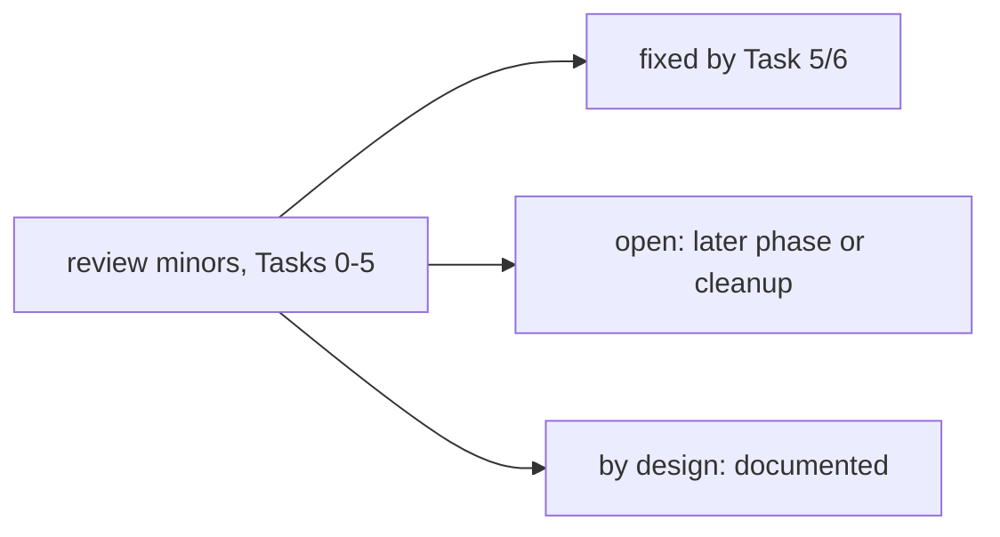

# Kernel P1 follow-ups

Deferred minors from the P1 task reviews (Tasks 0-5) and what Task 6 (Checkpoint 1) did with them. Source: the
SDD ledger (`.superpowers/sdd/investigate-the-potential-to-peaceful-music/progress.md`). Status is one of
fixed, open or by design.

## Task 0

- CLAUDE.md lines 8-9 are over-long. Open (docs cleanup).

## Task 1 (host contract types)

- `StaticCredentialResolver` scopes given as a `str` silently become a char set (`kernel/env.py`). Open.
- `safe_emit` failure fallback logs the whole event dict, which may carry a sensitive payload; it should log
  keys only (`kernel/trace.py`). Open.
- `CoreEnvironment.exec_base_env` is a mutable dict inside a frozen dataclass. Open. `repr=False` is in place.
- The case-alias `Paths` overlap check is untested on a case-insensitive filesystem. Open.

## Task 2 (LegacyEnvironment, env on ToolContext)

- `_ConfigSectionSource.section("providers")` dumps `api_key` values, bypassing resolver scopes. Open. The same
  item is Task 5 minor 3.
- The divergence when both `config=` and `env=` are given is now documented: the env wins for paths and
  credentials, the config picks the model (`docs/core-map/04-config-providers-core-sessions.md` section 4.1).
  Fixed (docs).
- The subagent `ToolContext.env` is not asserted in a test. Open.
- Some tests carry redundant asserts. Open (cosmetic).

## Task 3 (env.paths wiring)

- (a) `reload_image_generation_tool` rebuilt the tool without paths. Fixed in Task 4: the reload keeps
  `env.paths` and the strict floor.
- (b) `MoekaCore._build_vec_store` used `config.workspace_path` under an explicit env. Fixed in Task 5: it now
  uses `env.paths.work_dir`.
- (c) The xAI login status path used `get_data_dir()` under a strict env. Fixed: every xAI/MCP OAuth store takes
  `data_dir`, and the `None` fallback goes through `kernel.legacy.legacy_data_dir` (Task 6).
- (d) In-memory legacy configs keep OAuth tokens and media under `<ws>/data` and `<ws>/media`, while the CLI
  login writes the ambient `get_data_dir()/auth/xai.json`. The result is "not signed in" for in-memory xAI users.
  Open (disclosed). No tool-level test covers it.
- (e) `Paths` override cache: an unlocked check-then-set, unequal `Paths` for on-disk legacy configs (fresh
  lambdas), and a later `set_config_path` is not reflected. Open.
- (f) The strict floor does not protect `data_dir`/`logs_dir` wholesale when host overrides put them outside
  `state_dir`. Open.
- (g) Dream's hand-built file tools used the legacy floor. Fixed in Task 6: `MemoryStore(env=...)` gives them
  `env.paths`, the strict floor and the host plugin root (`tests/kernel/test_paths_wiring.py`).

## Task 4 (credentials through the resolver)

- (1) The staleness disclosure understates the issue: all env-sourced legacy credentials are snapshotted when
  `LegacyEnvironment` is built. Open (docs).
- (2) A cleared config search key stayed in the resolver after a hot reload. Fixed in Task 5
  (`resolve_credential(..., exclude_config=True)` / `resolve_non_config`).
- (3) The Copilot module-level login/catalog and the `oauth_model_catalog` xAI dispatcher run without an env or
  `data_dir`. By design, these are legacy-only entry points. They reach ambient state only through
  `kernel.legacy` helpers, and the Task 6 AST guard is clean for them.
- (4) The legacy `exec` scope reads any process variable. By design (R3 legacy parity); the docstring says so.
- (5) `resolve_override(config=)` under a legacy env can fall back to the startup key through the resolver.
  Open.
- (6) `command/builtin.py` uses `getattr(loop, "env", None)`. Open (typing cleanup).

## Task 5 (config re-reads and tunables)

- (1) A kernel-host reload source differs from the startup config: an MCP/image-gen reload with an env whose
  `ConfigSource` lacks `tools` drops servers. Open (undocumented, untested).
- (3) `section("providers")` exposes `api_key`, and kernel image-gen keys come from config sections, not the
  resolver. Open.
- (4) There are no Windows tests for `_resolve_shell` COMSPEC or the grep `_minimal_env`. Open.
- (5) `snapshot_config` duck-types the legacy source and swallows a `_resolve_tool_config_refs` error. Open.
- (6) `_ConfigSectionSource._read_file` reads the file twice (bytes, then `load_config`), which is a race. Open.
- (7) Runtime warnings name `NANOBOT_STREAM_IDLE_TIMEOUT_S` even for kernel-supplied values. Open.
- `expanduser()` calls outside R2. Resolved by Ruling G: `Path(x).expanduser()` on a caller-supplied path is not
  an ambient read. The AST guard forbids only `Path.home()`, `os.path.expanduser("~...")` and
  `Path("~...").expanduser()`.

## New in Task 6

- `nanobot/utils/path.py` (`abbreviate_path`) reads the home dir to shorten tool-hint paths. By design: it is
  the single `KNOWN_EXEMPTIONS` entry, display only.
- Env-less fallbacks still read ambient state through `kernel.legacy` helpers whenever a caller passes no host
  path. The AST guard cannot see through the helpers; `tests/kernel/test_fake_home.py` covers the strict-env
  runtime path for one turn with `exec`. Open: extend the runtime proof to Dream, MCP and image generation.
- The exec guard expands `$VAR` against `env.exec_base_env`, but the child sees only
  `HOME`/`LANG`/`TERM` plus `allowedEnvKeys`, so the guard over-approximates. This matches the pre-kernel
  behaviour. Open (tighten to `_build_env()` if it matters).
