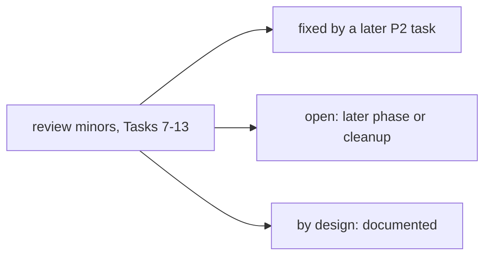

# Kernel P2 follow-ups

Deferred minors from the P2 task reviews (Tasks 7-12) and Task 13 (strict mode, Checkpoint 2). Source: the SDD
ledger (`.superpowers/sdd/investigate-the-potential-to-peaceful-music/progress.md`). Status is one of fixed,
open or by design.

## Task 7 (floors and policy vocabulary)

- NUL-byte normalisation differs between the floor exec check and `_guard_command` (the floor is stricter).
  By design (harmless).
- `_fs_floor` fell back to the legacy default roots when `protected=None`. Fixed in Task 9: the gate passes
  `protected_floor(env, workspace)`.
- The AST import guard checks top-level statements only, not `try:`/`if:` blocks. Open.
- `test_floors_cannot_be_exempted_by_policy` proves little on its own; the real guarantee is the gate-ordering
  test from Task 9. Open (test cleanup).
- `_floor_violation` has a stale `-> str | None` annotation (`shell.py`, pre-existing). Open.

## Task 8 (tool capability declarations)

- `exec_session` mixes resource semantics (input text vs session id), so "deny input to session s1" is not
  expressible. Open.
- Poll/read actions (`exec_session` wait/status, `bg_shell` status/tail/list) declare no capability. By design:
  the process was gated at start via `exec.run` and `owner_session_key`.
- `my action=set` declares nothing. Open (low severity; `allow_set` defaults False).
- `web_search` uses the resource `search:<query>`, so a host-based `net.fetch` deny rule cannot match a search.
  Open (documented refinement).
- `_FsTool` has no `capabilities` override (safety net for future subclasses outside the loader). Open.
- `test_capabilities_tolerate_missing_params` could also assert the element type. Open (test cleanup).

## Task 9 (the gate, live)

- `GateResult.policy_capability` returned a capability for `layer == "gate"` too. Fixed in Task 10.
- `hook.before_execute_tools` (batch level) still sees a call that is then denied (intent announcement, not
  execution). Open: the "never reaches a hook" wording should name this one exception.
- `execution.py` (test-only path) skips the escalation counter, and its no-registry fallback has no workspace
  fallback. Open (test-only module).
- `ctx` is always `None` at both gate call sites (plumbing for future policies). By design.
- `configure_gate` and `SubagentManager.policy` copy `loop.policy` at init; reassigning `loop.policy` later
  diverges silently. Open.
- No test proves a bound workspace scope outranks `tool._workspace` in `_call_workspace`, and none asserts the
  sub-agent `AgentRunSpec` carries the parent policy object. Open (tests).

## Task 10 (I5 denial ceiling)

- The gate-layer denial hint contradicts the "blocked by permission policy" wording. Open. Task 13 returns the
  strict-mode refusal verbatim (no retry hint); other gate-layer denials still get the hint.
- The fallback text for a `policy_denials` stop still says "maximum number of tool call iterations". Open
  (needs a dedicated template).
- An injection drained just before the exhaustion check is undocumented. Open.
- The exec-guard budget charge matches on error text, not tool identity (an MCP tool echoing the same text
  would be charged). Open: consider keying on `tool_call.name` / `ExecTool` identity.
- The count is cumulative per turn, not consecutive. By design (matches I5 as written; operator-visible).
- The exhaustion log line says "Permission-policy denial ceiling" even for an exec-guard trigger. Open
  (cosmetic).

## Task 11 (sub-agent attenuation, I4)

- Capability surfaces of `bg_shell`, the MCP wrappers and `image_generation` are pinned only via
  `capability_surface`, not by EXPECTED-equivalent calls. Open.
- A `capabilities` params path absent from EXPECTED escapes both sync tests (fails closed, but silently spends
  a sub-agent's denial budget). Open.
- Mixin edge case in the `capability_surface` MRO trust rule. Open.
- Aggregate exec-session cap is looser (8 per run vs 8 shared), and emptied managers stay in
  `_child_exec_managers` after natural expiry. Open.
- `_Plain` / `_Undeclared` test helpers are duplicated across two test files (a third copy now lives in
  `tests/kernel/test_strict_mode.py`). Open (test cleanup).
- Two `policy.decision` trace events per sub-agent call. By design (matches the main loop).
- A member `attenuate` returning a non-policy object is appended unchecked (fails at decide time, not at
  construction). Open.
- The random generator never produces `_RaisingRoot` (only a parametrized test covers it). Open (tests).
- Budget carve-out from the parent's remainder: out of scope (no carving mechanism exists yet). Open.

## Task 12 (scratchpad and deferred-action log, design 5a)

- A contradictory "try a different approach" hint still follows "do not retry" for some gate and workspace
  denials. Open (see Task 10).
- The `DEFERRED_NOTE` idempotence check is substring-based, not end-anchored. Open.
- Denied `write_file`/`edit_file` content is logged up to 20 KiB per string. Open: cap like the reason field.
- `_SECRET_KEY_RE` over-matches (`monkey`, `sort_key`, `keys`); it masks scalars only. Open (fidelity cost).
- Cross-process rotation race on a shared `work_dir` (double rotate, or a dropped entry on `os.replace`).
  Open.
- `_LOCKS` grows per path and never shrinks. Open.
- `execution.py` (test-only) drops the deferred note on its escalation rewrite. Open (non-production).
- The untrusted banner covers `read_file` only; grep, list_dir and exec have no banner mechanism. Open
  (pre-existing gap).

## Task 13 (strict mode, Checkpoint 2)

- Strict mode needs a sandbox for `exec.run` only; `exec.session_input` is not re-checked because no session
  can start without passing `exec.run`. By design.
- `bg_shell` has no `sandbox_active`, so strict mode refuses its `start` action (fail closed). By design; it
  stays gated off the auto-loader.
- The strict refusal is a gate-layer denial: it is logged to the deferred log but never counts toward the I5
  ceiling. By design (host configuration, not a permission wall the model probes).
- A tool dropped at `configure_gate` is not restored when the gate is later reconfigured with a looser
  policy. Open (no caller reconfigures today).
- `ToolRegistry.register` now returns `bool` (False = dropped). The loader uses it; other callers ignore it.
  By design (compatible).
- `tests/kernel/test_fake_home.py` stubs `ExecTool.sandbox_active` to keep its strict I1 proof running without
  bwrap in the test image, and `tests/kernel/test_policy_denial_budget.py`'s `_env` is no longer strict (it
  runs real unsandboxed exec). Open: run the fake-HOME proof under a real sandbox when the image has one.
