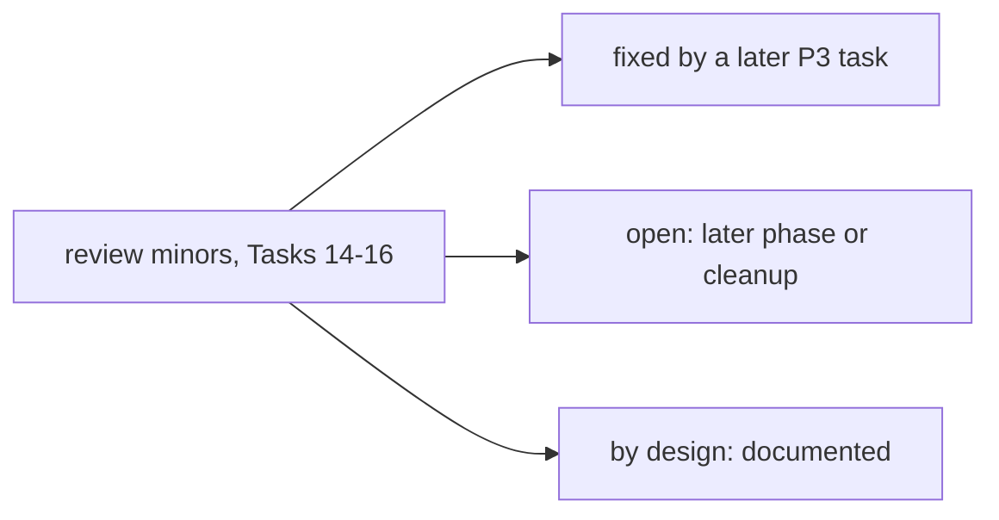

# Kernel P3 follow-ups

These are the deferred minors from the P3 task reviews (Task 14 cost ledger, Task 15 solver registry) and from
Task 16 (router, `model.dispatch`, baselines; Checkpoint 3). The source is the SDD ledger
(`.superpowers/sdd/investigate-the-potential-to-peaceful-music/progress.md`). Each item is marked fixed, open
or by design.

## Task 14 (cost ledger)

- Ruling J (1): pricing was keyed on the model name only, so the first preset won. Two presets sharing a model
  string under different providers swapped tier and price. Fixed in Task 16: `PricingTable` keys by
  `(provider, model)`, never borrows another provider's price, and logs collisions. A regression test covers a
  real failover.
- Ruling J (2): no marker separated estimated usage from billed usage. Fixed in Task 16:
  `LedgerEvent.usage_source` and `cost_is_billed`, plus `LLMCallRecord.usage_source`.
- Every call floods the log with `logger.exception` when the usage store cannot be written. Open: log once or
  rate-limit.
- No test pins that runner usage is identical with the observer on and off. Open.
- Two events per failover (primary fails, leaf succeeds) was untested. Fixed in Task 16
  (`test_regression_real_failover_is_priced_at_the_fallback`).
- A provider injected via `AgentLoop.from_config(extra["provider"]=...)` with an env gets no ledger. Open:
  this is a coverage gap that matches the single-wiring rule.
- Cache writes are priced at the input price, with no cache-write premium. Open.
- Hidden reasoning tokens are not billed, so reasoning models are under-costed. Open.

## Task 15 (deterministic-solver registry)

- The `SolverRegistry` class escape hatch does not reach the fast path, because there is no `registry=` on
  `acomplete_json` or `route`. Open: the docstring overstates it.
- There is no unregister API. By design for startup-only registration. Revisit for plugin reload (P4).
- The raising-solver log has no traceback. Open (`logger.opt(exception=True)`).
- `task_payload` without `task_type` is silently ignored. Open.
- No test directly asserts zero ledger events on the solved path. Open. It holds by construction: no provider
  is built.
- The `think_structured` zero-call test is weaker than `acomplete_json`'s. Partly fixed in Task 16: the router
  solver test makes `make_provider` and `config_from_sources` raise.

## Task 16 (router, `model.dispatch`, baselines; Checkpoint 3)

- Nothing routes by default. The runner turn loop, sub-agents, Dream and memory still call their provider
  directly. Only `route` and `think_structured(slot=/verify=/tier=)` are routed. Open (a later phase decides
  which call sites get slots).
- With `policy=None` the router enforces a configured ceiling (deny). The permissive `DefaultPolicy()` allows
  an over-ceiling dispatch, audited. By design. Revisit when the runner routes with `loop.policy`, which is
  `DefaultPolicy()` today.
- A `model.dispatch` deny is at layer `policy` (`violation:policy:model.dispatch`), but the router runs
  outside a turn and charges no I5 budget. By design.
- A dispatch exception propagates and does not escalate. That covers invalid JSON after the parse retries and
  a provider error. By design for now. Open: decide whether a parse failure should count as a verification
  failure.
- The ceiling cannot be enforced for a config with no tiered preset. The router dispatches the active preset
  untiered and emits `check="untiered"`. By design (documented).
- The ladder takes the first preset per tier in config order, with no per-slot preset choice. Open.
- `_ledger_pricing` resolves provider names once, when the provider is built, with the env's credential
  predicate. A credential that appears later does not re-key until the provider is rebuilt. Open (low
  impact).
- A preset whose provider cannot be resolved falls back to a bare-model wildcard key, which prices any
  provider's call for that model. Conflicting wildcards price nothing. By design (documented).
- `LLMUsageStore` has no `usage_source` column. By design: it is derivable from the stored `reported_tokens`
  and `estimated_tokens`.
- The router reuses the private `nanobot.api.complete._solve_deterministic`. Open: promote it to a public
  helper if a second caller appears.
- `cost_ratio` is strict: any estimated or unknown cost gives `None`. `compare_cost(allow_estimated=True)`
  flags the result instead. By design. `cost_ratio` inherits the Task 14 pricing gaps (cache-write premium,
  reasoning tokens).
- No confidence or grounding verifier ships. `verify` is caller-supplied. Open (P5 epistemic stores).
