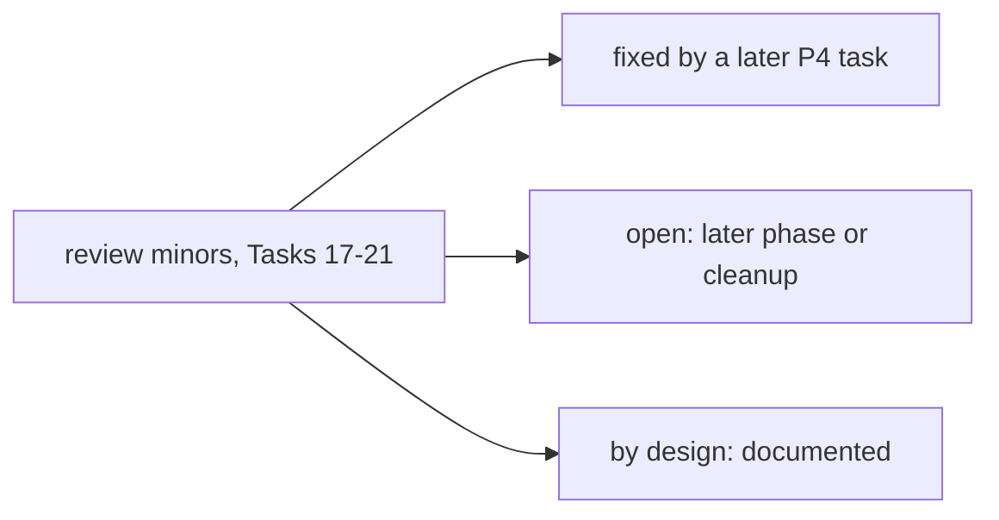

# Kernel P4 follow-ups

Deferred minors from the P4 task reviews: Task 17 (manifest model), Task 18 (plugin registry), Task 19 (loader
integration) and Task 20 (descriptions as data), plus Task 21 (typed calls, Checkpoint 4). The source is the
SDD ledger (`.superpowers/sdd/investigate-the-potential-to-peaceful-music/progress.md`) and the Task 21
report. Each item is marked fixed, open or by design.

## Trust boundary (final review I3)

- Kernel plugin code runs in-process and unsandboxed, with the host's full ambient Python authority. It can
  open files, sockets or subprocesses the gate never sees a request for.
- The grant (`policy ∩ capabilities_requested`) binds only the capability requests the plugin declares in
  `capabilities()`. A plugin that under-declares is not contained at all (`nanobot/kernel/gate.py` docstring).
- "Sandboxed" in older text means the design goal for tier 2, not what is built. Containing plugin code needs
  OS isolation (a sandboxed process). Open.
- Kernel mode itself has no production caller (Task 19 below), and sub-agents always load plugins in legacy
  mode. Both are in the design doc's I4 status.

## Task 17 (manifest model)

- Capability names are shape-checked only, so a misspelling passes silently. There is no importable
  capability registry for a soft warning. Open.
- The JSON Schema structural check does not descend into `additionalProperties`, `anyOf`/`oneOf`/`allOf`/`not`,
  `prefixItems` or `$defs`, and it wrongly rejects the tuple form of `items`. Open.
- The hash framing has no length prefix. Open (theoretical: the existing framing is distinct).
- `CAPABILITY_RULE` allows internal whitespace in the resource part. Open.
- There is no dedicated unknown-field rejection test for `Operation` (only for `PluginManifest`). Open.
- A manifest with `descriptions` cannot be deep-copied or pickled (`MappingProxyType`). By design until a
  caller needs it.
- `model_copy(update=)` and `model_construct` bypass validation (standard pydantic). By design: the loader
  re-reads and re-validates the manifest from disk and never trusts a copy.
- `config_schema`, `input_schema` and `output_schema` are still mutable dicts. By design: they are not
  capability bounds. Task 21 reads `Operation` schemas at call time, so an in-process mutation would change
  what is checked. That is in-process code, which nothing contains today (see "Trust boundary").
- Description edits (tier 1) sit inside the tier-2 package hash, so an edit quarantines the plugin until the
  host re-pins it. By design (Task 20 kept one hash); a separate description hash is open.
- The `config_schema` form (an inline JSON Schema) differs from the host design sketch's `module:Class`
  reference for `Tool.config_cls()`. Open: reconcile the design text.

## Task 18 (plugin registry)

- Residual risk: an agent with exec can write its own package and a matching "active" entry in
  `kernel-plugins.json`, and `check_active` then passes. By design (the documented exec caveat: real isolation
  is the sandbox). Fixed (wording, final review I2): the registry docstring, design section 9, the P4 proof
  and `docs/core-map/05-kernel.md` now say it is not proof against an exec-capable agent; strict mode plus a
  sandbox that does not bind `state_dir` read-write closes the gap.
- `register()` copies kind, version and tier from the caller's manifest, while the hash pin covers the manifest
  re-read from disk. Open (low risk: the caller is the host).
- `check_active(name, current_hash)` trusts the caller's hash. Fixed in Task 19: the loader passes a hash it
  computed from the bytes on disk.
- There is no cross-process lock (the `RLock` is per instance). A CLI `activate` racing a gateway quarantine
  can lose an update. Open (low impact: the next check corrects it).
- The state file is briefly world-readable on first creation, before the 0600 chmod. Open (create the temp
  file with 0600).
- There is no test for an unreadable (as opposed to malformed) state file. Open.
- `protected_paths` lazily imports `nanobot.kernel.registry` for one constant, which pulls the manifest and
  trace modules into every floor construction. Open (move the constant to a leaf module).
- In the split layout, `work_dir/kernel-plugins.json` is also read-protected. By design (harmless, broader
  than needed).

## Task 19 (loader integration)

- `SubagentManager._build_tools` always uses a legacy `ToolLoader()`, so sub-agents get no kernel plugin gating
  (no manifest, registry, hash or grant check), even when the parent runs in kernel mode. Open. Fix this first
  when kernel mode is wired into the runtime. It also means sub-agents do not bind manifest operations
  (Task 21).
- No production caller passes a `plugin_registry` (neither `AgentLoop` nor sub-agents). Open: kernel mode is
  opt-in and inert in the gateway today.
- An un-narrowed surface feeding sub-agent attenuation could, in theory, widen a capability across tools. Open
  (it matters only once kernel plugins reach sub-agents).
- First-round minors, all open:
  - a hash-then-import TOCTOU window;
  - `sys.modules` reuse across mixed-mode loaders in one process;
  - pip byte-compilation and `PYTHONPYCACHEPREFIX` are not documented;
  - the registry root is not compared, which allows a name-squatting DoS via quarantine;
  - the grant is computed against `registry.gate_policy`, not the runner's `spec.policy`;
  - an unknown surface is not narrowed;
  - the collision check cannot see dropped or disabled built-ins;
  - pydantic `loc` can leak input keys;
  - some lines are over 100 characters.

## Task 20 (descriptions as data)

- `builtin_description_hashes()` and `builtin_descriptions_hash()` have no production consumer. Open (an API
  for a future built-in manifest).
- One `raise` in `loader.py` lacks `from exc`. Open (cosmetic: implicit chaining still happens).
- Descriptions are cached per process (`functools.cache`), so an edited built-in description takes effect only
  after a restart. By design (documented).
- Every tool `parameters` schema stays in Python. By design as a scope-down: the reviewer found the key-order
  reason overstated. Moving them to data is open.

## Task 21 (typed calls, Checkpoint 4)

- The result validator is the `Schema` subset. `$ref`, `anyOf`/`oneOf`/`allOf`, `pattern`, `format`,
  `prefixItems` and `const` are accepted unchecked. So a pydantic model's JSON Schema (`FunctionTool`) or an
  MCP `outputSchema` using them is only partly re-checked by the kernel. Pydantic, and the MCP SDK's own
  `jsonschema` check, still validate fully. Open: full JSON Schema needs a dependency decision (`jsonschema` is
  only transitive, via `mcp`).
- The partial validator is worse than first disclosed for typeless schemas. Object keywords (`required`,
  `properties`, `additionalProperties`) are only checked when `type` is `"object"`, so `{"required": ["n"]}`
  enforces nothing. Open (review round 1).
- Fixed in review round 1:
  - An empty `output_schema` (`{}`) now accepts any value, prose included. This matches the `Operation`
    contract.
  - A `type` list is a union.
  - An integral float satisfies `integer` in results. Arguments stay strict.
  - Deeply nested JSON text fails with the marker instead of a bare `RecursionError`.
  - `FunctionTool` results are trusted as the pydantic `output_model` instance instead of being re-checked in
    their dumped form, which a `field_serializer` can change.
- Fixed in review round 2:
  - `FunctionTool` re-validates a returned model instance. pydantic returns an existing instance as is, so a
    `model_construct()`-ed or mutated instance used to pass. Round 3 corrected the method: it validates the
    instance's raw field values by name (recursively), not its serialized dump, because aliases,
    `exclude=True` and serializers change the dump.
  - The kernel's trust skip applies only to exactly `FunctionTool`, so no other tool can opt out.
  - A nullable union (`"type": [...]` with `nullable: true`) accepts `None` again.
- A `type` list is a union for arguments as well as results. This is deliberate: the old first-type-only
  check was a bug, since the model sees the whole union. Integral floats stay results-only.
- Open (round 2, deferred):
  - `FunctionTool`'s own `json.loads` does not catch `RecursionError`.
  - The union branch takes the first matching member without backtracking, so a value that matches an earlier
    member's type but fails its keywords is not tried against later members.
- The SDK's `Invalid schema for tool ...` `RuntimeError` is not mapped, so it stays a generic MCP failure
  without the marker. Open.
- `tool.result_invalid` fires only for `validate_result`'s own rejections, not for `FunctionTool` or
  SDK-raised failures. Open.
- Field names can appear in failure text: a path, or an unexpected key under `additionalProperties: false`.
  Values never do. The docstrings now say this. By design.
- There is no positive test that a legacy-mode plugin declaring its own `output_schema` is enforced through
  `_LegacyErrorPrefixTool`. Open.
- No built-in tool declares an `output_schema`, so typed results are opt-in. By design: built-in results are
  free text for the model. Open: typed results for the outside-service tools (web fetch, search) when P5
  needs them.
- The manifest `Operation.input_schema` is enforced on top of the tool's own `parameters`, but the model still
  sees the tool's `parameters`. A manifest stricter than the tool's schema means the model learns the extra
  rule only from the `Fields to fix` error. Open: expose the operation schema in `to_schema`, which would
  change plugin tool definitions.
- One tool binds at most one operation (matched by name). An operation that names no registered tool binds to
  nothing, silently. Open: warn at load, or model multi-operation service plugins.
- `MoekaCore.register_action` does not expose `output_model`, so hosts must build `FunctionTool` directly for a
  typed action. Open.
- The MCP SDK raises its own `RuntimeError` for result-schema failures inside `call_tool`. The wrapper maps
  them to the marker by message text, so an SDK wording change would drop them back to a generic
  `MCP tool call failed` error (still an error, never a success). Open: pin a test against the installed SDK.
- `validate_result` runs on every tool call. For a tool without a schema, the cost is one lazy import lookup
  and one `getattr`. By design.
- A result failure is a tool error, not a gate denial: no deferred entry, no `violation:*` signature, no I5
  count. So a service that keeps returning bad data is bounded only by the iteration limit. By design (the
  call was allowed). Open: a per-tool repeat counter, if it shows up in traces (`tool.result_invalid`).
