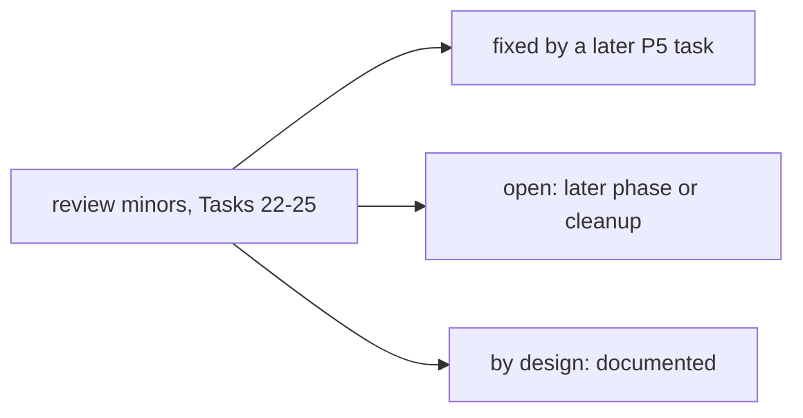

# Kernel P5 follow-ups

Deferred minors from the P5 task reviews: Task 22 (fact store), Task 23 (artifact store), Task 24
(clarification) and Task 25 (kernel facade and end-to-end test, Checkpoint 5). The source is the SDD ledger
(`.superpowers/sdd/investigate-the-potential-to-peaceful-music/progress.md`) and the Task 25 report. Each item
is marked fixed, open or by design. A last section lists P1-P4 follow-ups that P5 touched.

## Task 22 (fact store)

- The `journal_mode=WAL` pragma's return value is not asserted. Open (harmless: WAL persists in the file header
  whichever connection switched it).
- The WAL-switch retry sleeps with blocking `time.sleep` (up to about 10 s under contention). An async caller
  can stall its event loop; it should call the store through `asyncio.to_thread`. Open: say so in the
  docstring. The `MoekaKernel` facade (Task 25) calls the stores synchronously too, and so does the P5
  integration test from inside a host action.
- The "import-cheap" docstring claim is not quite true: `nanobot.kernel` re-exports `nanobot.core`, so importing
  any kernel module imports the core. Open (pre-existing package behaviour from Task 0).
- Use after `close()` silently reopens a connection that skips `_ensure_schema` and is never closed again. Open.
  The Task 25 facade avoids it for the stores it builds: `cleanup()` drops them and the next access builds new
  ones.
- An unhashable `source_kind` raises `TypeError` instead of the documented `ValueError`. Open.
- A test comment says "128 random-looking bits"; a uuid4 has 122. Open (cosmetic).
- No test pins the "same value from two sources is two facts" case (the reviewer checked it by hand). Open.
- The floor tests do not cover the `-journal` sidecar. Open.
- An `exec`-capable agent can still forge `facts.db` directly. By design (the documented exec caveat; real
  containment is a sandboxed exec backend, which strict mode requires). Task 23's cite check documents that a
  resolving cite is necessary, not sufficient, against such an agent.
- Correction, recorded for the record: the "same WAL race in `session/sqlite_store.py`" first flagged in Task 22
  is not exploitable. First opens there are serialised by the migration `FileLock`. Nothing to fix.

## Task 23 (artifact store)

- Deprecated pydantic v1 `@validator` on a parent field is stored in `__pydantic_decorators__.validators`, not
  `field_validators`, so the whole-leaf fallback misses it and a parent v1 validator on a nested field is
  skipped. Open (cheap fix; v1 decorators are deprecated).
- Deprecated pydantic v1 `@root_validator` is stored in `decorators.root_validators`, so `register_kind`'s
  model-validator refusal misses it. Open (same).
- A model-level `@model_serializer` makes any leaf fail with a bare `KeyError` instead of
  `ArtifactValidationError`. Open (wrong error type, not a security gap).
- A `Field(frozen=True)` field can never be proposed: `validate_assignment` rejects every assignment. Open.
- The design doc says "Annotated validator" where the real trigger is any field metadata. Open (cosmetic).
- `artifacts.py` imports the private `_enable_wal` from `facts.py`. Open: move it to a shared helper.

## Task 24 (clarification)

- `default_classifier` compares dict keys through `json.dumps`, which stringifies non-string keys, so
  `{1: "a"}` vs `{"1": "a"}` is classified minor instead of semantic. This contradicts the docstring's "dict
  keys compared exactly". Open. Impact is limited: a minor result commits the KNOWN value, so no wrong value is
  stored; the question is just skipped.
- Mixed-type dict keys (`{1: "a", "b": "c"}`) crash the classifier with `TypeError` from `sort_keys=True`. Open:
  fail safe to `semantic` ("when in doubt, ask").
- The docstring says "the committed value always equals its fact". That holds only when the caller's
  `Divergence.known` really is the resolved fact's value: `propose` checks that the cite exists, not that it
  matches. Open: document it as a caller obligation. The P5 integration test builds `known` from the recorded
  value, as a host should.
- Case-insensitive by default: wrong for case-sensitive values (paths, passwords). By design (damage limited by
  committing the known value); hosts override with `classify=`.
- Test gaps: `record_answer`'s `ArtifactValidationError` path; the foreign-store test does not assert that the
  user fact was still recorded in the other store; no dict-key-type boundary test. Open.

## Task 25 (kernel facade, Checkpoint 5)

- `kernel.facts`/`kernel.artifacts` on a kernel built without `env=` use the loop's `LegacyEnvironment`, whose
  `state_dir` is the workspace. For a file-loaded config that is the live workspace (for example `~/.nanobot`),
  so first access creates `facts.db` and `artifacts.db` there. By design (the legacy flat layout, R1); a host
  that wants them elsewhere passes a strict env. Nothing is created until first access.
- `clarify.resolve_divergence` emits no trace event, so the "clarification yield" objective (design section 8)
  has no signal yet. Open.
- No runtime path records facts or proposes artifacts on its own (the gateway, `AgentLoop` and built-in tools
  never call the stores). Open, for a later phase: bind typed tool results and ingested document spans
  automatically.
- `MoekaCore.ingest_text` returns a chunk count, not chunk IDs or spans, so a host cannot cite an ingested chunk
  directly; it records the span it extracted as a `document` fact itself (as the P5 integration test does).
  Open.
- The facade methods are synchronous and hit SQLite on the caller's thread (see Task 22's blocking-retry
  note). Open.

## P1-P4 follow-ups that P5 touched (quick scan, not an audit)

- P3: "No confidence or grounding verifier ships. `verify` is caller-supplied. Open (P5 epistemic stores)."
  Still open. P5 built the stores and a clarification classifier, but no router `verify` uses them.
- P4 (Task 21): "typed results for the outside-service tools ... when P5 needs them". Still open: P5 does not
  bind tool results into artifacts, so it did not need them.
- P4 (Task 21): "`MoekaCore.register_action` does not expose `output_model`". Still open; the Task 25 facade did
  not change `register_action`.
- P4 Checkpoint 4 wording "there is no artifact store yet (P5)" is now annotated in the design doc: the store
  exists, and nothing binds a failed (or any) tool result into it automatically.
- No P1-P4 item was closed by P5.
