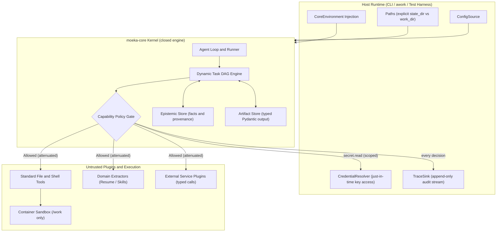
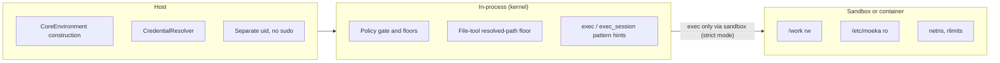
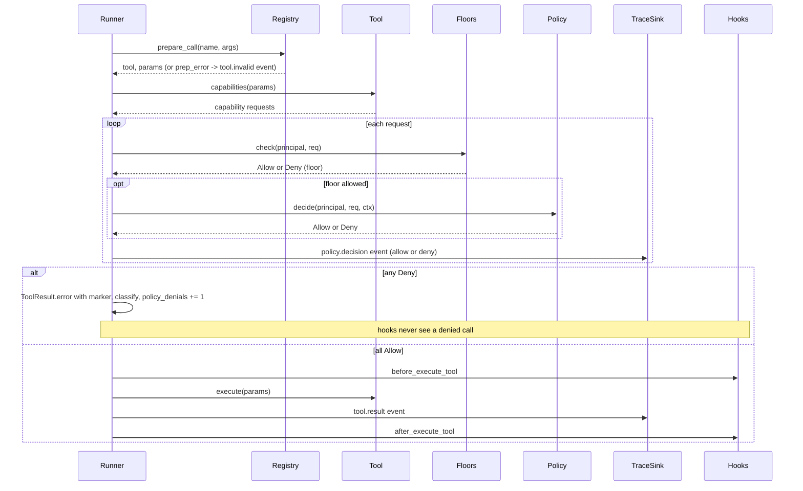
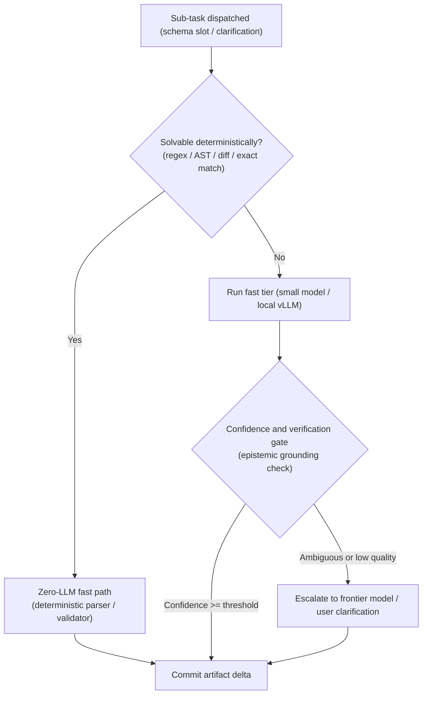
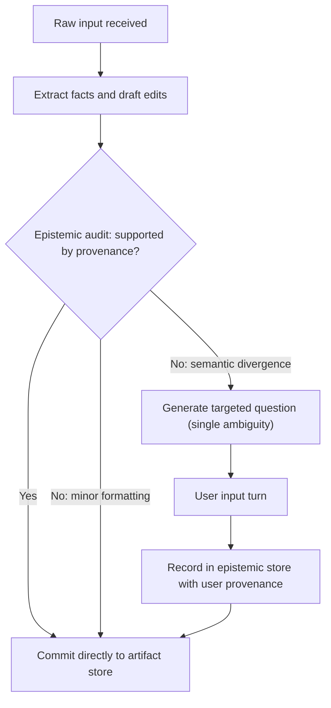
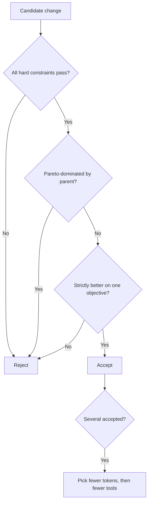
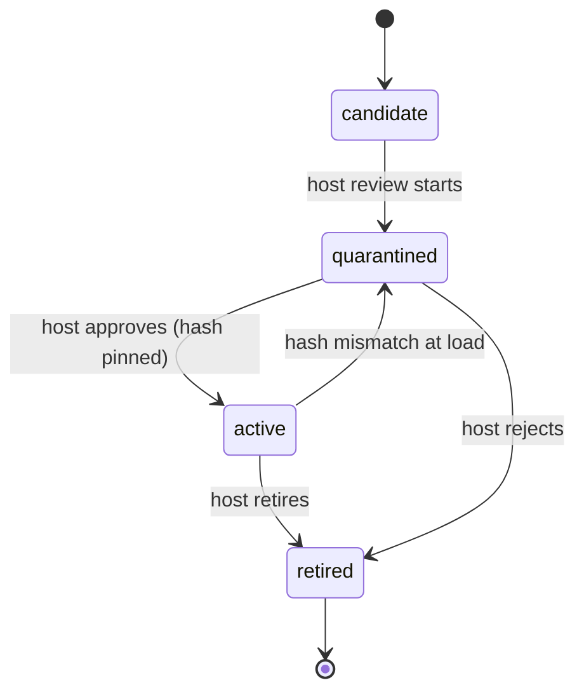
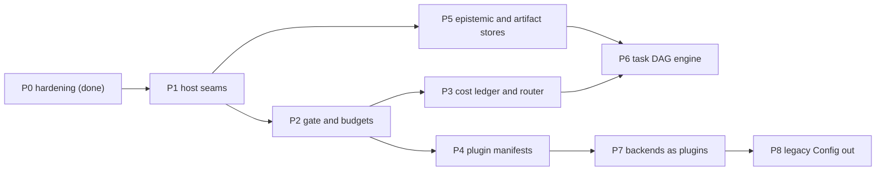

# moeka-core as a kernel: design

Status: design plan, 2026-09-26, branch `core-slim` at `4d2a2d8a`. Nothing new here is implemented; phase 0
shipped earlier. The detailed findings, threat model and phase-0 log live in the appendix spec,
`.agent/host-plugin-permissions-design.md` ("the earlier spec"). Code facts marked (unverified) were not read.

## 1. Mission

`moeka-core` must function strictly as an embeddable, secure execution kernel that guarantees isolation, auditability, and deterministic state transitions, leaving domain logic and environment access to the host and plugins.

## 2. Architecture and boundaries

Purpose: fix what the kernel owns, what the host injects, and what runs as an untrusted plugin.

- The **host** (CLI, awork, test harness) owns every path, credential, config value and audit destination.
- The **kernel** owns the agent loop and runner, the task graph engine, the capability policy gate, and the
  generic stores for facts-with-provenance and typed artifacts.
- The kernel must provide only GENERIC mechanics: provenance records, typed artifact deltas, graph scheduling.
- The kernel never contains domain schemas. Resume extraction, skill extraction and social simulation live in
  plugins or in awork.
- **Plugins** are untrusted. They reach the environment only through the gate, with attenuated grants.
- Shell execution must run inside a sandbox plugin or container that sees only `/work`.
- Every gate decision must be emitted to the host's `TraceSink`, allow or deny.



- Changed from the owner's version: the Gate now emits to the Sink and requests from the resolver (both arrows
  were reversed), and `ConfigSource` gets an edge into the kernel.

## 3. Invariants

Purpose: the rules that no phase, plugin or self-improvement step may break.

**I1 Zero ambient reads**
- The engine must never import `os.environ`, call `os.getenv`, or read config it was not handed. Every path,
  credential and runtime flag enters through `CoreEnvironment`.
- Enforced by: the host builds `CoreEnvironment`; `LegacyConfigAdapter` does ambient reads outside the kernel.
- Proven by: an AST test over `nanobot/` that fails on a forbidden read outside the compat and CLI modules.
- Status: not met. 95 lines in 20 files under `nanobot/` (outside `cli/`) match `os.environ|os.getenv`.

**I2 Physical path separation**
- `Paths.work_dir` and `Paths.state_dir` must never overlap. Agent file and shell operations stay in
  `work_dir`; sessions, traces and policy stay in `state_dir`.
- Enforced by: a construction check, the file-tool floor, and the sandbox for shell (section 4).
- Proven by: a test that constructing the kernel with overlapping dirs raises; a test that fs tools deny `state_dir`.
- Status: partial. The file-tool floor shipped in phase 0 (`nanobot/security/protected_paths.py`); the default
  layout is still flat (workspace == state home, Q5).

**I3 Unearned knowledge is forbidden**
- An output schema must bind only values backed by grounded source context or explicit user confirmation.
  Unsupported inferences stay provisional flags, never committed facts.
- Enforced by: the artifact store refuses a commit whose value lacks an epistemic trace ID.
- Proven by: a test that an uncited delta is stored as provisional and never reaches the committed artifact.
- Status: not built (P5).

**I4 Strict capability attenuation**
- A child sub-agent or plugin must get only the intersection of its parent's grants and its declared manifest.
  Privileges never broaden downstream.
- Enforced by: `PermissionPolicy.attenuate` and `policy ∩ capabilities_requested` at load.
- Proven by: a property test that every child policy is a subset of its parent's.
- Status: not built (P2, P4). Today `SubagentManager` passes config flags only.

**I5 Hard failure limits**
- A turn must terminate as soon as it exceeds its step budget or 6 policy denials.
- Enforced by: `budget.iterations` and `budget.policy_denials` in the runner, with the existing
  budget-exhausted finalisation.
- Proven by: the incident replay test (a whitelist-only policy, 50 distinct commands, turn ends at 6 denials).
- Status: the step budget exists (`max_tool_iterations`, default 200); the denial ceiling does not exist yet (P2).

**I6 Pareto simplicity and cost ceiling**
- For a sub-task T with target quality tau, moeka's expected cost must not exceed the cheapest adequate
  alternative:

  ```text
  E[Cost(Moeka(T))] <= min over S in S_adequate of E[Cost(S(T))]
  S_adequate = { S | E[Q(S(T))] >= tau }
  (S examples: one zero-shot LLM call, a deterministic AST/regex parser, a static heuristic)
  ```
- A task solvable deterministically must never invoke an LLM (runtime invariant violation).
- A task solvable by a compact lower-tier model must never dispatch a frontier model (budget violation).
- I6 is a target enforced by measurement and routing, not a theorem. Section 6 lists the four enforcement parts.
- Proven by: the RSI baseline comparator per task family, and a runtime test that an over-tier dispatch is denied.
- Status: not built (P3). No cost ledger exists.

## 4. Enforcement layers

Purpose: say which layer can guarantee what, so no check is trusted beyond its reach.

- **In-process checks** (gate, floors, tool-side checks) must stop well-formed tool calls and produce clean
  markers. They never hard-isolate shell commands on a shared uid.
- **Sandbox or container** must provide the real shell boundary: `/work` rw only, `/state` not mounted for the
  agent, `/etc/moeka` read-only.
- **Host** must own construction, credentials, the plugin list and OS privilege (no passwordless sudo, no
  docker group for the agent account).
- The kernel must refuse to start when `work_dir` and `state_dir` overlap.
- File tools must enforce the floor by resolved path (shipped in phase 0).
- In strict mode the kernel must refuse shell execution when no sandbox plugin is declared (fail closed).
- Phase 0's documented limits stand until the sandbox layer exists: exec reaches protected paths, hard links
  evade the path floor, and a symlink swap between resolve and open (TOCTOU) is open.



## 5. One tool call through the gate

Purpose: one choke point decides, audits and throttles every tool call.

- The gate must sit in `AgentRunner._run_tool` (`nanobot/agent/runner.py:1530`) and in `ToolRegistry.execute`.
- Hooks stay observers: `before_execute_tool` returns None (`nanobot/agent/hook.py:107`), so the gate is never a hook.
- A denial must be a `ToolResult.error` whose text embeds a pinned marker phrase.



**Floors** (checked before policy; no rule, flag or config removes them):
- The exec fork bomb and internal-state writes (`_FLOOR_DENY_PATTERNS`, `nanobot/agent/tools/shell.py:299`).
- The fs floor: `/proc/*/environ|mem|maps|root`, `auth/`, `plugin-data/`, the session root, the trace store, the policy source.
- The audit stream: a failing sink never turns a decision off; a fallback log record is written.
- `plugin.load` is host-only.
- A floor must never depend on an unrelated mode flag.

**June-2026 retry-loop protection:**
- Every denial carries a marker the runner already classifies; a new "blocked by permission policy" marker joins in P2.
- Repeated denials escalate on the third hit with "not configurable by the agent, stop retrying".
- The 6-denial ceiling (I5) ends the turn; the 200-iteration loop cannot recur.
- A capability denied for every resource is dropped at registration, so the model never sees the tool.

**Sub-agent attenuation:**
- A child's rules are the parent's rules intersected with an optional narrower set.
- Budgets are carved from the parent's remainder; `session.send` is denied by default.
- A child gets its own exec-session quota.

**Capability names** (the one table; grammar and resources are in the earlier spec, section 5):

| Capability | Checked by |
|---|---|
| `exec.run`, `exec.session_input` | exec, exec_session |
| `fs.read`, `fs.write` | file, search and patch tools, image-gen references |
| `net.fetch` | web_fetch, search backends, MCP HTTP |
| `secret.read` | resolver calls, exec `allowed_env_keys` |
| `mcp.call` | MCP wrappers |
| `plugin.load` | loader (host principal only) |
| `session.read`, `session.send` | session tools |
| `model.dispatch` (new, P3) | router: resource is the model tier |
| `budget.iterations`, `budget.tokens`, `budget.cost_usd`, `budget.subagents`, `budget.exec_sessions`, `budget.output_bytes`, `budget.policy_denials` | runner, subagent and exec-session managers |

## 5a. Scratchpad and deferred-action log

Purpose: the agent may record what it wants to run but cannot, so a denial ends the retry and the intent is kept.

- The agent must have a scratchpad under `work_dir`: free-form notes and plans it owns and may read and write.
- The agent must have a deferred-action log under `work_dir`: an append-only record of actions it believes it
  should run but knows it cannot (blocked by the gate, missing capability, missing sandbox, missing credential).
- A deferred entry holds the intended tool call (name and typed arguments), the reason, and the capability it
  would need. It never executes.
- Every gate denial must also append a deferred entry automatically, and the denial text must say so:
  "logged as a deferred action; do not retry".
- Writing to the scratchpad or the deferred log is never a policy denial and never counts toward the
  6-denial ceiling (I5).
- The deferred log is not the audit stream. The audit stream lives in `state_dir`, is host-owned and is
  authoritative; the agent cannot read or edit it (I2).
- Content read back from the scratchpad or deferred log is untrusted text and gets the untrusted banner.
- The host or a human reviews the deferred log and may grant a capability. An entry never grants anything.
- RSI may read the deferred log as a signal of missing capabilities. It must never use it to widen a
  grant: policy stays tier 4.

## 5b. Chat and typed calls

Purpose: the kernel must work as a chatbot and make effective, typed calls to outside services.

- The kernel must run a conversational turn (message in, streamed reply out) and tool calls to outside services
  inside the same loop. Transport (Telegram, web, CLI) belongs to the host, not the kernel.
- Every outward call must be typed: a declared argument schema, validated before the gate, and a declared
  result schema, validated before the result reaches the model or the artifact store.
- Today (verified): tools cast and validate arguments (`Tool.cast_params`, `Tool.validate_params`,
  `nanobot/agent/tools/base.py:251,297`; `ToolRegistry.prepare_call`, `registry.py:110`). No result schema exists.
- An argument that fails validation must return a structured error naming each bad field and the expected type,
  so the model repairs the call in one step instead of thrashing.
- Outside services are reached only through `net.fetch`, `mcp.call` or a service plugin, always behind the gate.
- A service plugin must declare its typed operations in its manifest (`input_schema`, `output_schema` per
  operation). The gate checks the capability; the kernel checks the types.
- A typed result that fails its schema is a tool error with a marker, never passed on as fact (I3).
- Typed results are the only values that may bind into the artifact store.

## 6. Cost-aware routing

Purpose: every sub-task takes the cheapest path that meets its quality target (I6).



- Changed from the owner's version: the fast path now joins "Commit artifact delta" (it had no exit).

**Mechanics:**
- Deterministic bypass comes before inference: schema remapping, AST validation, regex extraction and literal
  diffs never touch an LLM.
- Speculative cascading with early exit: simple extraction defaults to a light or local model; a high tier runs
  only on an explicit verification failure or low epistemic confidence.
- Complexity-bounded subgraphs: the DAG engine rejects a multi-hop decomposition when one direct prompt satisfies
  the schema.
- Token overhead gating: tool schemas and system prompts stay lean; a plugin never injects unbounded context or
  redundant descriptions without a budget justification.

**How I6 is measured:**
- A deterministic-solver registry per task type; the router must check it first.
- A per-call cost ledger through the `TraceSink`: tokens, model tier, latency, cost.
- A baseline comparator in the RSI evaluation harness: each eval task family declares its minimal adequate
  alternative (one zero-shot call, a regex/AST parser), and moeka is scored against it.
- A runtime rule: dispatching a tier above the slot's ceiling without a recorded verification failure is denied
  (`model.dispatch`) and audited.

## 7. Epistemic grounding and clarification

Purpose: facts enter the artifact only with provenance, and the user is asked only when it matters.

- Every committed value must cite an epistemic trace ID: a user document span, a tool output, or a user turn.
- A minor formatting divergence commits without a question.
- A semantic divergence must produce exactly one targeted question about a single ambiguity.
- The user's answer is recorded with user provenance before the commit.
- Unanswered or unsupported values stay provisional flags (I3).



## 8. Objectives for self-improvement

Purpose: define what RSI (recursive self-improvement: the harness that mutates and re-scores moeka) optimises
and when it may accept a change.

**Hard constraints** (a candidate failing any one is rejected):
- I1-I5 never regress.
- Floors and tier-4 files are untouched.
- Held-out tests stay hidden from the mutator.

**Pareto objectives:**
- Quality on held-out tasks (maximise).
- Cost per solved task (minimise; the I6 ledger).
- Provenance rate: every artifact mutation cites a trace ID from a document, tool output or user input (maximise).
- Clarification yield: questions only where ambiguity drives high downstream variance, none for trivial edits (maximise).
- Denial rate: invalid calls rejected with structured markers that guide recovery (minimise thrashing).
- Latency: stream read-only planning speculatively while gate checks run in parallel (minimise).
- Ambient leakage stays a hard zero: no credential in the agent's child environment; keys come just in time.

**Acceptance rule:**
- A candidate is accepted only if it passes every hard constraint, is not Pareto-dominated by its parent, and is
  strictly better on at least one objective.
- Ties between accepted candidates break toward fewer tokens, then fewer tools.
- The paired-margin gate and the cascade tiers live in `.agent/rsi-harness-design.md` (branch
  `rsi-harness-spec`); the cost dimension is added to that gate.



## 9. Plugins and trust

Purpose: a plugin runs only when the host activated it at a pinned hash, and the mutator edits only tier 1.



**Tiers:**
- Tier 1: skills, prompts, tool descriptions, tuning config. Automated edits behind the harness gate.
- Tier 2: plugin code. Sandboxed and gated; not in RSI v1.
- Tier 3: core code. Human-reviewed proposals only.
- Tier 4: policy, sandbox, evaluator, resolver, plugin list and hash pins. Never self-editable.

**Manifest fields:** `name`, `kind`, `version`, `version_hash`, `tier`, `capabilities_requested` (an upper
bound; the grant is `policy ∩ requested`), `config_schema`, `entry`, `descriptions`.

- Every lifecycle transition is a host action with an audit event.
- A name collision between plugins is a load error.

## 10. Phases

Purpose: the build order, each phase with a proof.

- The order below is an owner decision (recommended default).
- Renumbered from the earlier spec: old P1 -> P1, old P2 -> P2, old P3 manifests -> P4, old P4 backends -> P7,
  old P5 legacy Config -> P8.



**P0 hardening (done).** File-tool floor, `exec_session` guard, redaction, banners, SSRF ranges, grep worker,
bounded exec output. See the earlier spec, "Phase 0 outcome".

**P1 host seams.** Goal: the kernel reads nothing ambient.
- Resolve Q5: `Paths.state_dir` and `Paths.work_dir` are separate explicit attributes everywhere; test and
  production defaults point to separate paths.
- Add `CoreEnvironment(ConfigSource, CredentialResolver, Paths, TraceSink)`; remove `keys.env`, `os.environ` and
  `load_config()` from core modules; providers request keys on demand through the resolver.
- Add the AST guard test for ambient reads outside authorised compat modules.
- Wrap legacy config in `LegacyConfigAdapter` with an in-memory resolver; the floor takes its roots from `Paths`.
- Proof: AST guard green, fake-HOME test creates nothing under `$HOME`, awork suite green.

**P2 gate and budgets.** Goal: one audited choke point with hard limits.
- `PermissionPolicy` with default parity, floors, the gate at both call paths, audit events.
- `budget.policy_denials = 6` and `budget.iterations` end the turn (I5).
- Sub-agent attenuation (I4); strict mode refuses shell without a sandbox plugin.
- Scratchpad and deferred-action log (section 5a); every denial appends a deferred entry.
- Proof: incident replay ends within 6 denials; a denied call never reaches a hook (spy); child policy subset property test; a denied call leaves one deferred entry and no denial is counted for log writes.

**P3 cost ledger and router.** Goal: I6 is measured and enforced.
- Per-call ledger events (tokens, tier, latency, cost) through the `TraceSink`.
- Deterministic-solver registry checked before any model call; tier ceilings per slot via `model.dispatch`.
- Proof: a registered deterministic task makes zero model calls; an over-tier dispatch without a recorded failure is denied and audited.

**P4 plugin manifests.** Goal: host-activated, hash-pinned plugins.
- Manifests, per-plugin config validation, host plugin list plus entry points, quarantine on hash mismatch.
- Host-authenticated activation; the unsigned marker is rejected; tool descriptions become data files.
- Manifests declare typed operations (`input_schema`, `output_schema`); results are validated before use (section 5b).
- Proof: a changed description hash quarantines the plugin; an exec-written marker does not activate it; a service result that violates its schema is a tool error and never reaches the artifact store.

**P5 epistemic and artifact stores.** Goal: I3 holds by construction.
- Generic fact records with provenance (trace ID, source kind, span).
- Artifact store accepts typed deltas; uncited values stay provisional.
- Proof: an uncited delta never reaches the committed artifact; every committed value resolves to a trace ID.

**P6 task DAG engine.** Goal: decomposition only when needed.
- Decompose on executor failure, not up front; independent nodes run in parallel.
- Reject multi-hop decomposition when one direct prompt satisfies the schema.
- Proof: a task solvable in one call produces a one-node graph; every node's tool call passes the gate.

**P7 backends as plugins.** Goal: providers, search, sandbox, stores and token stores are plugins.
- Provider router plugin with a golden parity table for `_match_provider`.
- OAuth stores reachable only through the resolver.
- Proof: provider, session and core test suites green with the parity table.

**P8 legacy Config out of the core.** Goal: `Config` lives in compat only.
- Move `nanobot/config/schema.py` to compat with re-exports at old paths.
- Proof: `import nanobot.core` imports no `nanobot.config.schema` unless `config=` is passed; awork green.

**awork compatibility (hard requirement for every phase):**
- Stay importable: `nanobot.config.schema.Config`, `nanobot.api.complete` functions (looked up at call time),
  `MoekaCore.scoped/create/run`, `AgentHook`, `AgentProfileConfig`, `nanobot.core.vec.open_vec_store`.
- Gate command: `cd ~/projects/awork/backend && PYTHONPATH=/home/muk/projects/moeka-core-slim .venv/bin/python -m pytest tests/ -q`.
- Current state: 8 awork failures come from awork's venv lacking `rapidfuzz`; the fix is on awork's side (bump
  its moeka submodule, then `uv sync`).

## 11. Reading pointers (unverified leads)

Rule: no design decision, invariant or number in this document rests on a cited paper; each pointer must be
read and confirmed before anyone relies on it.

- Earlier citation errors prove the IDs need checking: 2407.03502 is a different paper (AgentInstruct),
  2211.08411 was not RARR, 2308.11534 is PlatoLM, one title was misquoted, and one cost figure was not in its abstract.
- Lead: ADaPT: As-Needed Decomposition and Planning with Language Models, arXiv:2311.05772; about decomposing
  only when the executor fails, relevant to P6.
- Lead: An LLM Compiler for Parallel Function Calling (LLMCompiler), arXiv:2312.04511; about planning a dependency
  graph of function calls for parallel execution, relevant to P6.
- Lead: CREATOR: Tool Creation for Disentangling Abstract and Concrete Reasoning of Large Language Models,
  arXiv:2305.14318; about LLMs writing their own tools, relevant to tier-2 plugin authoring.
- Lead: Voyager: An Open-Ended Embodied Agent with Large Language Models, arXiv:2305.16291; about a growing
  library of verified skills, relevant to tier-1 skill evolution.
- Lead: FacTool: Factuality Detection in Generative AI -- A Tool Augmented Framework for Multi-Task and
  Multi-Domain Scenarios, arXiv:2307.13528; about tool-assisted fact checking, relevant to P5.
- Lead: RARR: Researching and Revising What Language Models Say, Using Language Models, arXiv:2210.08726; about
  finding evidence and revising unsupported claims, relevant to P5.
- Lead: Enabling Large Language Models to Generate Text with Citations (ALCE), arXiv:2305.14627; about citation
  support in generated text, relevant to the provenance objective.
- Lead: FrugalGPT: How to Use Large Language Models While Reducing Cost and Improving Performance,
  arXiv:2305.05176; about LLM cascades for cost, relevant to P3.
- Lead: RouteLLM: Learning to Route LLMs with Preference Data, arXiv:2406.18665; about learned routers between
  strong and weak models, relevant to P3.
- Lead: Large Language Model Cascades with Mixture of Thoughts Representations for Cost-efficient Reasoning,
  arXiv:2310.03094; about escalating on weak-model answer inconsistency, relevant to the confidence gate.
- Lead: UCCI: Calibrated Uncertainty for Cost-Optimal LLM Cascade Routing, arXiv:2605.18796; about calibrating
  cascade escalation thresholds, relevant to P3 (single-workload study).

## 12. Decisions for the owner

Each item carries the recommended default.

Decided by the owner (2026-09-26):
- Phase order P1-P8 as in section 10.
- `CredentialResolver.resolve(ref, scope)`, because scope lets the resolver refuse cross-plugin reads.
- The agent gets a scratchpad and a deferred-action log (section 5a).
- Social simulation is out of scope for the kernel. The kernel must serve as a chatbot that makes typed calls
  to outside services (section 5b).

Still open:
- `Paths` derivation. Default: two host attributes; `sessions_root`, `data_dir` and `logs_dir` are
  subdirectories of `state_dir`; `media_dir` sits under `work_dir`, because agent-visible attachments and
  generated media must be reachable by the agent. Owner may veto.
- AST guard and `open_vec_store`. Default: the guard forbids ambient reads (`os.environ`, `os.getenv`,
  `load_config(`, `get_state_home(`, `get_data_dir(`, `Path.home()`, `~` expansion, implicit default DB
  paths); `open_vec_store` stays a public factory that requires an explicit path. Its signature already
  requires `db_path` (`nanobot/core/vec.py:38`). Owner to confirm.
- Who builds the deterministic-solver registry. Default: plugins register solvers per task type; the kernel
  owns only the lookup.
- Q5 flat layout, Q6 `restrict_to_workspace` default, Q8 Jina default, Q12 plugin activation, Q13 config edits:
  defaults and reasons are in the earlier spec, section 11.

## 13. Appendix pointers

- The earlier spec: `.agent/host-plugin-permissions-design.md` (threat model, findings, phase-0 log, interfaces,
  awork call sites, harness implications).
- Phase-0 follow-ups: `.agent/phase0-followups.md` (deferred limits and owners).
- RSI harness design: `.agent/rsi-harness-design.md` on branch `rsi-harness-spec` (paired-margin gate, cascade tiers).
