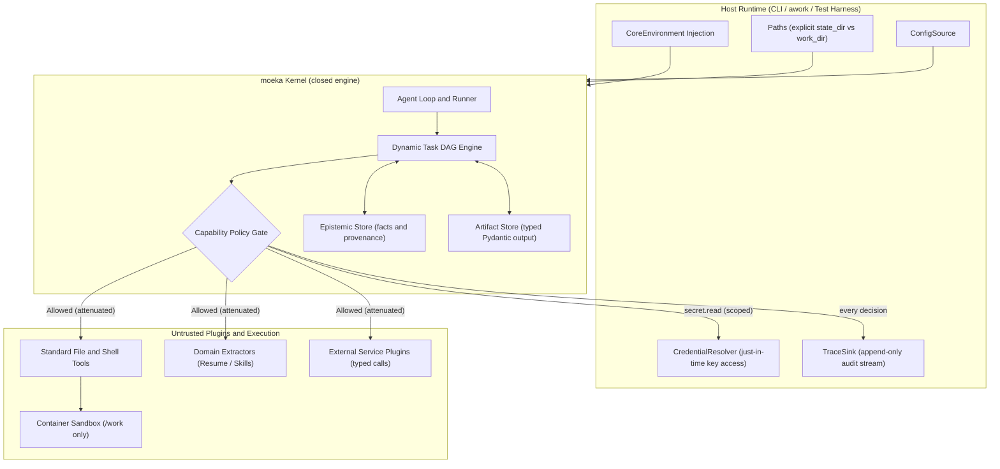
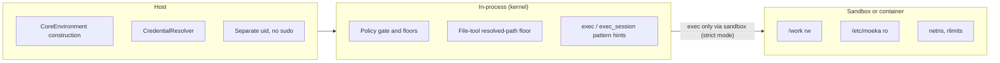
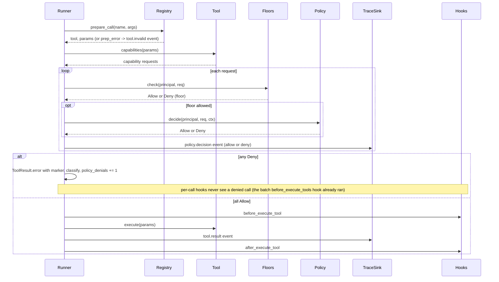
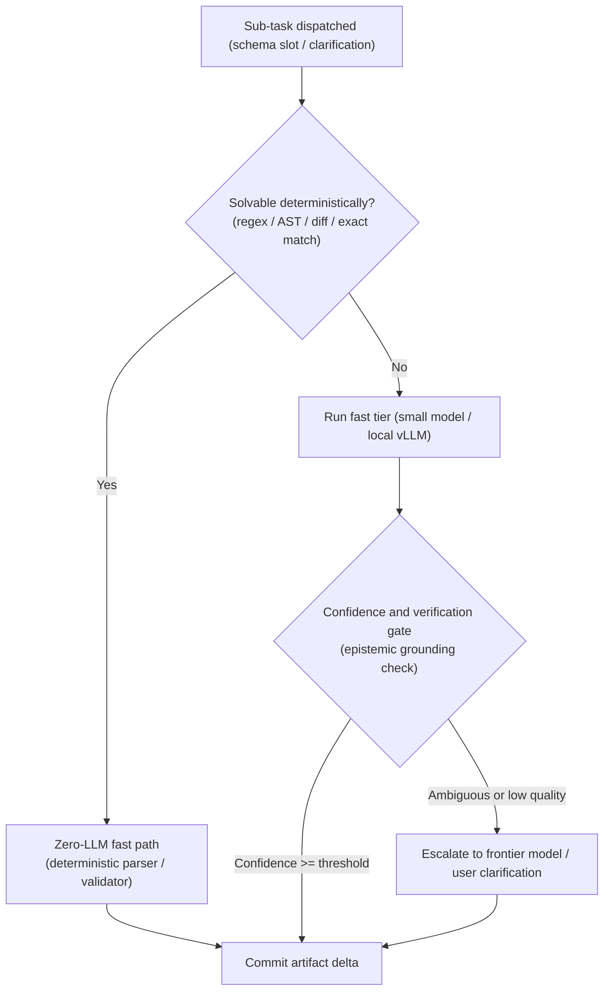
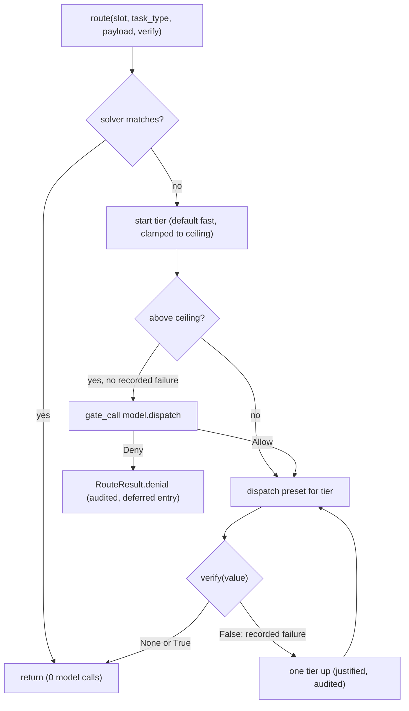
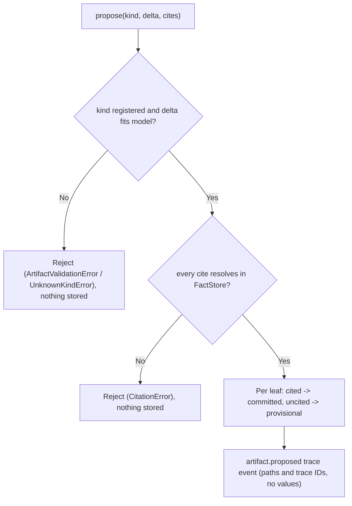
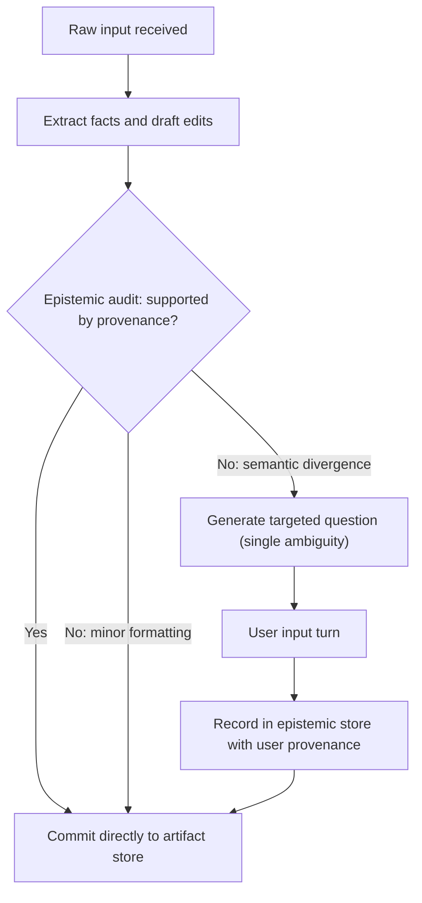
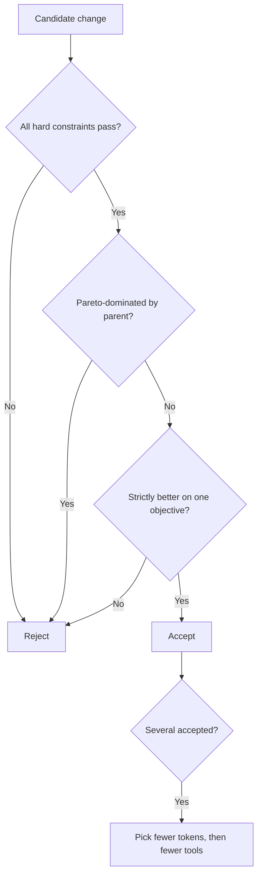
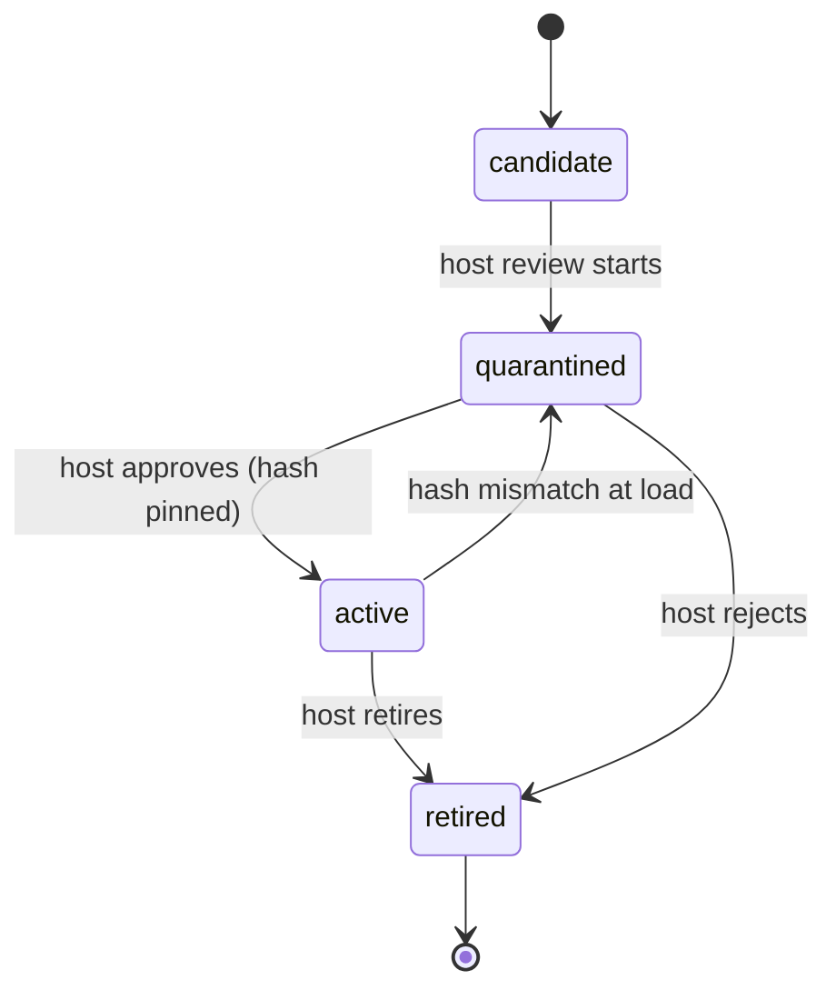
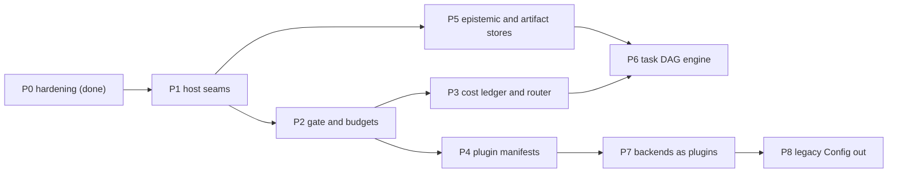

> Spec-kit artifacts: the principles, per-feature requirements, plans and open owner questions are in
> `.specify/memory/constitution.md` and `specs/` (`001-consumer-usage-surface`, `002-kernel-api-for-consumers`,
> `003-main-consolidation`, `004-rsi-harness`, `CLARIFY-LOG.md`). This file stays the detailed design and the
> source for mechanics, status and proofs; the specs do not duplicate it.

# moeka kernel: design

Naming: the host-facing API is the `moeka` package (`moeka.Kernel`, section 3a). `MoekaKernel` / `MoekaCore`
(`nanobot.core`, re-exported by `nanobot.kernel`) is the earlier facade, deprecated and kept only until awork
migrates.

Status: P1-P5 built on branch `core-slim` (2026-09-27, kernel plan Tasks 0-25; section 10 has each phase's
proof). The public API (`moeka` package, section 3a) was built on branch `kernel-api` (2026-09-28, public-API
plan Tasks 1-13, plus final-review fixes I-1 to I-7 and later commits through `5b9c7d43`); it is now part of
`core-slim` (the `kernel-api` branch no longer exists). awork's migration and the removal of the deprecated
shims are that plan's Tasks 14-15 and are NOT done (section 15). P6-P8 remain design only. Last re-checked
against the code 2026-09-30 (`core-slim` at `6f80c392` plus docs commits); tests were read, not re-run. This document began as a design plan (2026-09-26, `4d2a2d8a`); phase 0
shipped before it. The detailed findings, threat model and phase-0 log live in the appendix spec,
`.agent/host-plugin-permissions-design.md` ("the earlier spec"). Code facts marked (unverified) were not read.

## 1. Mission

The moeka kernel must function strictly as an embeddable, secure execution kernel that guarantees isolation, auditability, and deterministic state transitions, leaving domain logic and environment access to the host and plugins.

## 2. Architecture and boundaries

Purpose: fix what the kernel owns, what the host injects, and what runs as an untrusted plugin.

- The **host** (CLI, awork, test harness) owns every path, credential, config value and audit destination.
- The **kernel** owns the agent loop and runner, the task graph engine, the capability policy gate, and the
  generic stores for facts-with-provenance and typed artifacts.
- The kernel must provide only GENERIC mechanics: provenance records, typed artifact deltas, graph scheduling.
- The kernel never contains domain schemas. Resume extraction, skill extraction and social simulation live in
  plugins or in awork.
- **Plugins** are untrusted. Their declared capability requests go through the gate, with attenuated grants.
  - As built (P4), a kernel plugin's code runs in-process and unsandboxed, with the host's full ambient
    Python authority: it can open files, sockets or subprocesses the gate never sees a request for.
  - The grant binds only the requests the plugin itself declares in `capabilities()`. A plugin that does not
    declare something it does is not contained at all (`nanobot/kernel/gate.py` module docstring).
  - Real containment of plugin code needs OS isolation (a sandboxed process), which is not built.
- Shell execution must run inside a sandbox plugin or container that sees only `/work`.
- Every gate decision must be emitted to the host's `TraceSink`, allow or deny.



- Changed from the owner's version: the Gate now emits to the Sink and requests from the resolver (both arrows
  were reversed), and `ConfigSource` gets an edge into the kernel.

## 3. Invariants

Purpose: the rules that no phase, plugin or self-improvement step may break.

**I1 Zero ambient reads**
- The engine must never import `os.environ`, call `os.getenv`, or read config it was not handed. Every path,
  credential and runtime flag enters through `CoreEnvironment`.
- Enforced by: the host builds `CoreEnvironment`; `LegacyConfigAdapter` does ambient reads outside the kernel.
- Proven by: an AST test over `nanobot/` that fails on a forbidden read outside the compat and CLI modules.
- Status: met for kernel modules (P1, 2026-09-27). Proof is `tests/kernel/test_no_ambient_reads.py`, an AST
  guard (docstrings and comments never match) over every `nanobot/**/*.py`, with a self-test per pattern.
- Forbidden outside the allow-list: `os.environ`/`environb`/`getenv`/`putenv`/`unsetenv` (including `import os
  as x`, `from os import environ as e`, `getattr(os, "environ")`), bare `environ.get`, `os.path.expandvars`,
  `Path.home()`, `os.path.expanduser("~...")`, `Path("~...").expanduser()`, and every ambient locator in
  `nanobot/config/{paths,loader}.py` (`load_config`, `get_config_path`, `get_state_home`, `get_data_dir`,
  `get_media_dir`, `get_runtime_subdir`, `get_legacy_sessions_dir` and the other `get_*_dir` helpers).
- Allowed: `Path(x).expanduser()` and `os.path.expanduser(x)` on a caller-supplied path.
- Allow-list (`AMBIENT_ALLOWLIST`): `nanobot/cli/` (host CLI), `nanobot/config/` (config layer: paths, loader,
  schema `workspace_path` fallback and the pydantic `NANOBOT_` env prefix), `nanobot/kernel/legacy.py` (the
  ambient adapter) and `nanobot/utils/restart.py` (host re-exec).
- One exemption (`KNOWN_EXEMPTIONS`): `nanobot/utils/path.py`, which reads the home dir only to shorten a path
  string in tool-call hints ("/home/u/x" -> "~/x").
- Env-less legacy fallbacks (`data_dir=None`, `media_dir=None`, `workspace=None`) reach ambient state only
  through named helpers in `nanobot/kernel/legacy.py` (`legacy_data_dir`, `legacy_media_dir`,
  `legacy_state_home`, `legacy_config_path`, `legacy_runtime_subdir`, `legacy_sessions_dir`,
  `process_env_snapshot`, `ambient_credential`).
- Runtime proof: `tests/kernel/test_fake_home.py` runs one strict kernel turn with a tool call under a temp
  `HOME` with every legacy env var set to a poison sentinel. It asserts no poisoned variable is looked up and
  that `os.environ` is not mutated. It also asserts the sentinel reaches no trace, log, provider payload, tool
  output or file, and that nothing is created under `$HOME` or the cwd.

**I2 Physical path separation**
- `Paths.work_dir` and `Paths.state_dir` must never overlap. Agent file and shell operations stay in
  `work_dir`; sessions, traces and policy stay in `state_dir`.
- Enforced by: a construction check, the file-tool floor, and the sandbox for shell (section 4).
- Proven by: a test that constructing the kernel with overlapping dirs raises; a test that fs tools deny `state_dir`.
- Status: partial. `Paths` rejects overlap unless `overlap_ok=True` (legacy flat layout only), and
  `CoreEnvironment(strict=True)` raises `PathsOverlapError` on overlapping paths even with `overlap_ok=True`
  (`tests/kernel/test_env.py`). Sessions,
  auth stores, `llm_usage`, plugin state and logs live under `state_dir`, while media lives under `work_dir`.
  The file-tool floor denies `state_dir` (`tests/kernel/test_paths_wiring.py`).
- Not met in legacy (non-strict) mode: shell isolation. `exec` can still reach `state_dir` by absolute path unless
  the workspace guard is on or a sandbox backend runs.
- Strict mode (P2, Checkpoint 2): a strict env refuses `exec.run` unless `tools.exec.sandbox` names an active
  backend (`bwrap`/`seatbelt`, never on Windows), so a strict kernel never runs shell without a sandbox
  (`tests/kernel/test_strict_mode.py`). The sandbox itself is the boundary; its bind-mount guarantees are the
  backend's, not re-proven here.
- The legacy adapter keeps the flat layout (workspace == state home, R1 `overlap_ok=True`).

**I3 Unearned knowledge is forbidden**
- An output schema must bind only values backed by grounded source context or explicit user confirmation.
  Unsupported inferences stay provisional flags, never committed facts.
- Enforced by: the artifact store refuses a commit whose value lacks an epistemic trace ID.
- Proven by: a test that an uncited delta is stored as provisional and never reaches the committed artifact.
- Status: built and reachable from `MoekaKernel` (P5, Tasks 22-25, Checkpoint 5). Enforced for every write
  through `ArtifactStore`; nothing in the runtime writes on its own.
  - `nanobot/kernel/facts.py` `FactStore`: append-only facts with provenance (`document`/`tool`/`user`),
    opaque `fact-<uuid4>` trace IDs; `resolve()` returns `None` for an ID that points to nothing.
  - `nanobot/kernel/artifacts.py` `ArtifactStore`: a host or plugin registers a pydantic model per kind;
    `propose(kind, delta, cites)` commits a leaf only when its cite resolves in the `FactStore`; an uncited
    leaf is stored provisional; a cite that resolves to nothing rejects the whole propose (nothing stored).
  - User confirmation is a `FactStore.record("user", ...)` trace ID, never a sentinel.
  - `nanobot/kernel/clarify.py`: the epistemic audit's decision (minor commits the known value, semantic or
    unsupported asks one question) and `record_answer` (user fact, then commit).
  - Facade (Task 25, `nanobot/core/core.py`): `kernel.facts` and `kernel.artifacts` are built lazily from
    `kernel.env` under `env.paths.state_dir` and share one fact store; `kernel.propose` and `kernel.answer`
    pass through. No env: both are `None` and the methods raise `RuntimeError`.
  - "No env" almost never happens for a real kernel: every `MoekaKernel.create()` path builds a
    `LegacyEnvironment` when the host passes none (`agent/loop.py:597`). Its flat layout makes `state_dir` the
    live legacy workspace, so `facts.db` and `artifacts.db` appear there on first property access unless the
    host builds a strict or explicit env (`.agent/kernel-p5-followups.md`).
  - Proof: `tests/kernel/test_artifact_store.py` (an uncited delta never reaches `committed()`; every
    committed leaf's trace ID resolves; a missing-fact cite is rejected; accumulation, validation,
    persistence, concurrent threads and processes on a fresh file) and `tests/kernel/test_p5_integration.py`
    (end to end through `MoekaKernel` with a strict env and a fake provider).
  - Limit: "committed" means the cite resolved, not that the fact supports the value (the epistemic audit
    is the caller's), and it is not proof against an exec-capable agent: `exec` bypasses the file floor
    and can forge `facts.db` or `artifacts.db`. Real containment needs a sandboxed exec backend (strict mode
    refuses exec without one).
  - The same exec-forgery caveat covers the cost ledger's SQLite store, `<data_dir>/llm_usage.sqlite3`
    (`nanobot/llm_usage/__init__.py`, Task 14). An RSI harness scoring cost or denial rate must trust the
    host's `TraceSink` stream (`model.call`, `policy.decision`) over the raw SQLite contents unless exec is
    sandboxed.
  - Additional gap: the file floor protects `llm_usage.sqlite3` only in the split layout, where all of
    `state_dir` (and so `data_dir = state_dir/data`) is denied. In the legacy flat layout `data_dir` is the
    legacy instance dir and the floor names only its `auth/`, `plugin-data/` and `sessions/` subtrees, so even
    the file tools can read and write `llm_usage.sqlite3` there. `facts.db`, `artifacts.db` and
    `kernel-plugins.json` are protected by name in both layouts.
  - Not automatic: no gateway, `AgentLoop` or built-in tool path records facts or proposes artifacts. A host
    does, or a host action the agent calls (as in the P5 integration test). Typed tool results are not bound
    into artifacts automatically either.

**I4 Strict capability attenuation**
- A child sub-agent or plugin must get only the intersection of its parent's grants and its declared manifest.
  Privileges never broaden downstream.
- Enforced by: `PermissionPolicy.attenuate` and `policy ∩ capabilities_requested` at load.
- Proven by: a property test that every child policy is a subset of its parent's.
- Status: met for sub-agents (P2, Checkpoint 2). Each child's policy is the parent's attenuated to its tools'
  static capability surface minus `session.send`, intersected with any narrower set; a foreign parent policy is
  never trusted to attenuate itself (`tests/kernel/test_subagent_attenuation.py`, including the child and
  grandchild subset property test).
- Plugins: built (P4, Tasks 17-21). In kernel mode (a `ToolLoader` given a `plugin_registry`) a plugin loads
  only when host-activated at its on-disk hash, and its tools carry the grant `policy ∩
  capabilities_requested`, enforced per declared request by the gate (`tests/kernel/test_loader_integration.py`).
  The grant binds declared requests only; plugin code itself runs in-process and unsandboxed (section 2).
- Gap: kernel mode has no production caller. Since the public API (section 3a), `AgentLoop` and
  `SubagentManager._build_tools` pass their `plugin_registry` to `ToolLoader`, and `Kernel(plugins=...)`
  supplies it to every agent and sub-agent. The gateway (on `main`, not on this branch) and legacy `MoekaCore` pass none, so they still run
  legacy plugin loading: a plugin that kernel mode would quarantine is importable there, with no manifest,
  hash or grant check (`.agent/kernel-p4-followups.md`, Task 19).

**I5 Hard failure limits**
- A turn must terminate as soon as it exceeds its step budget or 6 policy denials.
- Enforced by: `budget.iterations` and `budget.policy_denials` in the runner, with the existing
  budget-exhausted finalisation.
- Proven by: the incident replay test (a whitelist-only policy, 50 distinct commands, turn ends at 6 denials).
- Status: met (P2, Checkpoint 2). The 6-denial ceiling ends the turn through the budget-exhausted
  finalisation (`tests/kernel/test_incident_replay.py`, including the real `tools.exec.allowPatterns`
  incident configuration).
- What counts toward the 6-denial ceiling (the one place to check; code: `GateResult.policy_capability` in
  `nanobot/kernel/gate.py`, `BUDGETED_EXEC_GUARD_SIGNATURES` and `_record_policy_denial` in
  `nanobot/agent/runner.py`):
  - Counted: gate denials at layer `policy`, which are `PermissionPolicy.decide` denials and kernel plugin
    grant denials.
  - Counted: exec-guard denials from the configurable `allowPatterns` / `denyPatterns` layer
    (`violation:exec-allowlist`, `violation:exec-denyguard`).
  - Not counted: the exec floor (fork bomb, internal-state writes) and the fs floor.
  - Not counted: strict-mode "requires a declared sandbox" refusals (layer `gate`) and failed capability
    declarations.
  - Not counted: SSRF and workspace-violation denials, and result-schema failures (tool errors, not denials).
  - Not counted: router `model.dispatch` denials (the router runs outside a turn).
  - Sub-agents: each sub-agent run gets its own fresh 6-denial budget (`SubagentManager.max_policy_denials`).
    Nothing is carved from the parent's remaining budget.
- The uncounted classes are bounded only by the iteration limit (default 200), plus the third-hit
  "stop retrying" escalation text.

**I6 Pareto simplicity and cost ceiling**
- For a sub-task T with target quality tau, moeka's expected cost must not exceed the cheapest adequate
  alternative:

  ```text
  E[Cost(Moeka(T))] <= min over S in S_adequate of E[Cost(S(T))]
  S_adequate = { S | E[Q(S(T))] >= tau }
  (S examples: one zero-shot LLM call, a deterministic AST/regex parser, a static heuristic)
  ```
- A task solvable deterministically must never invoke an LLM (runtime invariant violation).
- A task solvable by a compact lower-tier model must never dispatch a frontier model (budget violation).
- I6 is a target enforced by measurement and routing, not a theorem. Section 6 lists the four enforcement parts.
- Proven by: the RSI baseline comparator per task family, and a runtime test that an over-tier dispatch is denied.
- Status: measured; router and gate built but opt-in, so nothing live routes by default (P3, Checkpoint 3).
  What is built:
  - Ledger (`nanobot/kernel/ledger.py`): every call from an env-built provider is a `model.call` event with
    tokens, tier, latency, cost and `usage_source`. Pricing is keyed by `(provider, model)` (Ruling J), and an
    estimated cost is flagged (`cost_is_billed` is False), never ground truth.
  - Solvers (`nanobot/kernel/solvers.py`): `acomplete_json`, `think_structured` and the router try them first;
    a solved task makes no provider call.
  - Router (`nanobot/kernel/router.py`): solver, then the slot's start tier, then `verify`, then one tier up on
    a recorded verification failure. Over-ceiling dispatch without a recorded failure is a `model.dispatch`
    request through `gate_call` (`tests/kernel/test_router.py`).
  - Baselines (`nanobot/kernel/baselines.py`): a declared alternative per task family and `cost_ratio`.
- Still aspirational:
  - Nothing routes yet. The runner's turn loop, sub-agents and memory still call their provider directly; only
    a caller of `route` or `think_structured(slot=...)` is routed.
  - No slot has a ceiling unless the host configures `router.slots`.
  - "Adequate" is whatever `verify` says; no confidence or grounding verifier ships. P5 built the fact and
    artifact stores and a clarification classifier, but no router `verify` built on them.
  - The `E[Cost]` inequality is scored only by the RSI harness, which does not exist yet.
  - Cache-write premiums and hidden reasoning tokens are not priced (`.agent/kernel-p3-followups.md`).

## 3a. Public API

Purpose: show where each invariant surfaces in the `moeka` package, the only surface hosts use. Usage is in
`docs/python-sdk.md`; the layering diagram is in `docs/core-architecture.md`; old-to-new mapping in
`docs/migration-moeka-api.md`.

- Shape: `moeka/` only re-exports (`moeka`, `moeka.llm`, `.agents`, `.sessions`, `.memory`, `.epistemics`,
  `.trace`, `.budget`, `.errors`, `.variants`, `.tools`, `.testing`); every class lives in `nanobot/kernel/`.
  `Kernel(env, *, budget, cache, variant, policy, plugins, max_concurrency=16, solvers, baselines,
  action_workers=8)` owns one loop thread; async methods hop onto it and `*_sync` twins block on it from any
  thread. `action_workers` sizes the dedicated pool that agents' sync host actions run on (`ff94686d`).
  `moeka/__init__.py` itself exports only `CredentialResolver`, `Environment`, `Kernel`, `ModelSpec`, `Paths`,
  `PathsOverlapError`, `ProviderSpec`, `Sampling`, `StaticCredentialResolver`; everything else is reached
  through the submodules listed above.
- Agents: `AgentSpec.memory_key` (default: the agent's name) picks the per-agent memory root, so two agents with
  the same name can keep separate memory (`a2875b65`). Memory injection happens only with `memory=True`.
  Closing one kernel no longer closes a usage store shared with another (`5b9c7d43`).
- Kept private: `AgentLoop`, the runner, `ContextBuilder`, `SessionManager`, the providers and factory, the
  `Config` schema (reachable only through `Environment.from_config`), `LegacyEnvironment`, the router, and
  `AgentHook` (hosts observe through `StreamEvent`s and `kernel.trace`).

**I1 -> `Environment.for_host`.**
- The host passes `state_dir`, `work_dir`, `credentials` (a mapping or `CredentialResolver`), `ProviderSpec`s,
  `ModelSpec`s, the trace sink, the `tools` section and `exec_base_env`. The `Config` is built in memory with
  `model_construct` per section, so pydantic-settings never scans `NANOBOT_*` variables.
- API keys never enter the `Config`: providers resolve `providers/<name>/api_key` through the resolver, scoped
  to `provider:<name>` when the host passes a mapping.
- Child processes see only `exec_base_env`: the `exec` tool builds its env from it, and stdio MCP servers get
  the SDK's inherited variables from it (plus the server's own `env`) through an explicit-env shim over the MCP SDK's `get_default_environment` (`_explicit_stdio_env` in
  `nanobot/agent/tools/mcp.py`), so no host variable leaks into a server the agent starts.
- `Environment.from_config` is the migration escape hatch: it copies a legacy `Config` and does no ambient read,
  but leaves `${VAR}` placeholders unexpanded.

**I2 -> `Paths` and `state_dir` scopes.**
- `for_host(strict=True)` (the default) raises `PathsOverlapError` when `work_dir` and `state_dir` overlap.
- Everything the kernel keeps lives under `state_dir`: sessions (`sessions/`), the cost ledger (`data/`),
  logs, `facts.db` / `artifacts.db`, and document memory (`memory/<scope>.db`, scope names percent-encoded,
  long ones hashed, so scopes never share a file). Agents' file tools see `work_dir` and are denied `state_dir`
  by the file floor.
- `kernel.memory(path=...)` is the one host-chosen location; the host owns that path.

**I3 -> `kernel.epistemics`.**
- `record_fact` (source `user` / `tool` / `document`), `register_kind` + `propose(kind, delta, cites=)`, and
  `reconcile(Divergence) -> CommitReady | Question` + `answer(question, value, turn_ref=)`.
- A leaf commits only with a resolving cite; an uncited leaf stays provisional; `reconcile` asks exactly one
  question per unsupported or semantically divergent leaf and commits only the grounded value on a minor
  divergence. The subject of a fact is a `ref` prefix (`person:alice/...`); no subject column exists.
- Still not automatic: no agent or tool path records facts on its own. The host (or a host action) does.

**I4 -> policies, offline mode and plugins.**
- An agent's policy is `Kernel(policy=)` ∩ `AgentSpec.policy` (∩ `OfflinePolicy` when offline);
  sub-agents attenuate from it as before.
- `Agent.add_action` refuses (raises) an action the tool scope excludes, whose declared capabilities the
  policy denies everywhere, or that declares a network capability offline; nothing is dropped silently.
- Offline (`AgentSpec.offline` / `Environment.for_host(offline=True)`): no web tools, no tool declaring a
  network capability, no MCP servers. Limits: it binds declared capabilities only (an undeclared plugin or
  host action is not contained, nor is `exec`), and a bare-name capability (`"fs.write"`) has an empty
  resource, so resource-scoped `deny_rules` never match it.
- Default tool set: kernel agents do not get the cross-session tools (`list_sessions`, `read_session`,
  `search_sessions`, `send_session_message`) or the bus-delivered ones (`spawn`, goal tools, `defer_action`,
  `my`) unless `tools_allow` names them; naming a bus-delivered tool raises `ValueError`, because a kernel
  runs no gateway bus (`81c7dfd8`; list in `docs/python-sdk.md`).
- `Kernel(plugins=PluginRegistry(...))` switches every agent's and sub-agent's tool loading to kernel mode
  (only registry-active plugins, with `policy ∩ declared` grants), sub-agents included. It is the public
  way into kernel mode, though no production host passes a registry yet; `None` keeps legacy loading.

**I5 -> `RunLimits` and stop reasons.**
- `RunLimits(max_iterations, max_policy_denials=6, max_tool_errors, deadline_s)` per spec, with a per-run
  `deadline_s`. `max_tool_errors` raises `NotImplementedError` until the runner has that ceiling.
- Every run returns a `RunResult` whose `stop_reason` names the limit that ended it: `max_iterations`,
  `policy_denials`, `deadline`, `budget`, plus `completed`, `ask_user`, `empty_final_response`,
  `tool_error`, `error` (typed `LLMError`) and `cancelled`. `run.completed` in the trace carries the same value.

**I6 -> solvers, budget and cache.**
- `kernel.llm.complete_json(..., task_type=)` tries the kernel's `SolverRegistry` first; a solved call makes no
  provider call (`Completion.provider == "solver"`). `Kernel(solvers=, baselines=)` isolates registries per
  kernel (an RSI rollout never sees another's solvers).
- `Budget` (`admit` / `settle` / `release`) sees a worst-case `CallEstimate` before any call, once per
  logical call, including every agent-loop call through `BudgetedProvider`; `CapBudget` is the reference.
  Every physical attempt is a priced `model.call` ledger event. `ResponseCache` answers repeated calls for free.
- The router stays internal and opt-in: nothing in the public API routes by tier yet, so "cheapest adequate
  model" is still the host's choice of `ModelSpec`.
- Variants and fingerprints (`Variant`, `Agent.fingerprint()`) are the RSI hooks: what the model sees is
  swappable per kernel and identified by one digest.

## 3b. Usage and observability surface (requirement)

Purpose: a consumer such as awork must be able to show usage and spend from moeka alone, with no ledger of its
own (owner ruling 2026-09-30: "awork should derive its usage figures from moeka, so awork's interface can know
usage, and moeka conveniently plugs in"; this resolves awork PRD D7 in moeka's favour long-term). Second ruling
(same day): "everything is data"; better or paid models are acceptable when traceability and observation are
so well tested that not a single token goes to waste. This section states what must hold. Current-state facts
are confined to the dated subsection below so they can be refreshed without touching the requirements.

**Requirements (what must hold)**
- U1, consumer-facing usage and spend surface. One public, documented API in the `moeka` package (not
  `nanobot.*` internals) lets a host read usage for its own calls.
- U2, per-call attribution. Every physical call is attributed to a consumer, an agent, a session, a role or
  slot, and a call id, with the attempt number of a retried logical call. Attribution is set by the caller
  through a typed field, never inferred from free-form tags.
- U3, per-call content. Tokens in, tokens out, cached tokens read, cached tokens written, reasoning tokens where
  the provider reports them, model, provider, tier, latency, cost in USD with a flag saying whether it was billed
  or estimated, whether a response-cache hit answered the call (a hit is an event with zero billed tokens and
  the tokens it saved), and the finish reason. Content-free: no prompt or response text.
- U4, budget. Each event, and a separate query, states the budget in force for that scope: limit, spent,
  reserved, remaining (USD and tokens), so a consumer can show "remaining" without recomputing it. A refusal is a
  recorded event with the same attribution, not only an exception.
- U5, retrievable after the fact. Query by consumer, agent, session, role, model, time range and trace id, with
  totals and a group-by. The store is durable, survives restarts, and is readable by the consumer without the
  agent being able to rewrite it (see the I3 note on forging).
- U6, streamable live. A consumer subscribes to the same events as they happen (in-process callback or a
  cross-process stream), with backpressure that never blocks or fails the model call (fail-open, as today).
- U7, stable and versioned schema. Every event and query result carries a `schema_version`; additive changes
  keep the version's major number, removals or meaning changes bump it, and a consumer can ask which versions
  the kernel speaks. The schema is exportable in OpenTelemetry GenAI naming (`gen_ai.usage.input_tokens` and
  the like) so standard tools read it (section 11).
- U8, one source of truth. The per-call events, the stored rows and the query results agree: a total computed
  from the stream equals the stored total for the same filter. Tests enforce it.
- U9, every token attributable. Every token the kernel causes to be billed or computed is attributable to a
  call, a purpose (slot or role plus task type) and a consumer. A token with no attribution is a test failure,
  not a blank column.
- U10, wasted-token accounting as first-class metrics. The kernel reports, per scope, tokens and USD spent on:
  retries of a failed or malformed call, failover attempts, cache misses that a prior identical call would have
  served, discarded drafts (an output a verifier rejected or a later call superseded), and calls refused after
  admission. "Wasted" is a label on the call that the caller or the kernel sets, not an after-the-fact guess.
  These metrics feed the section 8 cost objective and the RSI objectives (RSI design, section 9).
- U11, replayable traces. A trace stream plus the recorded model responses is enough to replay a run and
  reproduce its verdicts, cache behaviour and cost figures, without network access.
- U12, observation is tested. Attribution completeness, schema stability, totals agreement (U8) and waste
  labelling have tests that fail on drift; this is the precondition for allowing better or paid models.

**Update 2026-10-01 (branch `feat/usage-surface`):** G1, G2 (LLM layer, agent loop, direct calls), G3 (cache
write and cache-hit events; reasoning tokens still null), G4, G6 (`schema_version`, canonical schemas in
`schemas/`), G7 and the in-process half of G5 are closed or reduced; G8 is partial (retry, discarded draft);
G9, G10, the cross-process stream, sub-agent/memory/router attribution and OpenTelemetry export remain open.
Details and status per task: `specs/001-consumer-usage-surface/tasks.md`. The bullets below are the
2026-09-30 snapshot.

**Review 2026-10-01 (branch `review/usage`, `docs/reviews/2026-10-01-usage-schema-review.md`):** U9 does not hold
for image generation, transcription or the local embedder (a test pins that list); the waste label was on the
wrong attempt (usage-record 1.1 fixes it); the store was not idempotent, silently lost locked writes and
forgot pruning (now counted in `kernel.usage.loss()`); U5's "agent cannot rewrite it" is only partly met (file
floor plus `checkpoint`/`verify` tamper evidence; no unreachable writer).

**Current state (verified against code 2026-09-30; refresh on change; not a requirement)**
- Exists: the I6 ledger, `nanobot/kernel/ledger.py`, emits one `model.call` event per physical attempt with
  `trace_id, slot, tier, model, provider, tokens_in, tokens_out, tokens_cache_read, latency_ms, cost_usd,
  source, usage_source, finish_reason, call_id, alias, attempt, cached, tags`. `cost_is_billed` separates
  reported from estimated cost. Events go to the host `TraceSink` and, through `nanobot/llm_usage`, to
  `<data_dir>/llm_usage.sqlite3` (`LLMUsageStore`, `llm_calls` table, content-free; `usage_payload` and
  `recent_calls` read it). The store is shared and ref-counted (`acquire_llm_usage_store`).
- Exists: `Tracer` fans events out to in-process subscribers, each isolated (U6 in-process only). Spans carry
  tags, so `trace_id` and tags reach each `model.call`.
- Exists: `CapBudget` (`nanobot/kernel/budget.py`) enforces `limit_usd`, `limit_tokens` and `per_tag` caps with
  reservations; refusal raises `BudgetExceeded` (`nanobot/kernel/llm_errors.py`, exported by `moeka.errors`) and
  emits a `budget.refuse` event. `BudgetHalt` is NOT a kernel class: it is awork's `BaseException`
  (`awork/llm.py`) that awork's shim translates `BudgetExceeded` into (`docs/migration-moeka-api.md`).
- Exists, legacy: `usage_sink` on `nanobot.api.complete*` calls back with a flat per-turn dict
  (`model`, `prompt_tokens`, `completion_tokens`, `total_tokens`, `cached_tokens`, `cache_write_tokens`); it is
  what awork's `UsageLedger` consumes today. It is deprecated with the legacy entry points.
- **Gaps against U1-U12 (requirements not implemented):**
  - G1 (U1, U5): no public `moeka` API reads usage. Consumers reach `nanobot.llm_usage` internals or the raw
    SQLite file.
  - G2 (U2): consumer, agent and session are not typed fields on the event or the store. `source` is one of five
    fixed values (`user, api, cron, dream, system`); `slot` and `trace_id` exist; the rest would ride in free-form
    `tags` by convention. The `llm_calls` table has no tags, call id, attempt or cached columns, so the SQLite
    copy is coarser than the trace event.
  - G3 (U3): `tokens_cache_read` exists but cache-write and reasoning tokens are not on the event, and are not
    priced (`.agent/kernel-p3-followups.md`). Whether a response-cache hit emits a `model.call` (with
    `cached=True`) needs checking before it is relied on.
  - G4 (U4): the budget's remaining amount is not on any event and there is no query for it; `CapBudget` exposes
    spent totals in process only. Budget state is not shared across processes.
  - G5 (U6): no cross-process live stream; subscription is in-process only.
  - G6 (U7): events carry no `schema_version`; `EVENTS` documents names and keys but is not versioned, and no
    OpenTelemetry export exists.
  - G7 (U8): nothing tests that stream totals equal stored totals; the two paths (trace sink and SQLite) are
    separate writers.
  - G8 (U9, U10): no waste label exists. Retries are visible only as `attempt > 1` and failovers as extra
    events; discarded drafts, avoidable cache misses and post-admission refusals are not recorded, so wasted
    tokens cannot be computed today.
  - G9 (U11): trace replay is not built; `ResponseCache` answers repeated calls but nothing records responses
    for offline replay.
  - G10 (U5): the SQLite ledger can be forged by an exec-capable agent (I3 note); a consumer showing usage must
    trust the host `TraceSink` stream or a file the agent cannot write.
  - G11 (U2): the turn loop and sub-agents call providers directly and are not routed (section 6), so their
    attribution is thinner than calls through the LLM layer; calls outside the LLM layer carry no
    `call_id` or `alias`.
  - G12 (legacy): `BudgetExceeded` versus awork's `BudgetHalt` mapping lives only in awork's shim; a consumer
    needs one documented stop contract.

## 4. Enforcement layers

Purpose: say which layer can guarantee what, so no check is trusted beyond its reach.

- **In-process checks** (gate, floors, tool-side checks) must stop well-formed tool calls and produce clean
  markers. They never hard-isolate shell commands on a shared uid.
- **Sandbox or container** must provide the real shell boundary: `/work` rw only, `/state` not mounted for the
  agent, `/etc/moeka` read-only.
- **Host** must own construction, credentials, the plugin list and OS privilege (no passwordless sudo, no
  docker group for the agent account).
- The kernel must refuse to start when `work_dir` and `state_dir` overlap.
- File tools must enforce the floor by resolved path (shipped in phase 0).
- In strict mode the kernel must refuse shell execution when no sandbox plugin is declared (fail closed).
  Implemented (P2): the gate denies `exec.run` from a tool without `sandbox_active` at layer `gate`, after the
  floors and before the policy, with the marker "strict mode requires a declared sandbox"; `ExecTool.execute`
  repeats the check before its own guard for callers that bypass the gate (`nanobot/kernel/strict.py`).
- In strict mode with an explicit policy, a tool whose whole capability surface the policy denies for every
  resource is dropped at registration (and pruned when the gate is configured later), so the model never sees
  it. Implemented (P2). A mixed, empty or undeclared surface is kept; the gate still decides per call. The
  permissive `DefaultPolicy` denies nothing everywhere, so this drops nothing by default.
- Phase 0's documented limits stand until the sandbox layer exists: exec reaches protected paths, hard links
  evade the path floor, and a symlink swap between resolve and open (TOCTOU) is open.



## 5. One tool call through the gate

Purpose: one choke point decides, audits and throttles every tool call.

- The gate must sit in `AgentRunner._run_tool` (the `gate_call` at `nanobot/agent/runner.py:1752`) and in
  `ToolRegistry.execute`.
- Hooks stay observers: `before_execute_tool` returns None (`nanobot/agent/hook.py:107`), so the gate is never a hook.
- A denial must be a `ToolResult.error` whose text embeds a pinned marker phrase.



- Exception: the batch-level `before_execute_tools` hook (`nanobot/agent/runner.py:642`) runs once per
  batch before any call is gated, so it sees calls that are later denied. It is an intent announcement, not
  an execution; the per-call hooks (`before_execute_tool`, `after_execute_tool`) never see a denied call.
- Policy and plugin grants see every view of an `fs.*` path (final review I1): the lexical path and the
  symlink-resolved path, and a deny on either denies. A path that is an existing directory (the root of
  `grep`, `find_files`, `list_dir`) is a subtree request: `DefaultPolicy` denies it when a deny rule could
  match anything beneath it, and a grant must cover the whole subtree (`tests/kernel/test_gate.py`).

**Floors** (checked before policy; no rule, flag or config removes them):
- The exec fork bomb and internal-state writes (`_FLOOR_DENY_PATTERNS`, `nanobot/agent/tools/shell.py:312`).
- The fs floor: `/proc/*/environ|mem|maps|root`, `auth/`, `plugin-data/`, the session root, the trace store, the policy source.
- The audit stream: a failing sink never turns a decision off; a fallback log record is written.
- `plugin.load` is host-only.
- A floor must never depend on an unrelated mode flag.

**June-2026 retry-loop protection:**
- Every denial carries a marker the runner already classifies; a new "blocked by permission policy" marker joins in P2.
- Repeated denials escalate on the third hit with "not configurable by the agent, stop retrying".
- The 6-denial ceiling (I5) ends the turn, so the June 2026 incident class (policy denials and exec
  `allowPatterns`/`denyPatterns` denials) cannot reach the 200-iteration limit again. Workspace, SSRF and floor
  denials do not count (I5 status), so they are still bounded only by the iteration limit.
- A capability denied for every resource is dropped at registration, so the model never sees the tool
  (strict mode with an explicit policy; section 4).

**Sub-agent attenuation:**
- A child's rules are the parent's rules intersected with an optional narrower set.
- Design goal, not built: budgets carved from the parent's remainder. Today each sub-agent run gets its
  own fresh 6-denial budget and its own iteration limit (I5 status). `session.send` is denied by default.
- A child gets its own exec-session quota.

**Capability names** (the one table; grammar and resources are in the earlier spec, section 5):

| Capability | Checked by |
|---|---|
| `exec.run`, `exec.session_input` | exec, exec_session |
| `fs.read`, `fs.write` | file, search and patch tools, image-gen references |
| `net.fetch` | web_fetch, search backends, MCP HTTP |
| `secret.read` | resolver calls, exec `allowed_env_keys` |
| `mcp.call` | MCP wrappers |
| `plugin.load` | loader (host principal only) |
| `session.read`, `session.send` | session tools |
| `model.dispatch` (P3) | router (`nanobot/kernel/router.py`): resource is the model tier |
| `budget.iterations`, `budget.tokens`, `budget.cost_usd`, `budget.subagents`, `budget.exec_sessions`, `budget.output_bytes`, `budget.policy_denials` | runner, subagent and exec-session managers |

## 5a. Scratchpad and deferred-action log

Purpose: the agent may record what it wants to run but cannot, so a denial ends the retry and the intent is kept.

- The agent must have a scratchpad under `work_dir`: free-form notes and plans it owns and may read and write.
- The agent must have a deferred-action log under `work_dir`: an append-only record of actions it believes it
  should run but knows it cannot (blocked by the gate, missing capability, missing sandbox, missing credential).
- A deferred entry holds the intended tool call (name and typed arguments), the reason, and the capability it
  would need. It never executes.
- Every gate denial must also append a deferred entry automatically, and the denial text must say so:
  "logged as a deferred action; do not retry".
- Writing to the scratchpad or the deferred log is never a policy denial and never counts toward the
  6-denial ceiling (I5).
- The deferred log is not the audit stream. The audit stream lives in `state_dir`, is host-owned and is
  authoritative; the agent cannot read or edit it (I2).
- Content read back from the scratchpad or deferred log is untrusted text and gets the untrusted banner.
- The host or a human reviews the deferred log and may grant a capability. An entry never grants anything.
- RSI may read the deferred log as a signal of missing capabilities. It must never use it to widen a
  grant: policy stays tier 4.

## 5b. Chat and typed calls

Purpose: the kernel must work as a chatbot and make effective, typed calls to outside services.

- The kernel must run a conversational turn (message in, streamed reply out) and tool calls to outside services
  inside the same loop. Transport (Telegram, web, CLI) belongs to the host, not the kernel.
- Every outward call must be typed: a declared argument schema, validated before the gate, and a declared
  result schema, validated before the result reaches the model or the artifact store.
- Before P4 (verified): tools cast and validate arguments (`Tool.cast_params`, `Tool.validate_params`,
  `nanobot/agent/tools/base.py`; `ToolRegistry.prepare_call`, `registry.py`). No result schema existed.
- An argument that fails validation must return a structured error naming each bad field and the expected type,
  so the model repairs the call in one step instead of thrashing.
- Outside services are reached only through `net.fetch`, `mcp.call` or a service plugin, always behind the gate.
- A service plugin must declare its typed operations in its manifest (`input_schema`, `output_schema` per
  operation). The gate checks the capability; the kernel checks the types.
- A typed result that fails its schema is a tool error with a marker, never passed on as fact (I3).
- Typed results are the only values that may bind into the artifact store.
- Status: built, opt-in per tool (P4, Task 21, Checkpoint 4). What is enforced:
  - `Tool.output_schema` (default `None`). `nanobot.kernel.typed.validate_result` (re-exported from
    `nanobot.kernel.gate`) runs after `execute` on all three live call paths: `AgentRunner._run_tool`,
    `ToolRegistry.execute` and `nanobot.agent.tools.execution`. It is live for every real tool call, but it
    checks only tools that declare a schema. No built-in declares one, so built-in results are unchanged.
  - The value checked: a `ToolResult`'s `structured` payload when present, else a string parsed as JSON,
    else the Python value. Text that is not JSON fails.
  - A failing result becomes `ToolResult.error` with marker `result failed schema` and each field path
    (`temp.c: expected integer, got string`). The payload is never echoed. A `tool.result_invalid` trace
    event is emitted. It reaches `on_execute_tool_error`, never `after_execute_tool`.
  - Classification: a tool error, not a gate denial. There is no deferred entry, no `violation:*` signature
    and no I5 count, because the call was allowed and the service broke its own contract; a retry may succeed.
  - Arguments: invalid-parameter errors keep the legacy text and add `Fields to fix: <path>: expected <type>`
    (`Schema.schema_violations`, the same validator results use).
  - MCP: a server `outputSchema` becomes the wrapper's `output_schema`, and `structuredContent` is checked,
    not the bannered text. `outputSchema` without `structuredContent` fails (the MCP spec says MUST; the SDK
    raises too, and its result-schema `RuntimeError`s carry the marker). `structuredContent` without
    `outputSchema`, or neither, is legacy text, unchanged.
  - `FunctionTool(output_model=)` validates through `nanobot.api.complete._coerce_json`, the same path as
    `acomplete_json` and the solvers. It returns `ToolResult(<model JSON>, structured=<model>)`.
  - Kernel-mode plugins: the manifest `Operation` named like the registered tool binds its `output_schema`
    (result) and its `input_schema` (on top of the tool's own `parameters`). Legacy-mode plugins ignore
    manifest operations.
- Still aspirational:
  - The validator is the `Schema` subset (`type`, `enum`, bounds, lengths, `properties`, `required`,
    `additionalProperties`, `items`). `$ref`, `anyOf`/`oneOf`/`allOf` and `pattern` are accepted unchecked.
  - Kernel mode itself is opt-in (`ToolLoader(plugin_registry=...)`); no production caller passes a
    registry, so manifest operations are enforced only where a host enables kernel mode.
  - The artifact store exists (P5), but no path binds a typed result into it automatically. The contract a
    host binding one can rely on: a non-error result of a tool with an `output_schema` has passed this check.
  - Outside services are not yet forced through a typed tool: an untyped tool may still return free text.

## 6. Cost-aware routing

Purpose: every sub-task takes the cheapest path that meets its quality target (I6).



- Changed from the owner's version: the fast path now joins "Commit artifact delta" (it had no exit).

**Mechanics:**
- Deterministic bypass comes before inference: schema remapping, AST validation, regex extraction and literal
  diffs never touch an LLM.
- Speculative cascading with early exit: simple extraction defaults to a light or local model; a high tier runs
  only on an explicit verification failure or low epistemic confidence.
- Complexity-bounded subgraphs: the DAG engine rejects a multi-hop decomposition when one direct prompt satisfies
  the schema.
- Token overhead gating: tool schemas and system prompts stay lean; a plugin never injects unbounded context or
  redundant descriptions without a budget justification.

**How I6 is measured:**
- A deterministic-solver registry per task type; the router must check it first.
- A per-call cost ledger through the `TraceSink`: tokens, model tier, latency, cost, and whether the usage was
  billed or estimated.
- A baseline comparator in the RSI evaluation harness: each eval task family declares its minimal adequate
  alternative (one zero-shot call, a regex/AST parser), and moeka is scored against it.
- A runtime rule: dispatching a tier above the slot's ceiling without a recorded verification failure is denied
  (`model.dispatch`) and audited.

**The router as built (P3):**
- `route(slot, task_type, payload, verify=...)` in `nanobot/kernel/router.py`. `MoekaKernel.think_structured`
  routes when it gets `slot=`, `verify=` or `tier=`, and is unchanged without them.
- Tier ladder: the model presets that declare a `tier`, cheapest first (`local < fast < standard < frontier`),
  with the first preset per tier. A config with no tiered preset dispatches the active preset untiered.
- Ceilings: `router.slots.<slot>.ceiling` in the host config. No entry means no ceiling and no
  `model.dispatch` check, which is the default for every slot.
- The start tier is the slot's `start` or an explicit `tier=`. Otherwise it is `fast`, clamped to the ceiling.
- `verify` returning False (or raising) is a recorded failure. It escalates exactly one configured tier up, at
  most `max_escalations` times (default 1). A justified escalation may pass the ceiling: it is audited
  (`check="justified"`) but the policy is not asked.
- An over-ceiling dispatch without a recorded failure calls `gate_call` with capability `model.dispatch` and
  the tier as resource. That means floors, `policy.decide`, a `policy.decision` event, and a deferred-log entry
  on a Deny.
- `policy=None` enforces the ceiling (deny). A host policy decides otherwise, and the permissive
  `DefaultPolicy()` allows. The deny is at layer `policy`. The router runs outside a turn, so it charges no I5
  budget.
- Every decision emits one `model.route` event (`reason`, `check`, `verdict`, `from_tier`). Model calls run
  under `llm_usage_slot(slot)`, so each `model.call` ledger event carries the slot.



## 7. Epistemic grounding and clarification

Purpose: facts enter the artifact only with provenance, and the user is asked only when it matters.

- Every committed value must cite an epistemic trace ID: a user document span, a tool output, or a user turn.
- A minor formatting divergence commits without a question.
- A semantic divergence must produce exactly one targeted question about a single ambiguity.
- The user's answer is recorded with user provenance before the commit.
- Unanswered or unsupported values stay provisional flags (I3).
- Verification independence (owner ruling 2026-09-30). Any verifier, judge or epistemic audit that accepts or
  rejects a value must run in a context separate from the one that produced it: its own messages, no access to
  the producer's memory, scratchpad or reasoning, and an evidence-only view (the claim plus the cited sources,
  not the producer's justification). A different model is better than the same model; the same model is
  acceptable when the context is separate. The same agent (same context or memory) verifying its own output is
  an anti-pattern and the kernel must not offer it as a default. Current state: `clarify.resolve_divergence`
  and `Epistemics.reconcile` are pure classifiers, so they are independent by construction; no shipped router
  `verify` exists (section 6), so the requirement binds any `verify` a host or the harness supplies. Evidence:
  self-preference bias and self-correction limits (section 11).
- Built mechanics (Tasks 22-23): the "Record ... with user provenance" step is
  `FactStore.record("user", <turn ref>, answer)`; the "Commit" step is `ArtifactStore.propose` with that trace
  ID as the leaf's cite.
- Built facade (Task 25): `kernel.propose(kind, delta, cites, artifact_id=)` and
  `kernel.answer(question, answer, turn_ref)` over `kernel.facts`/`kernel.artifacts`. The live question loop
  (ask the user, wait for the turn, call `kernel.answer`) is the host's; the kernel ships no turn loop for it.
- Built mechanics (Task 24, `nanobot/kernel/clarify.py`):
  - `resolve_divergence(Divergence, classify=)` is a pure decision: `CommitReady` (minor) or one
    `Question` (semantic); it writes no store and asks no user;
  - the default classifier is deterministic and LLM-free (I6): equal after whitespace collapse and
    `casefold()` (recursing into lists and dict values, exact types) is minor; anything else is semantic;
  - no known source (`known_trace_id` unset) is always a question; the classifier is not consulted;
  - a minor result commits the KNOWN value with its fact's cite, never the reformatted draft;
  - the classifier is pluggable (`ClassifierFn`); a label other than `minor`/`semantic` raises;
  - one divergence in, at most one question out; there is no batch or merge function, so two
    ambiguities are two questions; asking them one at a time is the host's turn loop's job;
  - `record_answer` records `FactStore.record("user", turn_ref, answer)`, then `propose`s it citing
    that trace ID.
- `propose` semantics:
  - merges leaf by leaf into the artifact; never replaces it wholesale;
  - a commit replaces the committed value and cite at that leaf and clears its provisional value;
  - an uncited change to a committed leaf stays a provisional pending edit; the committed value is kept;
  - every leaf, cited or not, must fit the kind's model (unknown fields and type errors are rejected);
  - each leaf is validated through the model's own validator (`validate_assignment` on a `model_construct()`
    instance): field validators, constraints and `strict` config apply, and the stored value is the model's
    own dump, so `committed()` and `committed_model()` agree;
  - `register_kind` refuses a model with a `@model_validator` on any walked model (cross-field checks cannot
    run per leaf); a model inside a single leaf (`list[M]`) is validated whole and is allowed;
  - a nested model instance (of the field's model) in a delta is walked like a dict of the fields it set;
    an unrelated model instance is rejected, not duck-typed;
  - a nested-model field the parent hooks (its own `@field_validator`/`@field_serializer` or Annotated
    validator) is one whole leaf, not walked, so the parent's validator runs on the whole value;
  - limit: a field validator reading `info.data` sees only defaults for the other fields, never the
    artifact's other committed or provisional leaves;
  - `committed()` is a partial dict; `committed_model()` requires every required field committed.





## 8. Objectives for self-improvement

Purpose: define what RSI (recursive self-improvement: the harness that mutates and re-scores moeka) optimises
and when it may accept a change.

**Hard constraints** (a candidate failing any one is rejected):
- I1-I5 never regress.
- Floors and tier-4 files are untouched.
- Held-out tests stay hidden from the mutator.

**Pareto objectives:**
- Quality on held-out tasks (maximise).
- Cost per solved task (minimise; the I6 ledger).
- Provenance rate: every artifact mutation cites a trace ID from a document, tool output or user input (maximise).
- Clarification yield: questions only where ambiguity drives high downstream variance, none for trivial edits (maximise).
- Denial rate: invalid calls rejected with structured markers that guide recovery (minimise thrashing).
- Latency: stream read-only planning speculatively while gate checks run in parallel (minimise).
- Ambient leakage stays a hard zero: no credential in the agent's child environment; keys come just in time.

**Signals available after P5** (the RSI harness that scores them does not exist yet):
- Provenance rate: `artifact.proposed` trace events list committed paths with trace IDs and provisional paths;
  `artifact.rejected` names the reason. Values never appear on the trace.
- Clarification yield: no signal yet. `clarify.resolve_divergence` returns a `Question` but emits no trace
  event, so questions asked are not counted.
- Cost: `model.call` ledger events (P3). Denial rate: `policy.decision` events and the deferred log (P2).

**Acceptance rule:**
- A candidate is accepted only if it passes every hard constraint, is not Pareto-dominated by its parent, and is
  strictly better on at least one objective.
- Ties between accepted candidates break toward fewer tokens, then fewer tools.
- The paired-margin gate and the cascade tiers live in `.agent/rsi-harness-design.md` (merged into this branch
  from `rsi-harness-spec`); the cost dimension is added to that gate.

**Held-out spec testing (first-class requirement; owner 2026-10-01; spec `004` FR-016, SC-007):**
- The agent that changes moeka (the mutator in RSI, the implementer in ordinary feature work) never sees the
  tests that judge it. Tester and implementer are different agents; the tester writes held-out tests from the
  spec only.
- Held-out tests and tasks live outside every implementer worktree and outside the mutator's write and read
  scope (`~/projects/.heldout/<repo>/<feature>/`, 0700, uncommitted while in use; in RSI, outside the rollout
  container). The mutator never sees the held-out task suite.
- The evaluator runs them on an isolated copy of the candidate and returns only redacted per-requirement
  results: requirement or task id plus pass/fail counts ("FR-007: 2/5 fail"). No assertion text, inputs, test
  names or paths cross the boundary, and every query is counted (rate-limited, as in FR-011).
- Accepted held-out tests are committed as regression tests and replaced by fresh ones for the next round. A
  held-out test that fails a behaviour the spec allows is a tester bug.

**Candidate kernel feature (not built; owner decision): a `heldout` evaluation helper.** A small kernel-side
helper that takes a candidate tree (or variant) and a hidden suite reference, copies the candidate into a
throwaway directory, runs the hidden checks there under a wall-clock cap and the kernel's isolation, and
returns a `HeldoutResult` of `{requirement_id: (passed, total)}` with nothing else. The suite path never
enters the agent's environment, trace payloads or the ledger (trace events carry ids and counts only). It
would serve the RSI evaluator and the feature-work runner (`004` T013-T015) with one redaction rule.



## 9. Plugins and trust

Purpose: a plugin runs only when the host activated it at a pinned hash, and the mutator edits only tier 1.

- Trust boundary as built: a kernel plugin's code runs in-process and unsandboxed, with full ambient Python
  authority. The gate binds only the capability requests the plugin declares in `capabilities()`; an
  undeclared action is not contained at all (`nanobot/kernel/gate.py` docstring). Containing plugin code needs
  OS isolation, which is not built.
- Activation is not proof against an exec-capable agent. With `exec`, an agent can write its own package plus
  a matching "active" entry in `kernel-plugins.json`, hashed with the public `compute_version_hash`, and
  `check_active` then passes. The file floor stops only the file tools. Strict mode plus a sandbox that does
  not bind `state_dir` read-write closes this gap (Task 18 residual risk).



**Tiers:**
- Tier 1: skills, prompts, tool descriptions, tuning config. Automated edits behind the harness gate.
- Tier 2: plugin code. Gated on its declared requests only; runs in-process, unsandboxed (see above). Not in
  RSI v1.
- Tier 3: core code. Human-reviewed proposals only.
- Tier 4: policy, sandbox, evaluator, resolver, plugin list and hash pins. Never self-editable.

**Manifest fields:** `name`, `kind`, `version`, `version_hash`, `tier`, `capabilities_requested` (an upper
bound; the grant is `policy ∩ requested`), `config_schema`, `entry`, `descriptions`.

- Every lifecycle transition is a host action with an audit event.
- A name collision between plugins is a load error.
- Status: built (P4, Checkpoint 4); section 10 has the proof. P5 adds no plugin surface: artifact kinds are
  registered in memory on `kernel.artifacts` by the host or a plugin's code, not declared in the manifest.

## 10. Phases

Purpose: the build order, each phase with a proof.

- The order below is an owner decision (recommended default).
- Renumbered from the earlier spec: old P1 -> P1, old P2 -> P2, old P3 manifests -> P4, old P4 backends -> P7,
  old P5 legacy Config -> P8.



**P0 hardening (done).** File-tool floor, `exec_session` guard, redaction, banners, SSRF ranges, grep worker,
bounded exec output. See the earlier spec, "Phase 0 outcome".

**P1 host seams.** Goal: the kernel reads nothing ambient.
- Resolve Q5: `Paths.state_dir` and `Paths.work_dir` are separate explicit attributes everywhere; test and
  production defaults point to separate paths.
- Add `CoreEnvironment(ConfigSource, CredentialResolver, Paths, TraceSink)`; remove `keys.env`, `os.environ` and
  `load_config()` from kernel modules; providers request keys on demand through the resolver.
- Add the AST guard test for ambient reads outside authorised compat modules.
- Wrap legacy config in `LegacyConfigAdapter` with an in-memory resolver; the floor takes its roots from `Paths`.
- Proof: AST guard green, fake-HOME test creates nothing under `$HOME`, awork suite green.
- Proof status (Checkpoint 1, 2026-09-27): AST guard and fake-HOME test green, and the full suite passes.
  The awork suite has the same 8 failures as before P1 (awork's venv lacks `rapidfuzz`), with no new failure.
  Deferred minors: `.agent/kernel-p1-followups.md`.

**P2 gate and budgets.** Goal: one audited choke point with hard limits.
- `PermissionPolicy` with default parity, floors, the gate at both call paths, audit events.
- `budget.policy_denials = 6` and `budget.iterations` end the turn (I5).
- Sub-agent attenuation (I4); strict mode refuses shell without a sandbox plugin.
- Scratchpad and deferred-action log (section 5a); every denial appends a deferred entry.
- Proof: incident replay ends within 6 denials; a denied call never reaches a hook (spy); child policy subset property test; a denied call leaves one deferred entry and no denial is counted for log writes.
- Proof status (Checkpoint 2, 2026-09-27): all green. `tests/kernel/test_incident_replay.py` (both the
  whitelist-only policy and the real `allowPatterns` configuration stop at 6), `test_gate.py`
  (`test_runner_denied_call_never_reaches_hooks_or_tool`), `test_subagent_attenuation.py` (subset property),
  `test_deferred_log.py`, and `test_strict_mode.py` (strict exec refusal, fully-denied tools dropped, no change
  under the permissive default). The full suite passes; the awork suite keeps the same 8 pre-existing failures.
  Deferred minors: `.agent/kernel-p2-followups.md`.

**P3 cost ledger and router.** Goal: I6 is measured and enforced.
- Per-call ledger events (tokens, tier, latency, cost) through the `TraceSink`.
- Deterministic-solver registry checked before any model call; tier ceilings per slot via `model.dispatch`.
- Proof: a registered deterministic task makes zero model calls; an over-tier dispatch without a recorded failure is denied and audited.
- Proof status (Checkpoint 3, 2026-09-27): all green.
  - `tests/kernel/test_solvers.py` and `test_router.py` show that a solved task builds no provider and makes
    no dispatch.
  - `test_router.py` shows an over-ceiling dispatch without a recorded failure is denied at the policy layer
    with `POLICY_MARKER`. It emits `policy.decision` and `model.route` events and leaves a deferred entry. A
    justified escalation never asks the policy, and no ceiling means no check.
  - `test_router.py` has a regression test for the Ruling J shared-model misattribution, including a real
    failover.
  - The full suite passes, and the awork suite keeps the same 8 pre-existing failures.
  - Deferred minors: `.agent/kernel-p3-followups.md`.

**P4 plugin manifests.** Goal: host-activated, hash-pinned plugins.
- Manifests, per-plugin config validation, host plugin list plus entry points, quarantine on hash mismatch.
- Host-authenticated activation; the unsigned marker is rejected; tool descriptions become data files.
- Manifests declare typed operations (`input_schema`, `output_schema`); results are validated before use (section 5b).
- Proof: a changed description hash quarantines the plugin; an exec-written marker does not activate it; a service result that violates its schema is a tool error and never reaches the artifact store.
- Proof status (Checkpoint 4, 2026-09-27): all green.
  - `tests/kernel/test_plugin_registry.py` and `test_loader_integration.py` show that a changed package or
    description hash quarantines the plugin and never imports it. They also show that the legacy Agent
    Plugin "enabled" marker (the one an exec-capable agent could write) does not activate it: only a
    host-principal `activate` at the on-disk hash, recorded in `kernel-plugins.json`, does.
  - Not proof against an exec-capable agent: `exec` can also forge the package and a matching
    `kernel-plugins.json` entry (section 9). Strict mode plus a sandbox that does not bind `state_dir`
    read-write closes this gap.
  - `tests/kernel/test_descriptions_data.py` and `test_description_golden.py` show that built-in and plugin
    descriptions are hashed data files, byte-identical to the old strings.
  - `tests/kernel/test_typed_results.py` shows that a result violating its `output_schema` (direct, MCP,
    `FunctionTool`, or a kernel plugin's manifest operation) becomes a `result failed schema` tool error on
    every call path before any success hook sees it. A tool without a schema is unchanged. There is no
    artifact store yet (P5), so "never reaches the artifact store" holds because nothing downstream receives
    a failed result as a success. (After P5: the store exists, but nothing binds tool results into it
    automatically, so the same reasoning still holds.)
  - The full suite passes (5667 after Task 21's fix rounds), and the awork suite keeps the same 8
    pre-existing failures.
  - Deferred minors: `.agent/kernel-p4-followups.md`.

**P5 epistemic and artifact stores.** Goal: I3 holds by construction.
- Generic fact records with provenance (trace ID, source kind, span).
- Artifact store accepts typed deltas; uncited values stay provisional.
- Proof: an uncited delta never reaches the committed artifact; every committed value resolves to a trace ID.
- Status: done (Tasks 22-25); see I3. `facts.db` and `artifacts.db` (with SQLite sidecars) are behind the file
  floor in both layouts.
- Proof status (Checkpoint 5, 2026-09-27): all green.
  - `tests/kernel/test_artifact_store.py` shows an uncited delta never reaches `committed()`, every committed
    leaf's trace ID resolves, and a cite to a missing fact rejects the whole propose.
  - `tests/kernel/test_facts.py` and `test_clarify.py` cover provenance, trace IDs, concurrency, the
    deterministic classifier and `record_answer`.
  - `tests/kernel/test_p5_integration.py` shows the pieces compose through `MoekaKernel`: strict env, fake
    provider, a real agent turn that drafts via `kernel.propose` (cited leaf commits, uncited stays
    provisional, forged cite refused), a minor divergence committing without a question, a semantic and an
    unsupported one each asking one question, and `kernel.answer` committing both with `user` provenance that
    resolves through `kernel.facts`. `tests/core/test_kernel_facade.py` covers the facade itself.
  - The full suite passes (5823), and the awork suite keeps the same 8 pre-existing failures.
  - Deferred minors: `.agent/kernel-p5-followups.md`.

**Plan status (kernel plan, Tasks 0-25, closed 2026-09-27):**
- P1-P5 done, each with its checkpoint proof above.
- P6, P7 and P8 are out of that plan's scope and not started.
- Main gaps carried forward: nothing routes the runner's own turn loop (I6), kernel mode is opt-in with no
  production caller (P4), and no runtime path records facts or proposes artifacts on its own (I3). Deferred
  minors per phase: `.agent/kernel-p1-followups.md` to `.agent/kernel-p5-followups.md`.

**P6 task DAG engine.** Goal: decomposition only when needed.
- Decompose on executor failure, not up front; independent nodes run in parallel.
- Reject multi-hop decomposition when one direct prompt satisfies the schema.
- Proof: a task solvable in one call produces a one-node graph; every node's tool call passes the gate.

**P7 backends as plugins.** Goal: providers, search, sandbox, stores and token stores are plugins.
- Provider router plugin with a golden parity table for `_match_provider`.
- OAuth stores reachable only through the resolver.
- Proof: provider, session and kernel test suites green with the parity table.

**P8 legacy Config out of the kernel.** Goal: `Config` lives in compat only.
- Move `nanobot/config/schema.py` to compat with re-exports at old paths.
- Proof: `import nanobot.core` imports no `nanobot.config.schema` unless `config=` is passed; awork green.

**awork compatibility (hard requirement for every phase):**
- Stay importable: `nanobot.config.schema.Config`, `nanobot.api.complete` functions (looked up at call time),
  `MoekaCore.scoped/create/run`, `AgentHook`, `AgentProfileConfig`, `nanobot.core.vec.open_vec_store`.
- Gate command: `cd ~/projects/awork/backend && PYTHONPATH=/home/muk/projects/moeka-core-slim .venv/bin/python -m pytest tests/ -q`.
- Current state (2026-09-30): awork's unmerged branch `compat/moeka-core-slim` bumps its submodule to
  `6f80c392` and routes every moeka import through `backend/awork/moeka_compat.py` (legacy entry points, with
  their `DeprecationWarning` filtered). The earlier "8 awork failures" came from awork's venv lacking
  `rapidfuzz` (used by `nanobot/utils/file_edit_events.py`); awork's `backend/uv.lock` and `pyproject.toml`
  still do not list it, so that cause is not fixed by the bump alone. Not re-run here.

## 11. References and lineage

Rule: no invariant, number or decision here rests on a cited paper alone; each entry says which decision it
supports, so a decision can be traced back to its reasoning and revisited. Entry fields: title; authors or
project; year; link or id; status; decision supported; keywords (an empty list is fine; other agents fit them
later). Status `verified` means title, authors and id were confirmed on 2026-09-30 through paper-gatherer
(arXiv, OpenAlex) or a web page, and for the ones marked "abstract read" the abstract was also read. It does
NOT mean the full paper was read or its result replicated. `unverified lead` means not confirmed here. This
section replaces the earlier "Reading pointers (unverified leads)" list (same entries, now checked). Earlier
citation errors prove IDs need checking: 2407.03502 is a different paper (AgentInstruct), 2211.08411 was not
RARR, 2308.11534 is PlatoLM. RSI-specific sources (self-improving loops) are in the RSI design, section 17.

Capability security and sandboxing
- The Protection of Information in Computer Systems; Saltzer and Schroeder; 1975 (Proc. IEEE 63(9));
  https://cgi.cse.unsw.edu.au/~cs9242/19/papers/Saltzer_Schroeder_75.pdf; verified (found by web search; the
  least-privilege definition was in the result text); decision supported: I4 strict capability attenuation and
  least-privilege grants, and keeping the set of audited programs small; keywords: [].
- Defeating Prompt Injections by Design (CaMeL); Debenedetti et al.; 2025; arXiv:2503.18813; verified
  (title, authors, id via search; abstract not read); decision supported: design analogy only for separating
  untrusted data from control and tracking capabilities on data; nothing here implements it; keywords: [].
- Firecracker: Lightweight Virtualization for Serverless Applications; Agache et al. (AWS); 2020 (NSDI);
  https://www.usenix.org/conference/nsdi20/presentation/agache; verified (web search); decision supported: real
  containment of an exec-capable agent belongs to a microVM or similar sandbox, not to regex floors (I2, I3
  notes, section 9); keywords: [].

Cost-aware routing and cascades (section 6, P3)
- FrugalGPT: How to Use Large Language Models While Reducing Cost and Improving Performance; Chen et al.; 2023;
  arXiv:2305.05176; verified, abstract read; supports the cascade (cheap tier first, escalate on failure) and
  the cost-per-task objective; keywords: [].
- Large Language Model Cascades with Mixture of Thoughts Representations for Cost-efficient Reasoning; Yue et
  al.; 2023; arXiv:2310.03094; verified, abstract read; supports using weak-model answer inconsistency as the
  escalation signal (the confidence gate); keywords: [].
- UCCI: Calibrated Uncertainty for Cost-Optimal LLM Cascade Routing; Kotte; 2026; arXiv:2605.18796; verified
  (title, author, id via arXiv search; single-workload study; abstract not read); supports calibrating
  escalation thresholds (`tau`); keywords: [].
- RouteLLM: Learning to Route LLMs with Preference Data; arXiv:2406.18665; unverified lead (a title search of
  arXiv on 2026-09-30 did not return it; ID not confirmed); supports learned routing between strong and weak
  models, relevant to P3; keywords: [].

LLM-judge bias and verification independence (section 7, requirement on verifiers)
- Judging LLM-as-a-Judge with MT-Bench and Chatbot Arena; Zheng et al.; 2023; arXiv:2306.05685; verified;
  supports treating any LLM verifier as a biased instrument to be measured; keywords: [].
- Self-Preference Bias in LLM-as-a-Judge; Wataoka et al.; 2024; arXiv:2410.21819; verified (title, authors,
  id); supports not using the producing model as its own verifier; keywords: [].
- LLM Evaluators Recognize and Favor Their Own Generations; Panickssery et al.; 2024; arXiv:2404.13076; verified
  (title, authors, id); supports separate context and, where possible, a different model for verification;
  keywords: [].
- Large Language Models Cannot Self-Correct Reasoning Yet; Huang et al.; 2023; arXiv:2310.01798; verified
  (title, authors, id); supports the same-agent-as-verifier anti-pattern: intrinsic self-review is not a gate;
  keywords: [].

Grounding, citation and fact checking (section 7, P5)
- FacTool: Factuality Detection in Generative AI; Chern et al.; 2023; arXiv:2307.13528; verified, abstract read;
  supports tool-assisted claim checking in P5; keywords: [].
- RARR: Researching and Revising What Language Models Say, Using Language Models; Gao et al.; 2022;
  arXiv:2210.08726; verified (title, authors, id); supports finding evidence and revising unsupported claims;
  keywords: [].
- Enabling Large Language Models to Generate Text with Citations (ALCE); arXiv:2305.14627; unverified lead (not
  returned by an arXiv title search on 2026-09-30); supports the provenance objective; keywords: [].

Planning, tools and skills (P6, tier-1 and tier-2 mutation)
- ADaPT: As-Needed Decomposition and Planning with Language Models; Prasad et al.; 2023; arXiv:2311.05772;
  verified, abstract read; supports decomposing only when the executor fails (P6); keywords: [].
- An LLM Compiler for Parallel Function Calling (LLMCompiler); Kim et al.; 2023; arXiv:2312.04511; verified
  (title, authors, id); supports planning a dependency graph of calls for parallel execution (P6); keywords: [].
- CREATOR: Tool Creation for Disentangling Abstract and Concrete Reasoning of Large Language Models; Qian et
  al.; 2023; arXiv:2305.14318; verified (title, authors, id); supports LLMs writing their own tools, relevant
  to tier-2 plugin authoring; keywords: [].
- Voyager: An Open-Ended Embodied Agent with Large Language Models; Wang et al.; 2023; arXiv:2305.16291;
  verified (title, authors, id); supports a growing library of verified skills, tier-1 skill evolution;
  keywords: [].

Tracing and observability (section 3b)
- OpenTelemetry GenAI semantic conventions (`gen_ai.usage.input_tokens`, `gen_ai.usage.output_tokens`,
  `gen_ai.client.token.usage`); OpenTelemetry project; 2026 pages;
  https://opentelemetry.io/docs/specs/semconv/registry/attributes/gen-ai/; verified (listed in a web search
  and summarised there; the registry page itself was not read in full); supports U7, a stable exportable
  usage and trace schema; keywords: [].

Self-improving loops: see the RSI design, section 17 (Darwin Godel Machine, Godel Agent, STOP, Promptbreeder,
ADAS, Reflexion). They support section 8 objectives and the acceptance rule by analogy only.

## 12. Decisions for the owner

Each item carries the recommended default.

Decided by the owner (2026-09-26):
- Phase order P1-P8 as in section 10.
- `CredentialResolver.resolve(ref, scope)`, because scope lets the resolver refuse cross-plugin reads.
- The agent gets a scratchpad and a deferred-action log (section 5a).
- Social simulation is out of scope for the kernel. The kernel must serve as a chatbot that makes typed calls
  to outside services (section 5b).

Still open:
- Clarification-yield signal (objective in section 8). The signal is unimplemented: `resolve_divergence` and
  `Epistemics.reconcile` are pure and emit no trace event, so questions asked, and whether each was needed, are
  not counted anywhere (`artifact.proposed` / `artifact.rejected` cover provenance only). Two options, not
  implemented: (a) add a trace event (for example `clarify.question` / `clarify.commit_ready`, paths and
  reasons, never values) emitted from `clarify.resolve_divergence` or the facade, plus a way to mark a
  question as needed or not (the "high downstream variance" half needs a downstream outcome, which no event
  carries); (b) drop clarification yield from the section 8 objectives until the harness can measure it.
  Until decided, treat the objective as absent from any Pareto comparison.
- Branch consolidation: chosen, not executed (owner, 2026-09-30). The owner chose: the kernel lives inside
  moeka `main`, and the gateway (channels, WebUI, Telegram and Discord bot) sits on top as one consumer of it.
  Nothing has been merged or renamed; this is a recorded plan. Facts at the time: `main` is the full gateway
  with the live bot; `core-slim` is the downstream slim kernel; `origin/core-slim` is at `6f80c392` and the
  docs commits after it are local. What a selective merge must preserve: gateway, channels, WebUI, cron,
  pairing and the `message` tool stay from `main`; the kernel (`nanobot/kernel/`, `nanobot/core/`, the `moeka`
  package, `nanobot/llm_usage/`) and the `.agent/` design docs come from `core-slim`; the kernel must keep
  I1-I6 and the import boundary (`tests/core/test_import_boundary.py`) with the gateway importing the kernel, never
  the reverse. A plain merge of `core-slim` into `main` is wrong (it deletes the gateway). Constraints until it is
  done: never rebase `core-slim` (the harness and awork pin it; pin decided `6f80c392`, then `main`), and
  `moeka.service` runs whatever is checked out in `~/projects/moeka`, so use worktrees. Open sub-questions: how
  the gateway moves onto `moeka.Kernel` (today it uses the legacy loop path), and the order of steps.
- `Paths` derivation. Default: two host attributes; `sessions_root`, `data_dir` and `logs_dir` are
  subdirectories of `state_dir`; `media_dir` sits under `work_dir`, because agent-visible attachments and
  generated media must be reachable by the agent. Owner may veto.
- AST guard and `open_vec_store`. Default: the guard forbids ambient reads (`os.environ`, `os.getenv`,
  `load_config(`, `get_state_home(`, `get_data_dir(`, `Path.home()`, `~` expansion, implicit default DB
  paths); `open_vec_store` stays a public factory that requires an explicit path. Its signature already
  requires `db_path` (`nanobot/core/vec.py:38`). Owner to confirm.
- Who builds the deterministic-solver registry. Default: plugins register solvers per task type; the kernel
  owns only the lookup.
- Q5 flat layout, Q6 `restrict_to_workspace` default, Q8 Jina default, Q12 plugin activation, Q13 config edits:
  defaults and reasons are in the earlier spec, section 11.

## 13. Appendix pointers

- The earlier spec: `.agent/host-plugin-permissions-design.md` (threat model, findings, phase-0 log, interfaces,
  awork call sites, harness implications).
- Phase-0 follow-ups: `.agent/phase0-followups.md` (deferred limits and owners).
- RSI harness design: `.agent/rsi-harness-design.md` on branch `rsi-harness-spec` (paired-margin gate, cascade tiers).

## 14. Assumptions and risks

Purpose: name what the self-improvement and cost machinery assumes, so nobody reads a green number as proof of
value. Cross-project view: the system contract (`awork-resume/docs/superpowers/specs/2026-09-30-system-contract.md`, sections 7-8: A8, A9, R1-R7). PROVEN means a test or
measurement exists and is cited; it does not mean the proxy is a good one. Tests were read, not re-run, on
2026-09-30.

**Assumptions (improving X is assumed to improve Y)**

| # | Assumption | Status |
|---|---|---|
| K1 | I1-I5 hold as mechanisms (ambient reads, path separation, uncited values provisional, attenuation, 6-denial ceiling). | PROVEN as mechanisms: `test_no_ambient_reads.py`, `test_fake_home.py`, `test_artifact_store.py`, `test_subagent_attenuation.py`, `test_incident_replay.py`. Not proven against an exec-capable agent without a sandbox (I2, I3, section 9). |
| K2 | A solved deterministic task makes zero model calls; an over-ceiling dispatch without a recorded failure is denied. | PROVEN: `test_solvers.py`, `test_router.py`. |
| K3 | I6: lower cost per task at target quality means more value. Cost-per-task is a proxy for value. | UNPROVEN. `tau` is whatever `verify` returns; no shipped verifier; no baseline comparator run (the RSI harness does not exist); estimated costs are flagged, not billed; the turn loop is not routed. |
| K4 | Section 8 objectives (quality, cost, provenance, clarification yield, denial rate, latency) together measure real usefulness. | UNPROVEN. No objective has been validated against an outcome a user cares about; clarification yield has no signal at all (section 12). |
| K5 | Provenance rate measures groundedness. | UNPROVEN, with a documented gap: "committed" means the cite resolved, not that the fact supports the value (I3 limit). A mutator can raise the rate by citing irrelevant facts. |
| K6 | Lower denial rate means less thrashing and better recovery. | UNPROVEN. A lower rate can also mean the agent stopped trying; denials of the uncounted classes (I5) are not in the I5 count. |
| K7 | The Pareto acceptance rule (not dominated by the parent, strictly better on one objective) selects better candidates. | UNPROVEN. It assumes held-out task quality is measurable. The task suite (RSI milestone M3) does not exist, so quality on held-out tasks is currently unmeasured, and with noisy evaluation "strictly better on one objective" can be chance. |
| K8 | Mutating tier-1 files (skills, prompts, tool descriptions) transfers from the eval tasks to real use. | UNPROVEN, no experiment yet. |
| K9 | The default epistemic classifier (equal after whitespace collapse and `casefold` is minor, else semantic) is a good split for what needs a question. | PROVEN as behaviour (`test_clarify.py`); UNPROVEN on real divergences. It asks a question for every non-identical value, which over-asks. |
| K10 | The cost ledger is ground truth for cost. | PARTLY: per-call events carry tokens and cost, but an estimate is flagged (`cost_is_billed` False), cache-write premiums and hidden reasoning tokens are not priced, and the SQLite ledger can be forged by an exec-capable agent (I3 note). |
| K11 | Section 3b usage and waste accounting will be good enough to justify better or paid models ("not a token wasted"). | UNPROVEN: requirements U1-U12 are not implemented (gaps G1-G12); waste is not measurable today. |

**Risks**

- Pinned commit and branch hygiene: awork's unmerged `compat/moeka-core-slim` branch pins `6f80c392`. That
  commit IS on `origin/core-slim` (checked with `git ls-remote`), so the earlier "unpushed pin" concern is
  resolved for the pin itself; the two local docs commits after it are not pushed. `core-slim` must never be
  rebased while pins exist, and the section 12 consolidation decision may move the pin.
- Dependency drift: `rapidfuzz` is a `core-slim` dependency (`pyproject.toml`, `uv.lock`, used by
  `nanobot/utils/file_edit_events.py`) but absent from awork's `backend/uv.lock` and `pyproject.toml`; awork
  installed from its own lock lacks it.
- The live gateway runs a working tree: `moeka.service` has `WorkingDirectory=%h/projects/moeka` and runs
  `bin/moeka.sh run`, so checking out another branch there changes production. Use worktrees for any work on
  other branches. Live checkout was on `main` when checked.
- Deprecated legacy entry points: `nanobot.api.complete*`, `MoekaCore` / `MoekaKernel` and
  `nanobot.core.vec.open_vec_store` still work but emit `DeprecationWarning` and are to be deleted (plan Task 15).
  awork's shim filters that warning, so removal would fail only at call time.
- The kernel-mode plugin path has no production caller (I4 gap); the gate binds declared capabilities only
  (section 2).
- Doc drift: this file was last verified against code 2026-09-30; anything dated earlier in section 10 proof
  logs is history, not a current test result.

## 15. Consumers

- awork (private dogfood; `Muxite/awork`): consumes the kernel through `backend/awork/moeka_compat.py`, a shim
  on the unmerged branch `compat/moeka-core-slim` that still binds the legacy entry points. Today awork needs:
  `complete`, `complete_json` and streaming (`complete_stream`, async twins); scoped agents (`MoekaCore.scoped`
  with `AgentProfileConfig`); the vec store (`open_vec_store`); the budget and usage ledger (`usage_sink` /
  `UsageLedger`, cache); and `AgentHook`. The old-to-new map (`Environment.for_host`, `kernel.llm`,
  `kernel.memory(path=)`, `ResponseCache`, trace spans) is `docs/migration-moeka-api.md`.
- The live gateway: Telegram and Discord bot on `main`, run by `moeka.service` from `~/projects/moeka`. It uses
  the legacy loop path, not `moeka.Kernel`, and passes no plugin registry.
- The RSI harness (`.agent/rsi-harness-design.md`, branch `rsi-harness-spec`): a separate repo pinning `core-slim`
  commit `6f80c392` as a submodule (decided 2026-09-30); it drives `moeka.Kernel` with `Variant`s and scores from the trace stream.
- awork-resume is explicitly NOT a consumer (owner decision 2026-09-30): it has its own `awr.llm` and depends
  on no moeka code. Kernel invariants do not bind it, and kernel changes need not consider it.
- Direction (owner, 2026-09-30): moeka should serve awork and similar consumers better; awork derives its usage
  figures from moeka (section 3b, requirement, gaps listed there). Consolidation is chosen, not executed
  (section 12).
