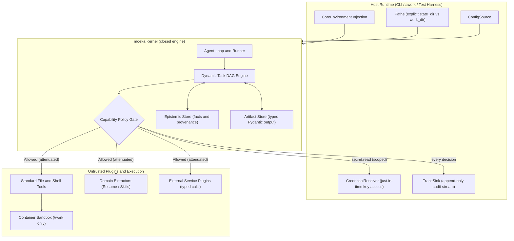
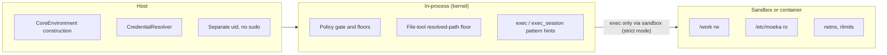
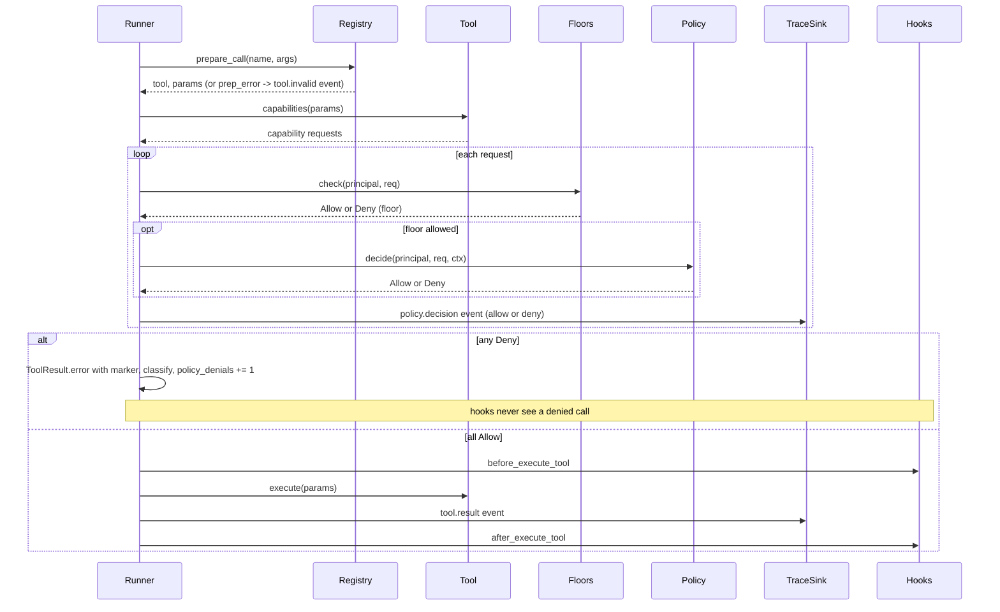
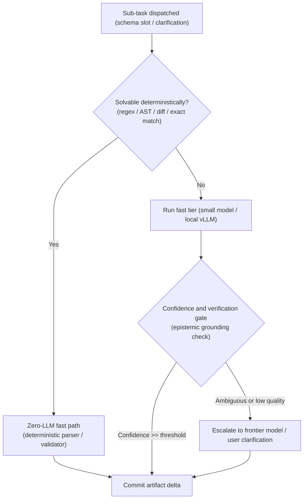
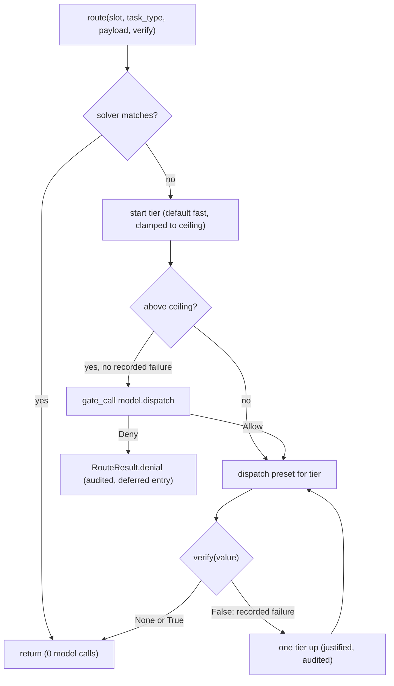
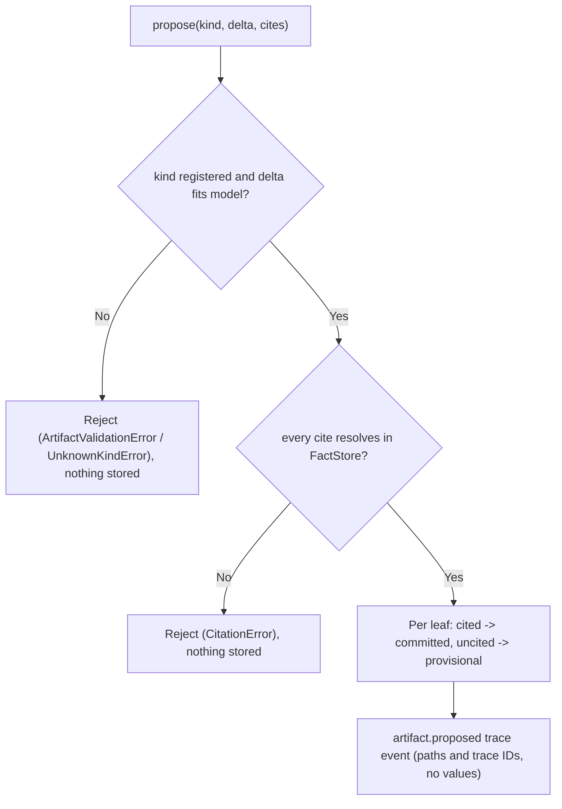
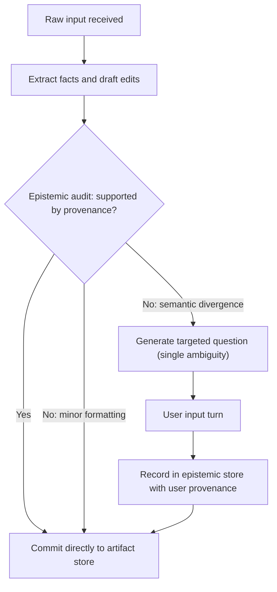
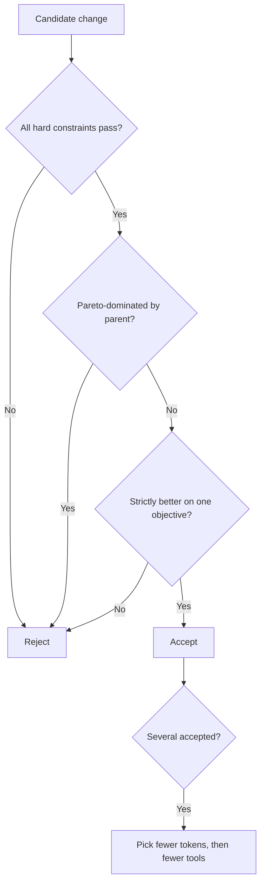
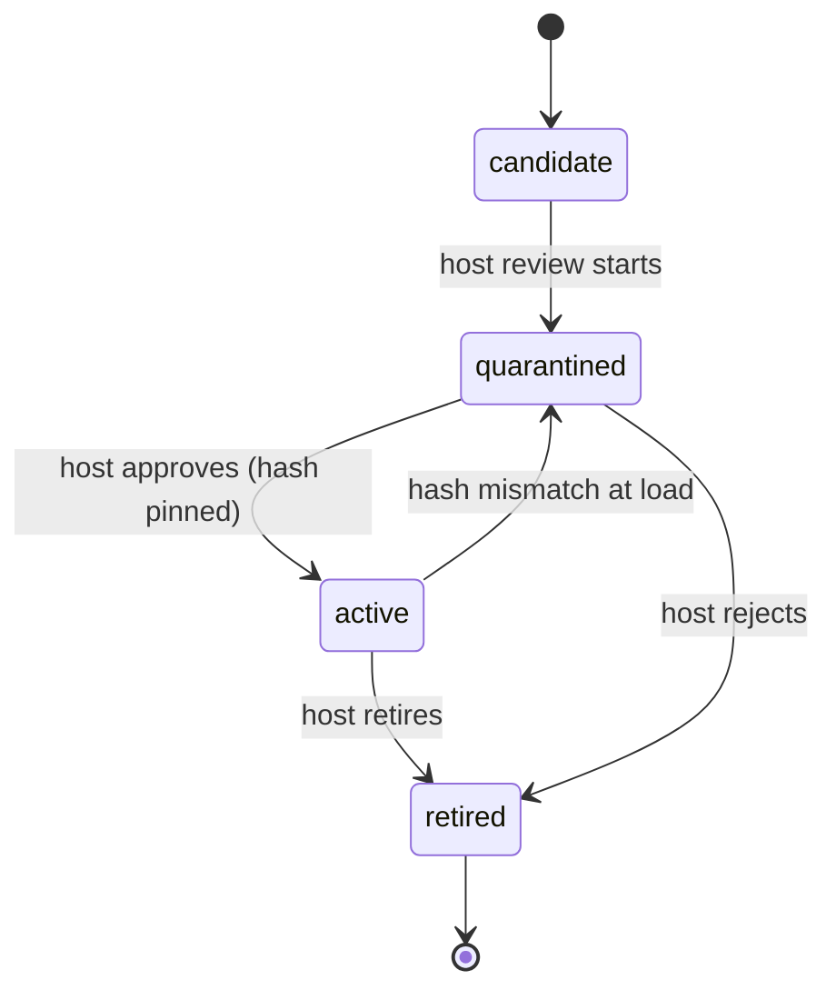
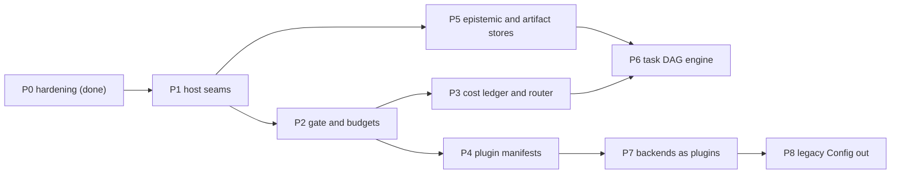

# moeka kernel: design

Naming: `MoekaKernel` is the public name; `MoekaCore` remains the real class and an alias (`nanobot.kernel` re-exports both).

Status: design plan, 2026-09-26, branch `core-slim` at `4d2a2d8a`. Nothing new here is implemented; phase 0
shipped earlier. The detailed findings, threat model and phase-0 log live in the appendix spec,
`.agent/host-plugin-permissions-design.md` ("the earlier spec"). Code facts marked (unverified) were not read.

## 1. Mission

The moeka kernel must function strictly as an embeddable, secure execution kernel that guarantees isolation, auditability, and deterministic state transitions, leaving domain logic and environment access to the host and plugins.

## 2. Architecture and boundaries

Purpose: fix what the kernel owns, what the host injects, and what runs as an untrusted plugin.

- The **host** (CLI, awork, test harness) owns every path, credential, config value and audit destination.
- The **kernel** owns the agent loop and runner, the task graph engine, the capability policy gate, and the
  generic stores for facts-with-provenance and typed artifacts.
- The kernel must provide only GENERIC mechanics: provenance records, typed artifact deltas, graph scheduling.
- The kernel never contains domain schemas. Resume extraction, skill extraction and social simulation live in
  plugins or in awork.
- **Plugins** are untrusted. They reach the environment only through the gate, with attenuated grants.
- Shell execution must run inside a sandbox plugin or container that sees only `/work`.
- Every gate decision must be emitted to the host's `TraceSink`, allow or deny.



- Changed from the owner's version: the Gate now emits to the Sink and requests from the resolver (both arrows
  were reversed), and `ConfigSource` gets an edge into the kernel.

## 3. Invariants

Purpose: the rules that no phase, plugin or self-improvement step may break.

**I1 Zero ambient reads**
- The engine must never import `os.environ`, call `os.getenv`, or read config it was not handed. Every path,
  credential and runtime flag enters through `CoreEnvironment`.
- Enforced by: the host builds `CoreEnvironment`; `LegacyConfigAdapter` does ambient reads outside the kernel.
- Proven by: an AST test over `nanobot/` that fails on a forbidden read outside the compat and CLI modules.
- Status: met for kernel modules (P1, 2026-09-27). Proof is `tests/kernel/test_no_ambient_reads.py`, an AST
  guard (docstrings and comments never match) over every `nanobot/**/*.py`, with a self-test per pattern.
- Forbidden outside the allow-list: `os.environ`/`environb`/`getenv`/`putenv`/`unsetenv` (including `import os
  as x`, `from os import environ as e`, `getattr(os, "environ")`), bare `environ.get`, `os.path.expandvars`,
  `Path.home()`, `os.path.expanduser("~...")`, `Path("~...").expanduser()`, and every ambient locator in
  `nanobot/config/{paths,loader}.py` (`load_config`, `get_config_path`, `get_state_home`, `get_data_dir`,
  `get_media_dir`, `get_runtime_subdir`, `get_legacy_sessions_dir` and the other `get_*_dir` helpers).
- Allowed: `Path(x).expanduser()` and `os.path.expanduser(x)` on a caller-supplied path.
- Allow-list (`AMBIENT_ALLOWLIST`): `nanobot/cli/` (host CLI), `nanobot/config/` (config layer: paths, loader,
  schema `workspace_path` fallback and the pydantic `NANOBOT_` env prefix), `nanobot/kernel/legacy.py` (the
  ambient adapter) and `nanobot/utils/restart.py` (host re-exec).
- One exemption (`KNOWN_EXEMPTIONS`): `nanobot/utils/path.py`, which reads the home dir only to shorten a path
  string in tool-call hints ("/home/u/x" -> "~/x").
- Env-less legacy fallbacks (`data_dir=None`, `media_dir=None`, `workspace=None`) reach ambient state only
  through named helpers in `nanobot/kernel/legacy.py` (`legacy_data_dir`, `legacy_media_dir`,
  `legacy_state_home`, `legacy_config_path`, `legacy_runtime_subdir`, `legacy_sessions_dir`,
  `process_env_snapshot`, `ambient_credential`).
- Runtime proof: `tests/kernel/test_fake_home.py` runs one strict kernel turn with a tool call under a temp
  `HOME` with every legacy env var set to a poison sentinel. It asserts no poisoned variable is looked up and
  that `os.environ` is not mutated. It also asserts the sentinel reaches no trace, log, provider payload, tool
  output or file, and that nothing is created under `$HOME` or the cwd.

**I2 Physical path separation**
- `Paths.work_dir` and `Paths.state_dir` must never overlap. Agent file and shell operations stay in
  `work_dir`; sessions, traces and policy stay in `state_dir`.
- Enforced by: a construction check, the file-tool floor, and the sandbox for shell (section 4).
- Proven by: a test that constructing the kernel with overlapping dirs raises; a test that fs tools deny `state_dir`.
- Status: partial. `Paths` rejects overlap unless `overlap_ok=True` (legacy flat layout only), and
  `CoreEnvironment(strict=True)` raises `PathsOverlapError` on overlapping paths even with `overlap_ok=True`
  (`tests/kernel/test_env.py`). Sessions,
  auth stores, `llm_usage`, plugin state and logs live under `state_dir`, while media lives under `work_dir`.
  The file-tool floor denies `state_dir` (`tests/kernel/test_paths_wiring.py`).
- Not met in legacy (non-strict) mode: shell isolation. `exec` can still reach `state_dir` by absolute path unless
  the workspace guard is on or a sandbox backend runs.
- Strict mode (P2, Checkpoint 2): a strict env refuses `exec.run` unless `tools.exec.sandbox` names an active
  backend (`bwrap`/`seatbelt`, never on Windows), so a strict kernel never runs shell without a sandbox
  (`tests/kernel/test_strict_mode.py`). The sandbox itself is the boundary; its bind-mount guarantees are the
  backend's, not re-proven here.
- The legacy adapter keeps the flat layout (workspace == state home, R1 `overlap_ok=True`).

**I3 Unearned knowledge is forbidden**
- An output schema must bind only values backed by grounded source context or explicit user confirmation.
  Unsupported inferences stay provisional flags, never committed facts.
- Enforced by: the artifact store refuses a commit whose value lacks an epistemic trace ID.
- Proven by: a test that an uncited delta is stored as provisional and never reaches the committed artifact.
- Status: built as a library, not wired (P5, Tasks 22-23).
  - `nanobot/kernel/facts.py` `FactStore`: append-only facts with provenance (`document`/`tool`/`user`),
    opaque `fact-<uuid4>` trace IDs; `resolve()` returns `None` for an ID that points to nothing.
  - `nanobot/kernel/artifacts.py` `ArtifactStore`: a host or plugin registers a pydantic model per kind;
    `propose(kind, delta, cites)` commits a leaf only when its cite resolves in the `FactStore`; an uncited
    leaf is stored provisional; a cite that resolves to nothing rejects the whole propose (nothing stored).
  - User confirmation is a `FactStore.record("user", ...)` trace ID, never a sentinel.
  - Proof: `tests/kernel/test_artifact_store.py` (an uncited delta never reaches `committed()`; every
    committed leaf's trace ID resolves; a missing-fact cite is rejected; accumulation, validation,
    persistence, concurrent threads and processes on a fresh file).
  - Limit: "committed" means the cite resolved, not that the fact supports the value (the epistemic audit
    is the caller's), and it is not proof against an exec-capable agent: `exec` bypasses the file floor
    and can forge `facts.db` or `artifacts.db`. Real containment needs a sandboxed exec backend.
  - Not wired: no gateway, `AgentLoop` or tool path records facts or proposes artifacts yet.

**I4 Strict capability attenuation**
- A child sub-agent or plugin must get only the intersection of its parent's grants and its declared manifest.
  Privileges never broaden downstream.
- Enforced by: `PermissionPolicy.attenuate` and `policy ∩ capabilities_requested` at load.
- Proven by: a property test that every child policy is a subset of its parent's.
- Status: met for sub-agents (P2, Checkpoint 2). Each child's policy is the parent's attenuated to its tools'
  static capability surface minus `session.send`, intersected with any narrower set; a foreign parent policy is
  never trusted to attenuate itself (`tests/kernel/test_subagent_attenuation.py`, including the child and
  grandchild subset property test). Plugins (manifest intersection) remain P4.

**I5 Hard failure limits**
- A turn must terminate as soon as it exceeds its step budget or 6 policy denials.
- Enforced by: `budget.iterations` and `budget.policy_denials` in the runner, with the existing
  budget-exhausted finalisation.
- Proven by: the incident replay test (a whitelist-only policy, 50 distinct commands, turn ends at 6 denials).
- Status: met (P2, Checkpoint 2). The 6-denial ceiling counts permission-policy denials and the configurable
  exec-guard layer (`allowPatterns` / `denyPatterns`), not the exec floor, and ends the turn through the
  budget-exhausted finalisation (`tests/kernel/test_incident_replay.py`, including the real
  `tools.exec.allowPatterns` incident configuration).

**I6 Pareto simplicity and cost ceiling**
- For a sub-task T with target quality tau, moeka's expected cost must not exceed the cheapest adequate
  alternative:

  ```text
  E[Cost(Moeka(T))] <= min over S in S_adequate of E[Cost(S(T))]
  S_adequate = { S | E[Q(S(T))] >= tau }
  (S examples: one zero-shot LLM call, a deterministic AST/regex parser, a static heuristic)
  ```
- A task solvable deterministically must never invoke an LLM (runtime invariant violation).
- A task solvable by a compact lower-tier model must never dispatch a frontier model (budget violation).
- I6 is a target enforced by measurement and routing, not a theorem. Section 6 lists the four enforcement parts.
- Proven by: the RSI baseline comparator per task family, and a runtime test that an over-tier dispatch is denied.
- Status: measured, routed and gate-enforced (P3, Checkpoint 3). What is built:
  - Ledger (`nanobot/kernel/ledger.py`): every call from an env-built provider is a `model.call` event with
    tokens, tier, latency, cost and `usage_source`. Pricing is keyed by `(provider, model)` (Ruling J), and an
    estimated cost is flagged (`cost_is_billed` is False), never ground truth.
  - Solvers (`nanobot/kernel/solvers.py`): `acomplete_json`, `think_structured` and the router try them first;
    a solved task makes no provider call.
  - Router (`nanobot/kernel/router.py`): solver, then the slot's start tier, then `verify`, then one tier up on
    a recorded verification failure. Over-ceiling dispatch without a recorded failure is a `model.dispatch`
    request through `gate_call` (`tests/kernel/test_router.py`).
  - Baselines (`nanobot/kernel/baselines.py`): a declared alternative per task family and `cost_ratio`.
- Still aspirational:
  - Nothing routes yet. The runner's turn loop, sub-agents and memory still call their provider directly; only
    a caller of `route` or `think_structured(slot=...)` is routed.
  - No slot has a ceiling unless the host configures `router.slots`.
  - "Adequate" is whatever `verify` says; no confidence or grounding verifier ships (P5).
  - The `E[Cost]` inequality is scored only by the RSI harness, which does not exist yet.
  - Cache-write premiums and hidden reasoning tokens are not priced (`.agent/kernel-p3-followups.md`).

## 4. Enforcement layers

Purpose: say which layer can guarantee what, so no check is trusted beyond its reach.

- **In-process checks** (gate, floors, tool-side checks) must stop well-formed tool calls and produce clean
  markers. They never hard-isolate shell commands on a shared uid.
- **Sandbox or container** must provide the real shell boundary: `/work` rw only, `/state` not mounted for the
  agent, `/etc/moeka` read-only.
- **Host** must own construction, credentials, the plugin list and OS privilege (no passwordless sudo, no
  docker group for the agent account).
- The kernel must refuse to start when `work_dir` and `state_dir` overlap.
- File tools must enforce the floor by resolved path (shipped in phase 0).
- In strict mode the kernel must refuse shell execution when no sandbox plugin is declared (fail closed).
  Implemented (P2): the gate denies `exec.run` from a tool without `sandbox_active` at layer `gate`, after the
  floors and before the policy, with the marker "strict mode requires a declared sandbox"; `ExecTool.execute`
  repeats the check before its own guard for callers that bypass the gate (`nanobot/kernel/strict.py`).
- In strict mode with an explicit policy, a tool whose whole capability surface the policy denies for every
  resource is dropped at registration (and pruned when the gate is configured later), so the model never sees
  it. Implemented (P2). A mixed, empty or undeclared surface is kept; the gate still decides per call. The
  permissive `DefaultPolicy` denies nothing everywhere, so this drops nothing by default.
- Phase 0's documented limits stand until the sandbox layer exists: exec reaches protected paths, hard links
  evade the path floor, and a symlink swap between resolve and open (TOCTOU) is open.



## 5. One tool call through the gate

Purpose: one choke point decides, audits and throttles every tool call.

- The gate must sit in `AgentRunner._run_tool` (`nanobot/agent/runner.py:1530`) and in `ToolRegistry.execute`.
- Hooks stay observers: `before_execute_tool` returns None (`nanobot/agent/hook.py:107`), so the gate is never a hook.
- A denial must be a `ToolResult.error` whose text embeds a pinned marker phrase.



**Floors** (checked before policy; no rule, flag or config removes them):
- The exec fork bomb and internal-state writes (`_FLOOR_DENY_PATTERNS`, `nanobot/agent/tools/shell.py:299`).
- The fs floor: `/proc/*/environ|mem|maps|root`, `auth/`, `plugin-data/`, the session root, the trace store, the policy source.
- The audit stream: a failing sink never turns a decision off; a fallback log record is written.
- `plugin.load` is host-only.
- A floor must never depend on an unrelated mode flag.

**June-2026 retry-loop protection:**
- Every denial carries a marker the runner already classifies; a new "blocked by permission policy" marker joins in P2.
- Repeated denials escalate on the third hit with "not configurable by the agent, stop retrying".
- The 6-denial ceiling (I5) ends the turn; the 200-iteration loop cannot recur.
- A capability denied for every resource is dropped at registration, so the model never sees the tool
  (strict mode with an explicit policy; section 4).

**Sub-agent attenuation:**
- A child's rules are the parent's rules intersected with an optional narrower set.
- Budgets are carved from the parent's remainder; `session.send` is denied by default.
- A child gets its own exec-session quota.

**Capability names** (the one table; grammar and resources are in the earlier spec, section 5):

| Capability | Checked by |
|---|---|
| `exec.run`, `exec.session_input` | exec, exec_session |
| `fs.read`, `fs.write` | file, search and patch tools, image-gen references |
| `net.fetch` | web_fetch, search backends, MCP HTTP |
| `secret.read` | resolver calls, exec `allowed_env_keys` |
| `mcp.call` | MCP wrappers |
| `plugin.load` | loader (host principal only) |
| `session.read`, `session.send` | session tools |
| `model.dispatch` (P3) | router (`nanobot/kernel/router.py`): resource is the model tier |
| `budget.iterations`, `budget.tokens`, `budget.cost_usd`, `budget.subagents`, `budget.exec_sessions`, `budget.output_bytes`, `budget.policy_denials` | runner, subagent and exec-session managers |

## 5a. Scratchpad and deferred-action log

Purpose: the agent may record what it wants to run but cannot, so a denial ends the retry and the intent is kept.

- The agent must have a scratchpad under `work_dir`: free-form notes and plans it owns and may read and write.
- The agent must have a deferred-action log under `work_dir`: an append-only record of actions it believes it
  should run but knows it cannot (blocked by the gate, missing capability, missing sandbox, missing credential).
- A deferred entry holds the intended tool call (name and typed arguments), the reason, and the capability it
  would need. It never executes.
- Every gate denial must also append a deferred entry automatically, and the denial text must say so:
  "logged as a deferred action; do not retry".
- Writing to the scratchpad or the deferred log is never a policy denial and never counts toward the
  6-denial ceiling (I5).
- The deferred log is not the audit stream. The audit stream lives in `state_dir`, is host-owned and is
  authoritative; the agent cannot read or edit it (I2).
- Content read back from the scratchpad or deferred log is untrusted text and gets the untrusted banner.
- The host or a human reviews the deferred log and may grant a capability. An entry never grants anything.
- RSI may read the deferred log as a signal of missing capabilities. It must never use it to widen a
  grant: policy stays tier 4.

## 5b. Chat and typed calls

Purpose: the kernel must work as a chatbot and make effective, typed calls to outside services.

- The kernel must run a conversational turn (message in, streamed reply out) and tool calls to outside services
  inside the same loop. Transport (Telegram, web, CLI) belongs to the host, not the kernel.
- Every outward call must be typed: a declared argument schema, validated before the gate, and a declared
  result schema, validated before the result reaches the model or the artifact store.
- Before P4 (verified): tools cast and validate arguments (`Tool.cast_params`, `Tool.validate_params`,
  `nanobot/agent/tools/base.py`; `ToolRegistry.prepare_call`, `registry.py`). No result schema existed.
- An argument that fails validation must return a structured error naming each bad field and the expected type,
  so the model repairs the call in one step instead of thrashing.
- Outside services are reached only through `net.fetch`, `mcp.call` or a service plugin, always behind the gate.
- A service plugin must declare its typed operations in its manifest (`input_schema`, `output_schema` per
  operation). The gate checks the capability; the kernel checks the types.
- A typed result that fails its schema is a tool error with a marker, never passed on as fact (I3).
- Typed results are the only values that may bind into the artifact store.
- Status: built, opt-in per tool (P4, Task 21, Checkpoint 4). What is enforced:
  - `Tool.output_schema` (default `None`). `nanobot.kernel.typed.validate_result` (re-exported from
    `nanobot.kernel.gate`) runs after `execute` on all three live call paths: `AgentRunner._run_tool`,
    `ToolRegistry.execute` and `nanobot.agent.tools.execution`. It is live for every real tool call, but it
    checks only tools that declare a schema. No built-in declares one, so built-in results are unchanged.
  - The value checked: a `ToolResult`'s `structured` payload when present, else a string parsed as JSON,
    else the Python value. Text that is not JSON fails.
  - A failing result becomes `ToolResult.error` with marker `result failed schema` and each field path
    (`temp.c: expected integer, got string`). The payload is never echoed. A `tool.result_invalid` trace
    event is emitted. It reaches `on_execute_tool_error`, never `after_execute_tool`.
  - Classification: a tool error, not a gate denial. There is no deferred entry, no `violation:*` signature
    and no I5 count, because the call was allowed and the service broke its own contract; a retry may succeed.
  - Arguments: invalid-parameter errors keep the legacy text and add `Fields to fix: <path>: expected <type>`
    (`Schema.schema_violations`, the same validator results use).
  - MCP: a server `outputSchema` becomes the wrapper's `output_schema`, and `structuredContent` is checked,
    not the bannered text. `outputSchema` without `structuredContent` fails (the MCP spec says MUST; the SDK
    raises too, and its result-schema `RuntimeError`s carry the marker). `structuredContent` without
    `outputSchema`, or neither, is legacy text, unchanged.
  - `FunctionTool(output_model=)` validates through `nanobot.api.complete._coerce_json`, the same path as
    `acomplete_json` and the solvers. It returns `ToolResult(<model JSON>, structured=<model>)`.
  - Kernel-mode plugins: the manifest `Operation` named like the registered tool binds its `output_schema`
    (result) and its `input_schema` (on top of the tool's own `parameters`). Legacy-mode plugins ignore
    manifest operations.
- Still aspirational:
  - The validator is the `Schema` subset (`type`, `enum`, bounds, lengths, `properties`, `required`,
    `additionalProperties`, `items`). `$ref`, `anyOf`/`oneOf`/`allOf` and `pattern` are accepted unchecked.
  - Kernel mode itself is opt-in (`ToolLoader(plugin_registry=...)`); no production caller passes a
    registry, so manifest operations are enforced only where a host enables kernel mode.
  - The artifact store (P5) does not exist. The contract it can rely on: a non-error result of a tool with
    an `output_schema` has passed this check.
  - Outside services are not yet forced through a typed tool: an untyped tool may still return free text.

## 6. Cost-aware routing

Purpose: every sub-task takes the cheapest path that meets its quality target (I6).



- Changed from the owner's version: the fast path now joins "Commit artifact delta" (it had no exit).

**Mechanics:**
- Deterministic bypass comes before inference: schema remapping, AST validation, regex extraction and literal
  diffs never touch an LLM.
- Speculative cascading with early exit: simple extraction defaults to a light or local model; a high tier runs
  only on an explicit verification failure or low epistemic confidence.
- Complexity-bounded subgraphs: the DAG engine rejects a multi-hop decomposition when one direct prompt satisfies
  the schema.
- Token overhead gating: tool schemas and system prompts stay lean; a plugin never injects unbounded context or
  redundant descriptions without a budget justification.

**How I6 is measured:**
- A deterministic-solver registry per task type; the router must check it first.
- A per-call cost ledger through the `TraceSink`: tokens, model tier, latency, cost, and whether the usage was
  billed or estimated.
- A baseline comparator in the RSI evaluation harness: each eval task family declares its minimal adequate
  alternative (one zero-shot call, a regex/AST parser), and moeka is scored against it.
- A runtime rule: dispatching a tier above the slot's ceiling without a recorded verification failure is denied
  (`model.dispatch`) and audited.

**The router as built (P3):**
- `route(slot, task_type, payload, verify=...)` in `nanobot/kernel/router.py`. `MoekaKernel.think_structured`
  routes when it gets `slot=`, `verify=` or `tier=`, and is unchanged without them.
- Tier ladder: the model presets that declare a `tier`, cheapest first (`local < fast < standard < frontier`),
  with the first preset per tier. A config with no tiered preset dispatches the active preset untiered.
- Ceilings: `router.slots.<slot>.ceiling` in the host config. No entry means no ceiling and no
  `model.dispatch` check, which is the default for every slot.
- The start tier is the slot's `start` or an explicit `tier=`. Otherwise it is `fast`, clamped to the ceiling.
- `verify` returning False (or raising) is a recorded failure. It escalates exactly one configured tier up, at
  most `max_escalations` times (default 1). A justified escalation may pass the ceiling: it is audited
  (`check="justified"`) but the policy is not asked.
- An over-ceiling dispatch without a recorded failure calls `gate_call` with capability `model.dispatch` and
  the tier as resource. That means floors, `policy.decide`, a `policy.decision` event, and a deferred-log entry
  on a Deny.
- `policy=None` enforces the ceiling (deny). A host policy decides otherwise, and the permissive
  `DefaultPolicy()` allows. The deny is at layer `policy`. The router runs outside a turn, so it charges no I5
  budget.
- Every decision emits one `model.route` event (`reason`, `check`, `verdict`, `from_tier`). Model calls run
  under `llm_usage_slot(slot)`, so each `model.call` ledger event carries the slot.



## 7. Epistemic grounding and clarification

Purpose: facts enter the artifact only with provenance, and the user is asked only when it matters.

- Every committed value must cite an epistemic trace ID: a user document span, a tool output, or a user turn.
- A minor formatting divergence commits without a question.
- A semantic divergence must produce exactly one targeted question about a single ambiguity.
- The user's answer is recorded with user provenance before the commit.
- Unanswered or unsupported values stay provisional flags (I3).
- Built mechanics (Tasks 22-23, library only): the "Record ... with user provenance" step is
  `FactStore.record("user", <turn ref>, answer)`; the "Commit" step is `ArtifactStore.propose` with that trace
  ID as the leaf's cite. The epistemic audit and the question loop are not built (Tasks 24-25).
- Built mechanics (Task 24, library only, `nanobot/kernel/clarify.py`):
  - `resolve_divergence(Divergence, classify=)` is a pure decision: `CommitReady` (minor) or one
    `Question` (semantic); it writes no store and asks no user;
  - the default classifier is deterministic and LLM-free (I6): equal after whitespace collapse and
    `casefold()` (recursing into lists and dict values, exact types) is minor; anything else is semantic;
  - no known source (`known_trace_id` unset) is always a question; the classifier is not consulted;
  - a minor result commits the KNOWN value with its fact's cite, never the reformatted draft;
  - the classifier is pluggable (`ClassifierFn`); a label other than `minor`/`semantic` raises;
  - one divergence in, at most one question out; there is no batch or merge function, so two
    ambiguities are two questions; asking them one at a time is the (unbuilt) turn loop's job;
  - `record_answer` records `FactStore.record("user", turn_ref, answer)`, then `propose`s it citing
    that trace ID.
- `propose` semantics:
  - merges leaf by leaf into the artifact; never replaces it wholesale;
  - a commit replaces the committed value and cite at that leaf and clears its provisional value;
  - an uncited change to a committed leaf stays a provisional pending edit; the committed value is kept;
  - every leaf, cited or not, must fit the kind's model (unknown fields and type errors are rejected);
  - each leaf is validated through the model's own validator (`validate_assignment` on a `model_construct()`
    instance): field validators, constraints and `strict` config apply, and the stored value is the model's
    own dump, so `committed()` and `committed_model()` agree;
  - `register_kind` refuses a model with a `@model_validator` on any walked model (cross-field checks cannot
    run per leaf); a model inside a single leaf (`list[M]`) is validated whole and is allowed;
  - a nested model instance (of the field's model) in a delta is walked like a dict of the fields it set;
    an unrelated model instance is rejected, not duck-typed;
  - a nested-model field the parent hooks (its own `@field_validator`/`@field_serializer` or Annotated
    validator) is one whole leaf, not walked, so the parent's validator runs on the whole value;
  - limit: a field validator reading `info.data` sees only defaults for the other fields, never the
    artifact's other committed or provisional leaves;
  - `committed()` is a partial dict; `committed_model()` requires every required field committed.





## 8. Objectives for self-improvement

Purpose: define what RSI (recursive self-improvement: the harness that mutates and re-scores moeka) optimises
and when it may accept a change.

**Hard constraints** (a candidate failing any one is rejected):
- I1-I5 never regress.
- Floors and tier-4 files are untouched.
- Held-out tests stay hidden from the mutator.

**Pareto objectives:**
- Quality on held-out tasks (maximise).
- Cost per solved task (minimise; the I6 ledger).
- Provenance rate: every artifact mutation cites a trace ID from a document, tool output or user input (maximise).
- Clarification yield: questions only where ambiguity drives high downstream variance, none for trivial edits (maximise).
- Denial rate: invalid calls rejected with structured markers that guide recovery (minimise thrashing).
- Latency: stream read-only planning speculatively while gate checks run in parallel (minimise).
- Ambient leakage stays a hard zero: no credential in the agent's child environment; keys come just in time.

**Acceptance rule:**
- A candidate is accepted only if it passes every hard constraint, is not Pareto-dominated by its parent, and is
  strictly better on at least one objective.
- Ties between accepted candidates break toward fewer tokens, then fewer tools.
- The paired-margin gate and the cascade tiers live in `.agent/rsi-harness-design.md` (branch
  `rsi-harness-spec`); the cost dimension is added to that gate.



## 9. Plugins and trust

Purpose: a plugin runs only when the host activated it at a pinned hash, and the mutator edits only tier 1.



**Tiers:**
- Tier 1: skills, prompts, tool descriptions, tuning config. Automated edits behind the harness gate.
- Tier 2: plugin code. Sandboxed and gated; not in RSI v1.
- Tier 3: core code. Human-reviewed proposals only.
- Tier 4: policy, sandbox, evaluator, resolver, plugin list and hash pins. Never self-editable.

**Manifest fields:** `name`, `kind`, `version`, `version_hash`, `tier`, `capabilities_requested` (an upper
bound; the grant is `policy ∩ requested`), `config_schema`, `entry`, `descriptions`.

- Every lifecycle transition is a host action with an audit event.
- A name collision between plugins is a load error.

## 10. Phases

Purpose: the build order, each phase with a proof.

- The order below is an owner decision (recommended default).
- Renumbered from the earlier spec: old P1 -> P1, old P2 -> P2, old P3 manifests -> P4, old P4 backends -> P7,
  old P5 legacy Config -> P8.



**P0 hardening (done).** File-tool floor, `exec_session` guard, redaction, banners, SSRF ranges, grep worker,
bounded exec output. See the earlier spec, "Phase 0 outcome".

**P1 host seams.** Goal: the kernel reads nothing ambient.
- Resolve Q5: `Paths.state_dir` and `Paths.work_dir` are separate explicit attributes everywhere; test and
  production defaults point to separate paths.
- Add `CoreEnvironment(ConfigSource, CredentialResolver, Paths, TraceSink)`; remove `keys.env`, `os.environ` and
  `load_config()` from kernel modules; providers request keys on demand through the resolver.
- Add the AST guard test for ambient reads outside authorised compat modules.
- Wrap legacy config in `LegacyConfigAdapter` with an in-memory resolver; the floor takes its roots from `Paths`.
- Proof: AST guard green, fake-HOME test creates nothing under `$HOME`, awork suite green.
- Proof status (Checkpoint 1, 2026-09-27): AST guard and fake-HOME test green, and the full suite passes.
  The awork suite has the same 8 failures as before P1 (awork's venv lacks `rapidfuzz`), with no new failure.
  Deferred minors: `.agent/kernel-p1-followups.md`.

**P2 gate and budgets.** Goal: one audited choke point with hard limits.
- `PermissionPolicy` with default parity, floors, the gate at both call paths, audit events.
- `budget.policy_denials = 6` and `budget.iterations` end the turn (I5).
- Sub-agent attenuation (I4); strict mode refuses shell without a sandbox plugin.
- Scratchpad and deferred-action log (section 5a); every denial appends a deferred entry.
- Proof: incident replay ends within 6 denials; a denied call never reaches a hook (spy); child policy subset property test; a denied call leaves one deferred entry and no denial is counted for log writes.
- Proof status (Checkpoint 2, 2026-09-27): all green. `tests/kernel/test_incident_replay.py` (both the
  whitelist-only policy and the real `allowPatterns` configuration stop at 6), `test_gate.py`
  (`test_runner_denied_call_never_reaches_hooks_or_tool`), `test_subagent_attenuation.py` (subset property),
  `test_deferred_log.py`, and `test_strict_mode.py` (strict exec refusal, fully-denied tools dropped, no change
  under the permissive default). The full suite passes; the awork suite keeps the same 8 pre-existing failures.
  Deferred minors: `.agent/kernel-p2-followups.md`.

**P3 cost ledger and router.** Goal: I6 is measured and enforced.
- Per-call ledger events (tokens, tier, latency, cost) through the `TraceSink`.
- Deterministic-solver registry checked before any model call; tier ceilings per slot via `model.dispatch`.
- Proof: a registered deterministic task makes zero model calls; an over-tier dispatch without a recorded failure is denied and audited.
- Proof status (Checkpoint 3, 2026-09-27): all green.
  - `tests/kernel/test_solvers.py` and `test_router.py` show that a solved task builds no provider and makes
    no dispatch.
  - `test_router.py` shows an over-ceiling dispatch without a recorded failure is denied at the policy layer
    with `POLICY_MARKER`. It emits `policy.decision` and `model.route` events and leaves a deferred entry. A
    justified escalation never asks the policy, and no ceiling means no check.
  - `test_router.py` has a regression test for the Ruling J shared-model misattribution, including a real
    failover.
  - The full suite passes, and the awork suite keeps the same 8 pre-existing failures.
  - Deferred minors: `.agent/kernel-p3-followups.md`.

**P4 plugin manifests.** Goal: host-activated, hash-pinned plugins.
- Manifests, per-plugin config validation, host plugin list plus entry points, quarantine on hash mismatch.
- Host-authenticated activation; the unsigned marker is rejected; tool descriptions become data files.
- Manifests declare typed operations (`input_schema`, `output_schema`); results are validated before use (section 5b).
- Proof: a changed description hash quarantines the plugin; an exec-written marker does not activate it; a service result that violates its schema is a tool error and never reaches the artifact store.
- Proof status (Checkpoint 4, 2026-09-27): all green.
  - `tests/kernel/test_plugin_registry.py` and `test_loader_integration.py` show that a changed package or
    description hash quarantines the plugin and never imports it. They also show that an exec-written or
    legacy "enabled" marker does not activate it: only a host-principal `activate` at the on-disk hash does.
  - `tests/kernel/test_descriptions_data.py` and `test_description_golden.py` show that built-in and plugin
    descriptions are hashed data files, byte-identical to the old strings.
  - `tests/kernel/test_typed_results.py` shows that a result violating its `output_schema` (direct, MCP,
    `FunctionTool`, or a kernel plugin's manifest operation) becomes a `result failed schema` tool error on
    every call path before any success hook sees it. A tool without a schema is unchanged. There is no
    artifact store yet (P5), so "never reaches the artifact store" holds because nothing downstream receives
    a failed result as a success.
  - The full suite passes (5647), and the awork suite keeps the same 8 pre-existing failures.
  - Deferred minors: `.agent/kernel-p4-followups.md`.

**P5 epistemic and artifact stores.** Goal: I3 holds by construction.
- Generic fact records with provenance (trace ID, source kind, span).
- Artifact store accepts typed deltas; uncited values stay provisional.
- Proof: an uncited delta never reaches the committed artifact; every committed value resolves to a trace ID.
- Status: Tasks 22-23 done as a library (`nanobot/kernel/facts.py`, `nanobot/kernel/artifacts.py`); see I3.
  `facts.db` and `artifacts.db` (with SQLite sidecars) are behind the file floor in both layouts.

**P6 task DAG engine.** Goal: decomposition only when needed.
- Decompose on executor failure, not up front; independent nodes run in parallel.
- Reject multi-hop decomposition when one direct prompt satisfies the schema.
- Proof: a task solvable in one call produces a one-node graph; every node's tool call passes the gate.

**P7 backends as plugins.** Goal: providers, search, sandbox, stores and token stores are plugins.
- Provider router plugin with a golden parity table for `_match_provider`.
- OAuth stores reachable only through the resolver.
- Proof: provider, session and kernel test suites green with the parity table.

**P8 legacy Config out of the kernel.** Goal: `Config` lives in compat only.
- Move `nanobot/config/schema.py` to compat with re-exports at old paths.
- Proof: `import nanobot.core` imports no `nanobot.config.schema` unless `config=` is passed; awork green.

**awork compatibility (hard requirement for every phase):**
- Stay importable: `nanobot.config.schema.Config`, `nanobot.api.complete` functions (looked up at call time),
  `MoekaCore.scoped/create/run`, `AgentHook`, `AgentProfileConfig`, `nanobot.core.vec.open_vec_store`.
- Gate command: `cd ~/projects/awork/backend && PYTHONPATH=/home/muk/projects/moeka-core-slim .venv/bin/python -m pytest tests/ -q`.
- Current state: 8 awork failures come from awork's venv lacking `rapidfuzz`; the fix is on awork's side (bump
  its moeka submodule, then `uv sync`).

## 11. Reading pointers (unverified leads)

Rule: no design decision, invariant or number in this document rests on a cited paper; each pointer must be
read and confirmed before anyone relies on it.

- Earlier citation errors prove the IDs need checking: 2407.03502 is a different paper (AgentInstruct),
  2211.08411 was not RARR, 2308.11534 is PlatoLM, one title was misquoted, and one cost figure was not in its abstract.
- Lead: ADaPT: As-Needed Decomposition and Planning with Language Models, arXiv:2311.05772; about decomposing
  only when the executor fails, relevant to P6.
- Lead: An LLM Compiler for Parallel Function Calling (LLMCompiler), arXiv:2312.04511; about planning a dependency
  graph of function calls for parallel execution, relevant to P6.
- Lead: CREATOR: Tool Creation for Disentangling Abstract and Concrete Reasoning of Large Language Models,
  arXiv:2305.14318; about LLMs writing their own tools, relevant to tier-2 plugin authoring.
- Lead: Voyager: An Open-Ended Embodied Agent with Large Language Models, arXiv:2305.16291; about a growing
  library of verified skills, relevant to tier-1 skill evolution.
- Lead: FacTool: Factuality Detection in Generative AI -- A Tool Augmented Framework for Multi-Task and
  Multi-Domain Scenarios, arXiv:2307.13528; about tool-assisted fact checking, relevant to P5.
- Lead: RARR: Researching and Revising What Language Models Say, Using Language Models, arXiv:2210.08726; about
  finding evidence and revising unsupported claims, relevant to P5.
- Lead: Enabling Large Language Models to Generate Text with Citations (ALCE), arXiv:2305.14627; about citation
  support in generated text, relevant to the provenance objective.
- Lead: FrugalGPT: How to Use Large Language Models While Reducing Cost and Improving Performance,
  arXiv:2305.05176; about LLM cascades for cost, relevant to P3.
- Lead: RouteLLM: Learning to Route LLMs with Preference Data, arXiv:2406.18665; about learned routers between
  strong and weak models, relevant to P3.
- Lead: Large Language Model Cascades with Mixture of Thoughts Representations for Cost-efficient Reasoning,
  arXiv:2310.03094; about escalating on weak-model answer inconsistency, relevant to the confidence gate.
- Lead: UCCI: Calibrated Uncertainty for Cost-Optimal LLM Cascade Routing, arXiv:2605.18796; about calibrating
  cascade escalation thresholds, relevant to P3 (single-workload study).

## 12. Decisions for the owner

Each item carries the recommended default.

Decided by the owner (2026-09-26):
- Phase order P1-P8 as in section 10.
- `CredentialResolver.resolve(ref, scope)`, because scope lets the resolver refuse cross-plugin reads.
- The agent gets a scratchpad and a deferred-action log (section 5a).
- Social simulation is out of scope for the kernel. The kernel must serve as a chatbot that makes typed calls
  to outside services (section 5b).

Still open:
- `Paths` derivation. Default: two host attributes; `sessions_root`, `data_dir` and `logs_dir` are
  subdirectories of `state_dir`; `media_dir` sits under `work_dir`, because agent-visible attachments and
  generated media must be reachable by the agent. Owner may veto.
- AST guard and `open_vec_store`. Default: the guard forbids ambient reads (`os.environ`, `os.getenv`,
  `load_config(`, `get_state_home(`, `get_data_dir(`, `Path.home()`, `~` expansion, implicit default DB
  paths); `open_vec_store` stays a public factory that requires an explicit path. Its signature already
  requires `db_path` (`nanobot/core/vec.py:38`). Owner to confirm.
- Who builds the deterministic-solver registry. Default: plugins register solvers per task type; the kernel
  owns only the lookup.
- Q5 flat layout, Q6 `restrict_to_workspace` default, Q8 Jina default, Q12 plugin activation, Q13 config edits:
  defaults and reasons are in the earlier spec, section 11.

## 13. Appendix pointers

- The earlier spec: `.agent/host-plugin-permissions-design.md` (threat model, findings, phase-0 log, interfaces,
  awork call sites, harness implications).
- Phase-0 follow-ups: `.agent/phase0-followups.md` (deferred limits and owners).
- RSI harness design: `.agent/rsi-harness-design.md` on branch `rsi-harness-spec` (paired-margin gate, cascade tiers).
