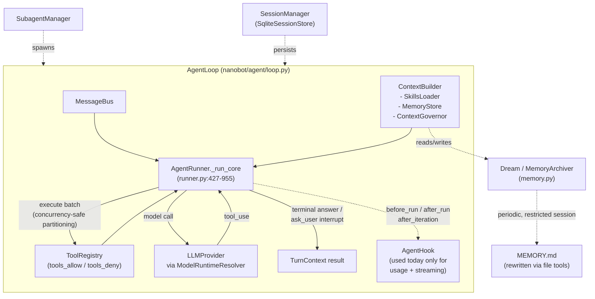
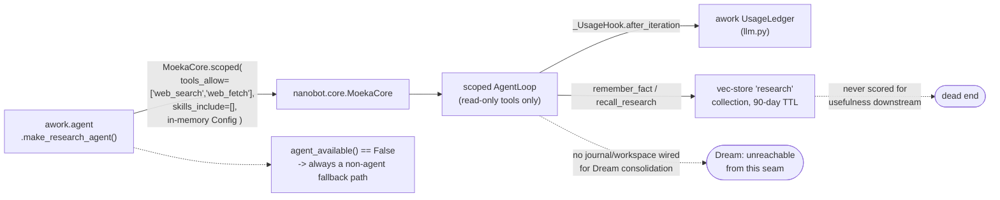
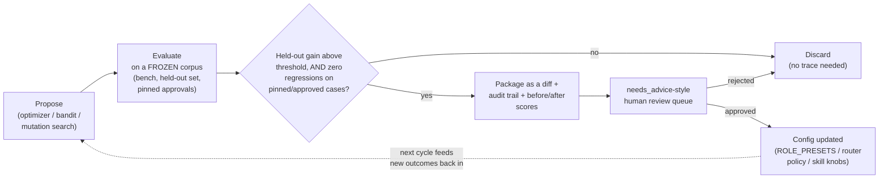

# Closing the loop on moeka: RSI potential, agent-core seams, and awork's open feedback loops

*Experiment report — 2026-09-24. No live LLM calls were made anywhere in this
work; every "outcome," "preference," and "cost" value in the three experiments
below is a deterministic synthetic stand-in for a real signal. The finding is
about loop *shape* and safety gating, not a claim about real weights, costs,
or model choices. Full findings doc this report was built from:
`/tmp` scratch research (not checked in) plus direct code reading, cited
file:line throughout.*

Companion artifact (styled, with rendered diagrams):
https://claude.ai/artifact/Uk6VPjY2UjTrc18WyhVRQH

## 0. The one-line version

moeka already has almost every piece a self-improving agent core would need —
a hook for scoring turns, a loop that already rewrites its own memory
(`Dream`), tool-restriction as a first-class primitive. awork (moeka's only
real consumer today) already has almost every piece a self-improving
*pipeline* would need — a 28-case benchmark, a cost ledger, an MCDA scorer
with tunable weights, an approval/lineage system. **Neither system's feedback
data reaches the other's decisions.** There is exactly one place in the
codebase where someone already built the missing wire — a weight-learning
module — and it was deleted one commit later. That's a fact from `git log`,
not a hypothesis.

## 1. moeka today: what an "agent" actually is

moeka (package name `nanobot`, this repo, a fork of upstream nanobot) is a
real agent-loop runtime, not a thin LLM wrapper. One `AgentLoop` per running
session hosts a model-call → tool-execution → repeat cycle, scoped by a small
config object rather than by subclassing.



"Agent" = an `AgentLoop` scoped by an `AgentProfileConfig`
(system_prompt / tools_allow / skills_include). Persona is a prompt string;
skills are markdown files or in-memory `InlineSkillConfig` objects.

### The one self-modification loop that already exists

`Dream` is moeka's only built-in "the system rewrites its own state from its
own operation" mechanism (`nanobot/agent/memory.py`, `MemoryArchiver`/
`Consolidator`, ~lines 59-850): a periodic, tool-restricted sub-session reads
the accumulated interaction journal and edits `MEMORY.md` directly via file
tools, committing against the real working-tree diff (`_dream_commit_message`,
memory.py:797). It's real RSI in miniature — bounded blast radius (one file),
grounded in actual history, auditable via git. But it only ever touches
free-text memory notes. It has never been pointed at a prompt, a skill file,
or a tool weight.

### The seam nothing uses yet

`AgentHook` (`agent/hook.py`) exposes `before_run` / `after_run` / `on_error`
/ `after_iteration` — a clean, generic place to say "score what just
happened." Today every implementation of it just accumulates usage or
forwards a stream. Nothing scores a turn as good or bad and writes that
judgment anywhere. This is the single cleanest lever moeka could offer any
downstream host for self-improvement, sitting unused.

## 2. The awork seam: a well-behaved but starved consumer

awork uses moeka at three depths — a one-shot completion router, loop-less
vector-store access, and one real agent loop (`ResearchAgent`, built in
`backend/awork/agent.py`, 476 lines). The interesting part is how carefully
it's fenced in.



Constraints are enforced at moeka's own tool-discovery layer (not
post-filtered by awork) — the right shape for a general primitive. Provider
keys pass through an in-memory `Config` (`_config_source`, agent.py:447-462),
never env vars, specifically to avoid a leak class awork's own project memory
already flagged once.

This is a good example of a host using an agent core *well*: read-only tool
allowlist enforced structurally, persona injected as a plain prompt, graceful
fallback everywhere (`agent_available()`, agent.py:159-165). What's missing
isn't discipline — it's a return path. The agent's own memory cache
(`remember_fact`/`recall_research`, agent.py:399-444) is never checked
against whether the research it produced ended up in something that shipped;
facts age out on a fixed 90-day TTL (`RESEARCH_STALENESS_DAYS`, agent.py:47),
never on measured usefulness. Dream, the one piece of moeka built exactly for
"learn from operation, rewrite your own state," is never given a workspace to
write into from this seam (`make_research_agent`, agent.py:322-346 always
uses an ephemeral or bare `memory_dir`), so it can't run here at all.

## 3. awork's feedback infrastructure — richer than expected, wired to nothing

Independent of moeka, awork's resume pipeline already measures a lot about
itself. None of these measurements feed each other.

| Component | File | Measures | Feeds back into |
|---|---|---|---|
| Usage/cost ledger | `backend/awork/llm.py:245+` (`UsageLedger`) | token cost per completion, tagged by pipeline stage, budget-guarded | `manifest.json` |
| Benchmark driver | `backend/awork/bench/driver.py` | 28-case labelled JD corpus, per-arm cost + deterministic honesty/coverage scorecard | a human reading a report |
| Deterministic scorecard | `bench/scorecard.py:1-19` | ranks on honesty -> parse -> keyword coverage -> bullet count, in that order; explicitly refuses to rank on `confidence.py`'s ~52% LLM-judged score | nothing — no calibration loop against confidence.py |
| MCDA project scorer | `compose/score.py:722-750` | `S_p = sum(w_k * c_k) - wX*X` over R/E/I/D/C/F/K/H/X | weights = `ROLE_PRESETS` (score.py:727-734), a hardcoded dict, no config/YAML source |
| Rewrite lineage | `bullet_meta[].swapped_from` (`library_store.py:533-590`) | full swap history per bullet | dedupe check only (`assemble.py:615-631`) — never mined for which rewrites survive review |
| Approval states | `compose/library.py:47-320,1070-1128` | approved / rejected / needs_advice / unreviewed | one structural rule (last-surviving-variant promotion), not a measured one |
| Application lifecycle | `apply/tracker.py` | throughput only — applications/day, session time, jobs/hour | **no outcome field anywhere** — no interview/offer/rejection in the schema |

### The finding that matters most

`git log` shows `backend/awork/compose/weight_learning.py` and
`sensitivity.py` were **added** in commit `be5aa17` — the evidence-selection
system that built the MCDA scorer itself — and **deleted** in the very next
commit that touched them, `f5b0378` ("chore: accumulated backlog"). Only
stale `.pyc` files remain (`compose/__pycache__/{weight_learning,sensitivity}
.cpython-312.pyc`); no `.py` source exists today.

This isn't "nobody thought of it." A self-tuning loop over `ROLE_PRESETS` was
built and then removed during a cleanup pass — probably because nothing
consumed it yet, or it wasn't trusted enough to gate. Either way, the hard
part (the optimizer) already existed once.

## 4. Nine open loops, precisely located

1. **bench never updates `ROLE_PRESETS`** *(removed)* — bench already scores
   the exact corpus the deleted `weight_learning.py` was built to learn from.
   `compose/score.py:727-734`, `bench/driver.py`, `compose/weight_learning.py`
   (deleted, `be5aa17`→`f5b0378`).
2. **`confidence.py` vs. `scorecard.py` disagree, and nobody calibrates
   them** — the deterministic scorecard explicitly refuses to rank on the
   LLM-judged confidence score because of renormalization bias, but nothing
   checks how often they actually disagree on the same corpus.
   `bench/scorecard.py:6-9`.
3. **Rewrite lineage is recorded, never mined** *(unused)* — every swap
   appends to `bullet_meta[].swapped_from`; every consumer only checks "have
   we seen this exact phrasing before," never "which kind of rewrite tends to
   survive." `library_store.py:533-590`, `assemble.py:615-631`.
4. **`needs_advice` -> `approved` promotion is structural, not measured** —
   promotes on "nothing else survived," never on "this phrasing pattern tends
   to get approved." `compose/library.py:1070-1128`.
5. **`apply/tracker.py` has no outcome field** *(unused)* — throughput only.
   No interview, no offer, no rejection anywhere in the schema, so nothing
   upstream can ever be validated against the signal that actually matters.
   `apply/tracker.py` — `daily_counts`/`sessions`/`summary`/`build_tracker`.
6. **`ResearchAgent`'s memory cache is never scored** — facts age out on a
   fixed 90-day TTL, never on measured usefulness. `agent.py:399-444`,
   `RESEARCH_STALENESS_DAYS` at `agent.py:47`.
7. **`AgentHook` is the cleanest seam in moeka and is unused for scoring**
   *(open seam)* — `before_run`/`after_run`/`after_iteration` exist purely
   for usage accounting and streaming today, in both moeka's own tests and
   awork's use of it. `nanobot/agent/hook.py`.
8. **Cost-by-stage and quality-by-case never get joined** — `UsageLedger`'s
   per-stage breakdown and bench's per-case scorecard are both real, both
   rich, and live in separate artifacts with no code correlating "is this
   stage's cost buying its quality." `llm.py:450+` vs. `bench/driver.py:44-56`.
9. **Dream is structurally unreachable from the only real agent loop awork
   runs** *(unused)* — `ResearchAgent` always constructs an ephemeral or bare
   `memory_dir`, with no journal/workspace wired for consolidation, so
   moeka's actual self-rewrite mechanism never gets to run in awork at all.
   `agent.py:322-346`.

## 5. Three mocked experiments

No LLM was called anywhere below — every "outcome," "human preference," and
"cost" is a deterministic synthetic model standing in for the real signal, so
each experiment tests the *shape of the loop*, not a claim about real weights
or real costs. All three ran locally as plain Python (scripts not checked in;
available on request).

### Experiment 1 — closing the ROLE_PRESETS loop

Target: `score.py`'s hand-tuned weight dict. A synthetic corpus of 240 scored
bullets carries a hidden "true preference" that secretly overweights keyword
coverage (K) and evidence quality (E) relative to the hand-tuned prior — the
kind of drift real JD requirements create over time without anyone revisiting
the weights. A coordinate-ascent optimizer (no gradients, no LLM — just "try
nudging each weight, keep the nudge if it improves held-out agreement")
searches for better weights on a training half and is checked against a
held-out half.

```
baseline weights : {R: 0.35, E: 0.20, I: 0.15, D: 0.15, C: 0.10, F: 0.05, K: 0.00, H: 0.00, X: 0.20}
tuned    weights : {R: 0.00, E: 0.22, I: 0.07, D: 0.07, C: 0.04, F: 0.01, K: 0.26, H: 0.06, X: 0.18}

baseline agreement  train=0.640  test=0.626
tuned    agreement  train=0.994  test=0.993

held-out improvement: +0.367

GATE: held-out gain 0.367 >= 0.03 -> flag for human review as a
      `needs_advice`-style weight-change PR. NOT auto-applied.
```

The optimizer independently rediscovered that K mattered and that R didn't —
the exact structure of the hidden ground truth — using only pairwise ranking
agreement as its signal. The gate at the bottom is the point: a real version
of this would open a PR with a diff and a before/after score, never touch
`ROLE_PRESETS` on disk itself.

### Experiment 2 — agent-core routing as a bandit

Target: the observation in awork's own project memory that "cheaper-per-token
!= cheaper-per-build" (Haiku beat Sonnet on some archetypes, lost on others,
because of retries). A synthetic cost model gives each model arm a per-token
price and an archetype-dependent retry tax. A naive global UCB1 bandit (no
archetype awareness) is compared against a contextual variant (one bandit per
JD archetype — a signal awork's `jd_fit` taxonomy already computes).

```
-- naive global bandit (no archetype context) --
pulls: {haiku: 293, sonnet: 6, opus: 1}
observed avg cost (blended): {haiku: 2.03, sonnet: 3.32, opus: 16.08}
-> collapses onto haiku overall -- never gets enough hard-only signal
   to learn otherwise

-- contextual bandit: one policy per archetype --
archetype=easy    -> converges to: haiku   (ground truth: haiku, 1.04)
archetype=medium  -> converges to: haiku   (ground truth: haiku, 1.84)
archetype=hard    -> converges to: sonnet  (ground truth: sonnet, 4.74 vs haiku 5.49)
```

The naive router loses money silently on hard JDs because they're a minority
of traffic and its exploration budget gets spent elsewhere. The
archetype-aware router recovers the actual crossover. This is the argument
for moeka exposing routing as a first-class, context-keyed policy object
rather than awork hardcoding one model choice — a static choice can't
discover a crossover it was never told to look for.

### Experiment 3 — a safe self-modification loop, end to end

The closest thing here to literal RSI: an agent proposes a change to its own
configuration (a toy "skill" — two numeric rewrite knobs), tries the
mutation, and it's only kept if it survives a frozen held-out check *and* a
non-regression check against cases a human already approved. This mirrors
two rules already load-bearing in awork: never pre-approve, and never
silently break lineage-protected bullets.

```
start skill        : {trim: 0.20, frontload: 0.90}
baseline held-out  : 36.29
searched-to skill  : {trim: 0.229, frontload: 0.856}
searched held-out  : 47.37  (internal search gain: +11.08)

internal search steps accepted: 3/60
steps rejected specifically for pin-regression: 21
  example: candidate {trim: 0.274, frontload: 0.90} scored 45.02 on held-out
           but was rejected -- would regress a pinned, human-approved case
           by 4.48 points.

OUTER GATE: internal gain 11.08 >= 1.0 ->
  package as a diff + audit_log + before/after scores, surface as a
  `needs_advice`-style review item. The skill config on disk is NOT touched.
```

21 of 60 candidate mutations looked good on the aggregate benchmark and were
still rejected because they would have broken a case a human had already
signed off on. That's the whole safety argument for RSI in this codebase in
one number: aggregate improvement is necessary but not sufficient — a
self-edit that regresses anything under lineage protection has to be vetoed
regardless of its overall score.

## 6. The pattern all three experiments share



Propose -> evaluate-on-frozen-data -> gate on (gain AND no regression) ->
human review -> promote. No step auto-ships. This is the shape every closed
loop in this report takes — it's also exactly the shape awork's existing
approval/lineage system already enforces for content, just not yet for
weights, routing policy, or skills.

The reason to insist on this shape rather than a tighter, faster loop:
awork's own history already contains the counter-example. The weight-learning
module that was built once and deleted didn't fail because the optimization
was wrong — the experiments above suggest a coordinate-ascent approach
recovers real structure. It's more likely it was removed because nothing
gated its output into something a human could safely review and reject, so it
either had to auto-apply (too risky to trust) or sit unused (which is what
eventually happened to the whole module).

## 7. Recommendations

1. **Rebuild weight-learning as a gated bench post-process, not a runtime
   path.** *(small, reuses deleted design)* Re-add a `weight_learning.py`
   equivalent that runs *after* `awork bench`, scored against the
   scorecard's honesty/coverage ranking (never against `confidence.py` —
   scorecard already explains why), gated exactly like Experiment 1's
   threshold + held-out split, and output as a reviewable diff to
   `ROLE_PRESETS` rather than a live override. This is the one recommendation
   with direct historical evidence it was almost built.

2. **Give moeka an outcome-scoring hook, not just lifecycle hooks.**
   *(medium, moeka core change)* `AgentHook` already has the right shape
   (`after_iteration`/`after_run`); it just has no "was this good" callback.
   Adding one general `score_turn(context) -> float | None` hook, left as a
   no-op by default, would let *any* host (not just awork) start closing
   loops without moeka itself knowing anything about resumes, bench corpora,
   or approval states.

3. **Make routing archetype-aware before making it adaptive.** *(small, uses
   data already computed)* Experiment 2's failure mode (naive global bandit
   silently loses on a minority archetype) is the actual risk of "just add a
   bandit." awork already computes a JD-archetype signal (`jd_fit` taxonomy,
   per its own project memory) — route on that context first, even with
   hand-set per-archetype defaults, before adding any learning on top. The
   contextual structure matters more than the learning algorithm.

4. **Add one outcome field to `apply/tracker.py`.** *(small, highest
   long-run leverage)* Every other recommendation here optimizes proxies
   (held-out agreement, bench scorecards, retry cost) because the one signal
   that actually matters — did this resume get a callback — isn't captured
   anywhere. Even a coarse, manually-updated
   `outcome: interviewed | rejected | no_response` field on tracked
   applications would eventually let every proxy above be checked against
   reality instead of against itself.

5. **Mine `swapped_from` lineage before building anything new.** *(small,
   data already exists)* This is the cheapest experiment to make real: it
   needs no new instrumentation, only a script that groups swaps by
   rewrite-type and checks survival-to-`approved` rate. If a pattern shows up
   (e.g. "metric-add rewrites survive 3x more than verb-strength-only
   rewrites"), that's a real, low-risk finding to feed into
   `library-curator`'s guidance — Experiment 3's gating pattern would apply
   here too if it ever became automatic.

6. **Leave Dream where it is.** *(deliberate non-recommendation)* Wiring
   Dream into `ResearchAgent` so it can rewrite its own memory sounds like
   the obvious "more RSI" move, but nothing in awork's seam currently needs
   cross-run agent memory that outlives a single research call, and Dream
   committing to a workspace is exactly the kind of expanded blast radius the
   gating pattern above exists to avoid taking on without a concrete need
   pulling it.

## Seams for "better agent core, generally" (not resume-specific)

- moeka has no first-class **outcome-scoring hook**: `AgentHook` covers
  lifecycle events but not "was this turn's output good," so any downstream
  consumer (awork or otherwise) has to build outcome measurement entirely
  outside moeka and wire it back in by hand — which is exactly what awork's
  bench/scorecard/ledger stack does today, disconnected from the agent loop.
- Skill/persona configuration (`AgentProfileConfig`, `InlineSkillConfig`,
  `bootstrap_overrides`) is in-memory and per-construction — there's no
  built-in mechanism for a profile to be *revised* based on how past runs
  under that profile scored, only for a host to hand it a fixed static
  string/list at `MoekaCore.scoped()` time.
- The **tool-restriction/allowlist mechanism** (`tools_allow`/`tools_deny`
  enforced at `ToolLoader.load()`) is a clean, generalist seam — awork's use
  of it (section 2) is a good example of "using it well," not fighting it:
  the restriction happens at moeka's own tool-discovery layer rather than by
  awork post-filtering results, which is the right shape for a general
  agent-core primitive.
