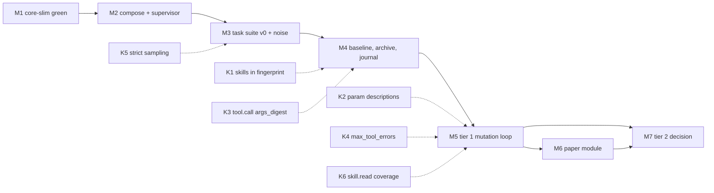

# RSI harness: implementation plan (M1-M7)

Status: plan, 2026-09-28; status lines re-checked 2026-09-30 (nothing below is
built; the harness repo does not exist and no M1 Docker run is recorded).
Executes `.agent/rsi-harness-design.md` (the spec;
section numbers below refer to it). Kernel prerequisites K1-K6 are defined in
spec section 4.3.

Conventions:
- Harness repo `moeka-rsi/`, local-only in v1 (bare remote on the volume).
- `core/` is a git submodule pinned to moeka `core-slim` (planned pin
  `5b9c7d43`). The harness imports only `moeka.*`, never `nanobot.*`.
  Pin note 2026-09-30: `core-slim` tip `6f80c392` (on `origin`) differs from
  `5b9c7d43` only by a merge of `main`'s upstream sync and docs; `nanobot/kernel/`
  and `moeka/` are unchanged, but the test suite is not, so M1's green run must
  be on whichever commit is actually pinned (awork's compat branch pins
  `6f80c392`). The owner's 2026-09-30 consolidation direction may move this pin
  from `core-slim` to `main`; undecided.
- Kernel prerequisites land in core-slim first (their own commits and tests),
  then the harness bumps the `core/` pin. A pin bump is its own harness commit.
- Every milestone ends with its exit criteria checked in `docs/milestones.md`.

## M1. core-slim green

- **Goal:** a slim kernel whose tests pass and whose API the harness can pin.
- **State:** NOT done. The code half is done: core-slim carries the fixes for
  the 5 parked kernel residuals (`c8a9cd08..5b9c7d43`). The exit gate is open:
  no green `scripts/test-docker.sh` run on the pinned commit is recorded (not
  run or verified when this was updated), and `moeka-rsi/` does not exist.
- **Kernel prerequisites:** none.
- Tasks:
  - [x] Remove channels, gateway, WebUI, bridge, pairing.
  - [x] `moeka` package over `nanobot.kernel`; `docs/python-sdk.md`.
  - [x] Fix the 5 parked residuals (memory_key, action pool, rewind archive,
        shared usage store, identity memory paths).
  - [ ] Full suite green in Docker on the pinned commit:
        `scripts/test-docker.sh` in the core-slim worktree; record the result.
  - [ ] Create `moeka-rsi/` with `core/` as a submodule at that commit.
- **Verification:** `scripts/test-docker.sh` exit 0;
  `python -c "import moeka; from moeka.variants import Variant"` from the
  harness venv with `core/` installed editable.
- **Exit criteria:** green suite on the pinned commit, recorded with the commit
  hash; harness repo exists with the pin.

### Kernel prerequisites K1-K6: current status (2026-09-30)
Checked against core-slim `6f80c392`; definitions in spec section 4.3. All open.

| ID | Needed by | Status |
|---|---|---|
| K1 skills in fingerprint | M4 | open: fingerprint has no `skills` component |
| K2 param-description overrides | M5 | open: no `Variant.tool_param_descriptions` |
| K3 `tool.call` `args_digest` | M4 | open: event has no digest |
| K4 `max_tool_errors` | M5 | open: still raises `NotImplementedError` |
| K5 strict sampling on agents | M3 | open: no `AgentSpec.on_unsupported` |
| K6 `skill.read` coverage | M5 (optional) | open: only `read_file` emits it |

## Assumptions and risks
- M3 (task suite v0) does not exist. Held-out quality is unmeasured, so M5's
  acceptance gate cannot be calibrated and no mutation can yet be shown to
  improve quality. M3's noise measurement is what will say how small a gain
  the gate can resolve.
- The objectives the loop optimises (kernel design section 8) are proxies for
  usefulness, unproven; clarification yield has no signal. Mutation transfer
  to unseen tasks and real use is assumed, not shown. Full list: spec section 16.
- M1's Docker run is the first real evidence about the pinned commit; until it
  is recorded every later milestone rests on an unverified pin.

## M2. Compose stack, vLLM smoke, supervisor skeleton

- **Goal:** the daemon can start, run a no-op task, and survive stop, kill and
  resume. The model serves on the 5070 Ti.
- **Kernel prerequisites:** none.
- Deliverables:
  - `compose.yml`: `vllm` (stateless, `stop_grace_period: 90s`), `supervisor`,
    `runner` image; internal network where the runner reaches only `vllm`.
  - `supervisor/`: `db.py` (SQLite WAL task table: pending, running, done,
    failed), `loop.py` (claim-run-record), `gate.py` (nvidia-smi, `gpu-lock`
    acquire/renew/poll, activity flag, hysteresis), `stop.py` (SIGTERM
    protocol, spec section 11).
  - `runner/`: `rollout.py` builds `Environment.for_host` + `Kernel` +
    `AgentSpec(offline=True)` per spec section 4.2 and writes `trace.jsonl`,
    `result.json`, `fingerprint.json`.
  - `docs/runbook.md`: start, stop, recover.
- Tasks:
  - [ ] vLLM image smoke test on sm_120: `openai/gpt-oss-20b` (fallback
        Qwen3-14B-AWQ), prefix caching, `--gpu-memory-utilization 0.88`,
        tool-call parsing on; record tokens/s at `--max-num-seqs 16`.
  - [ ] Confirm the served model honours `seed` (two identical requests,
        identical output) and that no `sampling.dropped` event appears.
  - [ ] Supervisor task table and claim loop; tasks left `running` on start
        become `pending`.
  - [ ] Run gate with hysteresis and `gpu-lock` TTL renewal.
  - [ ] Runner no-op rollout: one kernel against vLLM (no FakeProvider), one trivial
        prompt, `JsonlTraceSink` output, rollout span tags
        (`rollout`, `task`, `seed`, `candidate`, `pool`).
  - [ ] Stop protocol: SIGTERM drains within 60 s, commits, releases the lock.
- **Verification:**
  - `docker compose up`; a no-op task completes; its `trace.jsonl` holds
    `run.started`, `iteration`, `run.completed` with the rollout tags.
  - `docker compose kill supervisor` mid-task; restart; the task re-runs and
    completes once (no duplicate `done` rows).
  - `docker compose stop` finishes under 2 minutes; `gpu-lock` shows released.
  - From inside the runner container, any host other than `vllm` is
    unreachable (`curl` to a public IP fails).
- **Exit criteria:** 10 consecutive stop/kill/resume cycles with no lost or
  duplicated task; vLLM smoke numbers recorded.

## M3. Task suite v0 and noise measurement

- **Goal:** 30 audited tasks with deterministic verifiers, the held-out split,
  and the unchanged agent's seed-to-seed disagreement.
- **Kernel prerequisites:** K5 (strict sampling), or its interim: the runner
  marks any rollout with a `sampling.dropped` event non-reproducible and the
  noise run rejects it.
- Deliverables:
  - `evalsuite/tasks/<family>/<task>/`: `task.toml` (prompt, `tools_allow`,
    expected skill if any, `max_iterations`, `deadline_s`), `fixture/` (no
    `skills/` dir), `verify.py` (state diff over the final `work_dir`),
    `reference/` (reference solution).
  - `evalsuite/audit.py`: reference passes; defect-injected, no-op,
    touch-everything and `rm -rf` agents score 0; 10-90% local pass rate.
  - `evalsuite/split.py`: gate set 75%, locked set 25%, practice pool disjoint;
    minimum family size enforced for coarse deltas.
  - `supervisor/verify.py`: runs `verify.py` outside the rollout container on a
    copy of the final state; writes the `rollout.scored` record.
  - Base variant: `variants.git` branch `base` = empty overrides plus a copy of
    `core/nanobot/skills` as `skills/`.
- Tasks:
  - [ ] 30 tasks across the five families (spec section 8), mock APIs as
        harness-authored `AgentSpec.actions`.
  - [ ] Audit passes for all 30; drop or fix failures.
  - [ ] Test-store separation: test rollouts write to `tests-traces/`, which the
        mutator container never mounts.
  - [ ] Noise run: base variant, 2 seeds x full suite; per-task disagreement
        and the implied task count for a +2 point gate.
  - [ ] Result cache keyed by (task, seed, fingerprint digest, variant tree
        hash, `core/` commit).
- **Verification:** audit report checked in; rerunning the noise run hits the
  cache for every rollout; a deliberately broken verifier is caught by the
  audit.
- **Exit criteria:** 30 audited tasks; noise number recorded in
  `docs/milestones.md` with the resulting tier sizes.

## M4. Baseline scoring, archive, journal

- **Goal:** score the base variant through tiers 0-2, store it in the archive,
  and produce the first journal and per-tool / per-skill rollups.
- **Kernel prerequisites:** K1 (skills in the fingerprint) and K3
  (`tool.call.args_digest`). Interim: variant tree hash in the cache key; loop
  and repeat rate parsed from `RunResult.messages`.
- Deliverables:
  - `archive/schema.sql` + migrations: candidates (id, parent, variants.git
    commit, fingerprint digest and components, source), rollouts (tags,
    stop_reason, usage, outcome), gate verdicts, certificates, evidence log.
  - `supervisor/metrics.py`: every metric in spec section 9 "Metric sources",
    computed from `trace.jsonl`, `result.json` and `rollout.scored`.
  - `supervisor/rollup.py`: per-rollout text summary; per-tool and per-skill
    rollup (calls, invalid-arg rate, error rate, contribution).
  - `docs/journal/` templates; `supervisor/journal.py` writes per-candidate
    entries and periodic summaries.
  - Archive text snapshot committed to the harness repo every few minutes.
- Tasks:
  - [ ] K1 and K3 in core-slim (with tests), then bump the `core/` pin.
  - [ ] Metrics module with one unit test per metric against a recorded trace.
  - [ ] Baseline: base variant through tiers 0-2; archive rows; journal entry.
  - [ ] Verify the redaction boundary: no test task text, ids or traces in any
        practice-side artifact (grep the practice store for test ids).
- **Verification:** metrics recompute identically from the stored JSONL;
  changing one non-always-on `SKILL.md` body changes the fingerprint (K1);
  a kill during baseline scoring resumes without rescoring cached rollouts.
- **Exit criteria:** base variant scored on tiers 0-2 with every section 9
  metric populated or explicitly marked unavailable.

## M5. Tier 1 mutation loop with the gate

- **Goal:** the daemon proposes, evaluates, admits or rejects variant
  candidates unattended.
- **Kernel prerequisites:** K2 (parameter-description overrides) before
  parameter schemas enter mutation scope; K4 (`max_tool_errors`) for error
  recovery tasks; K6 optional (until then `skill.read` is a lower bound).
- Deliverables:
  - `mutator/`: prompts and policy; input is the practice-side rollups,
    mutation history and the parent's variant tree; output is one change to a
    child tree on a scratch branch plus a stated hypothesis.
  - `supervisor/gate.py` (the evaluation gate): paired margin against the
    parent, no regression-task loss, pass / fail / unresolved with capped
    resampling, certificate on admission.
  - Write-scope check: the diff touches only the candidate's variant tree;
    `variant.toml` knobs within harness ceilings; `seed`, `tools_allow`,
    `deadline_s`, model fixed.
  - Skill checks: description-collision screen, declared preconditions,
    leakage screen for task strings, length cap, active-set cap via
    `skills_include`.
  - Parent selection (score + novelty + descendant success); retirement from
    the evidence log, confirmed by `skills_exclude` ablation.
  - Verifier audit per epoch: inject known-bad candidates; record the judge's
    false-pass rate.
- Tasks:
  - [ ] K2 and K4 in core-slim, pin bump. K6 if cheap.
  - [ ] Mutator producing valid variant trees (schema check on
        `variant.toml`; `Variant(...)` constructs; fingerprint differs from
        the parent's).
  - [ ] Gate and certificate; rejected candidates excluded from mutator
        context.
  - [ ] Promotion: locked-set canary (rate-limited); tag `best` in
        `variants.git`; optional export of the winner as a core-slim review
        branch (variant baked into bundled skills and templates).
  - [ ] Overnight unattended run with stop/resume in the middle.
- **Verification:** injected known-bad candidates are all rejected; an edit
  outside the variant tree fails the candidate; the journal shows diff,
  hypothesis, family deltas and verdict for every candidate.
- **Exit criteria:** at least one overnight run with no human intervention,
  zero false passes on the injected canaries, journal summary produced.

## M6. Paper module

- **Goal:** papers become hypotheses that run through the same gate.
- **Kernel prerequisites:** none. The module uses `kernel.llm.complete_json`
  on the local model for the yes/no filter and hypothesis distillation, in a
  kernel of its own with network access limited to the paper sources.
- Deliverables: `papers/poll.py` (arXiv cs.AI/CL/LG, HF daily, OpenAlex;
  Semantic Scholar rate-limited), `papers/filter.py` (embedding similarity via
  `kernel.memory` DocStore, then local yes/no), `papers/distil.py` (change,
  expected effect, measurement), paper-id outcome table in the archive.
- Tasks:
  - [ ] Daily poll with dedupe by paper id.
  - [ ] Two-stage filter; reject hypotheses needing frontier models, training
        or missing resources.
  - [ ] Hand accepted hypotheses to the mutator as seeds; the implementer step
        runs without network.
  - [ ] Replication tracking: claimed gain versus gate outcome per paper.
- **Verification:** a week of polling yields a filtered list with reasons;
  one paper-seeded candidate goes through the gate end to end.
- **Exit criteria:** paper-sourced candidates appear in the archive with their
  paper ids and outcomes; no paper is retried after a recorded failure.

## M7. Tier 2 decision

- **Goal:** decide, with evidence, whether to allow code mutation.
- **Kernel prerequisites:** none for the decision. A "yes" reopens spec
  section 15's tool-implementation question and makes `core/` writable on
  scratch branches, which needs a stricter gate.
- Tasks:
  - [ ] Report from the journal: acceptance rate by mutation type, locked-set
        trajectory, verifier audit results, suspected gaming.
  - [ ] Identify improvements tier 1 could not express (for example tool
        behaviour rather than tool text).
  - [ ] Owner decision recorded in the spec; if yes, draft the tier 2 gate and
        isolation additions as a spec revision.
- **Verification:** the report cites archive rows and journal entries for
  every claim.
- **Exit criteria:** a written go / no-go in the spec with its evidence.
