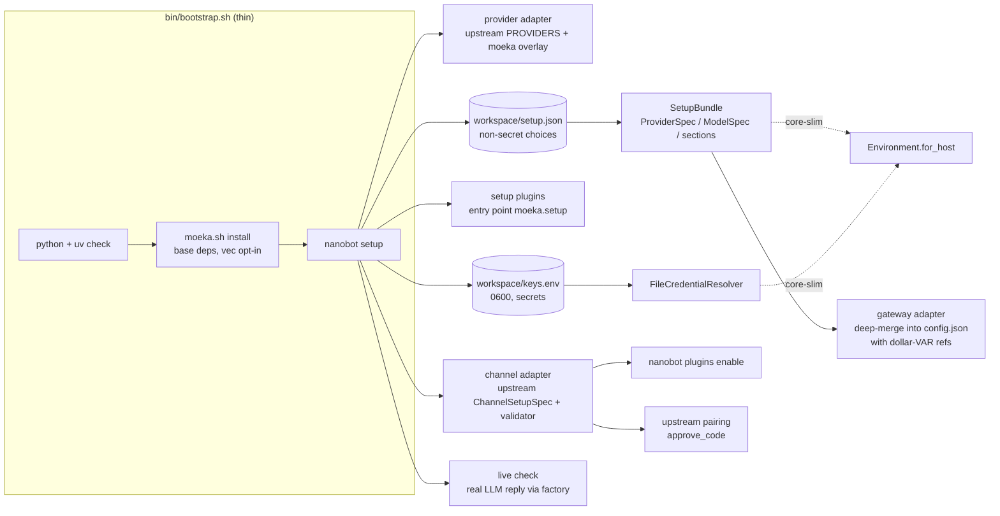
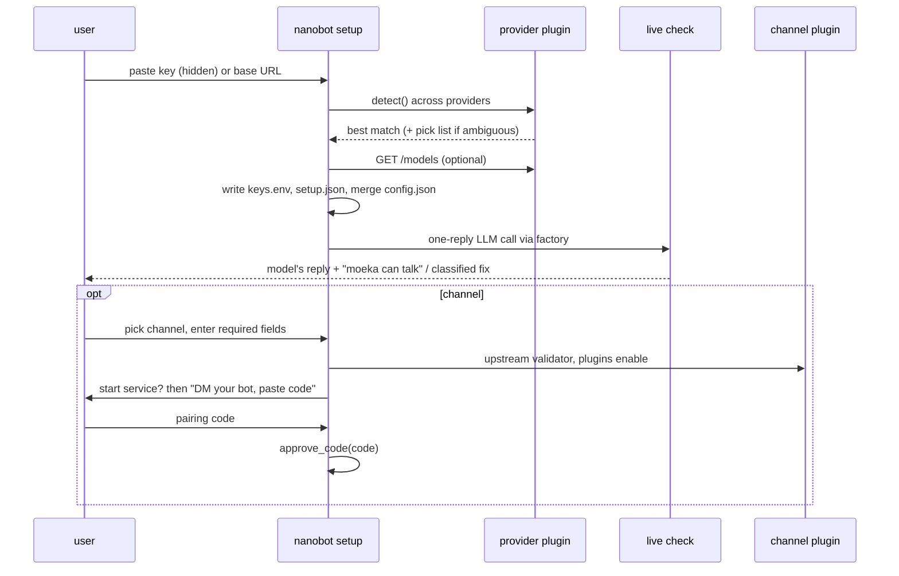

# Moeka setup harness — design

- **Status:** approved design, not built. Branch `feat/setup-harness` (off `main`).
- **Date:** 2026-09-29.
- **Goal:** fresh clone → one command → paste one LLM key → moeka provably replies. Optional channel (Telegram first) and systemd follow, and never run against a bot that cannot talk.

## 1. Intent and constraints

- **Outcome:** install moeka as one bundle; "done" means a real LLM reply was observed, not that a key is present.
- **Users:** the owner and homelab/Linux admins, often headless over SSH. Windows and Docker are out of scope.
- **Config model:** "everything is a plugin"; a host-side harness injects configuration. `config.json` becomes derived output for the current gateway, not the source of truth.
- **Reuse over re-implementation:** wrap upstream nanobot's contracts (provider registry, `ChannelSetupSpec`, channel validators, pairing, `plugins enable`) so upstream tests carry per-channel/per-provider correctness and merges stay cheap.
- **Parallel work:** must not block or conflict with `core-slim` (kernel) or the RSI harness. `core-slim` is downstream of `main` and syncs by `git merge main`, so this lands on `main` and reaches the kernel branch automatically.

## 2. Current state (what breaks today)

- `templates/workspace/config.json:5-6` hard-codes `provider: openrouter` + a Gemini model; a user with only an Anthropic/OpenAI key gets "no API key for openrouter".
- No step ever calls the LLM: `moeka.sh doctor` and `nanobot status` are static; upstream's wizard only checks the key is non-empty.
- Keys travel `keys.env` → shell `set -a` → `${VAR}` in `config.json`. Python never reads `keys.env`; running `nanobot gateway` directly loses keys.
- An unresolved `${VAR}` is left as a literal and treated as a real key by provider matching → 401.
- `bin/bootstrap.sh`: `$EDITOR`-only key entry (skippable), `[o]` runs `onboard` without `--wizard`, `.env` loaded after the workspace is resolved in `moeka.sh`.
- `scripts/moeka.service` hard-codes `%h/projects/moeka`; `.[vec]` always pulls CUDA torch with output hidden.
- `README.md` / `scripts/install.sh` install upstream `nanobot-ai` from PyPI; the moeka path lives only in `docs/OPERATIONS.md`.
- `uv sync --locked` removes on-demand channel dependencies (2026-09-28 deploy).
- `scripts/telegram_pair.py` is moeka-only, Telegram-only, and its `getUpdates` poll conflicts (409) with a running gateway.

## 3. Architecture

- **Package:** `nanobot/setup/` — a host layer. It may read files and env; the kernel still never does.
- **Dependency rule:** nothing in `nanobot/setup/` imports `gateway_adapter.py` except the CLI wiring. On `core-slim` the adapter is deleted with the gateway and `nanobot/setup/` is added to the ambient-reads allowlist in `tests/kernel/test_no_ambient_reads.py`.
- **No import of `nanobot.kernel`:** `main` has no kernel. Kernel-facing types are matched structurally (same field names / method signatures), so they drop into `Environment.for_host` later without an adapter.

### 3.1 Units

- **`contract.py` — `SetupPlugin` protocol.**
  - `name: str`, `kind: Literal["provider", "channel", "tool"]`, `display_name: str`.
  - `secrets: tuple[SecretSpec, ...]` — `SecretSpec(env_name, label, hidden=True)`.
  - `detect(value: str) -> float` — confidence 0–1 that a pasted value belongs to this plugin (providers only; others return 0).
  - `contribute(answers: Mapping[str, str]) -> Contribution` — pure; returns provider specs, model specs, and config sections.
  - `async check(ctx: CheckContext) -> CheckResult` — the only method allowed IO.
  - Discovery: built-ins (the two adapters below, which expand into one plugin per provider/channel) plus third-party plugins from the `moeka.setup` entry-point group, mirroring how tools and channels are discovered.
- **`providers.py` — generic provider adapter.**
  - One `SetupPlugin` per entry in upstream `nanobot/providers/registry.py:PROVIDERS` that is chat-capable and key-based (skips OAuth-only `openai_codex`, `github_copilot`, `xai_grok`, and `azure_openai` / `bedrock` in v1).
  - Reads `env_key`, `default_api_base`, `detect_by_key_prefix`, `is_gateway`, `is_local`, `builtin_models` from the registry — no per-provider code.
  - **Moeka overlay** (`providers_overlay.py`, data only): extra key prefixes the registry lacks (`sk-ant-` → anthropic, `sk-proj-` → openai, `AIza` → gemini, `gsk_` → groq) and a curated default model per common provider (e.g. anthropic → `claude-sonnet-5`). Fallback: registry `builtin_models[0]`, else prompt.
  - Pasted `http(s)://` values route to the local/OpenAI-compatible plugins (`ollama`, `lm_studio`, `vllm`, `custom`) by port/keyword, key optional.
- **`channels.py` — generic channel adapter.**
  - One `SetupPlugin` per discovered channel whose `ChannelPlugin.setup` is a `ChannelSetupSpec` (via upstream `nanobot/channels/_setup.py:channel_setup_spec`).
  - Prompts only the spec's `required` fields; `field.kind == "secret"` values go to `keys.env` and are written into config as `${CHANNEL_FIELD}` refs.
  - `check()` calls the channel's own upstream `validator`. `verifies_connection=True` (Telegram, Discord, Slack, Email) → live-verified; otherwise "configured (not live-verified)".
  - Enabling a channel runs upstream `nanobot plugins enable <name>` (installs its manifest dependencies and flips it on).
  - Sender access uses upstream pairing (`nanobot/pairing`): after the service starts, setup says "DM your bot; it replies with a code", the user pastes the code, setup calls `approve_code(code)`. Works for every channel.
  - `scripts/telegram_pair.py` is retired.
- **`credentials.py`.**
  - `KeysEnv` — read/write `<workspace>/keys.env`: atomic replace, forced `0600`, preserves comments and ordering, quotes values with spaces. Absorbs `scripts/edit_keys_env.py`.
  - `FileCredentialResolver.resolve(ref: str, scope: str) -> str | None` — structural match for the kernel's `CredentialResolver`; maps `providers/<name>/api_key` to the provider's env name.
  - Precedence (one rule everywhere): process env > `<workspace>/keys.env` > repo-root `keys.env` (legacy fallback). Never writes `os.environ`.
- **`bundle.py` — `SetupBundle`.**
  - Pure data built from `setup.json` + plugins: `providers`, `models`, `default_model`, `sections`.
  - `ProviderSpec`/`ModelSpec` field names mirror `nanobot/kernel/hostenv.py` (`name`, `api_base`, `credential`, …; `name`, `model`, `provider`, `context_window`, `max_tokens`).
- **`state.py` — `setup.json`.**
  - `<workspace>/setup.json`, non-secret: `version`, `providers: [{plugin, api_base?, env_name}]`, `default_model`, `channels: [{plugin, enabled}]`, `last_check: {ok, model, at}`.
  - Source of truth for the harness; `config.json` is re-derived from it.
- **`gateway_adapter.py`.**
  - `SetupBundle` → deep-merge patch onto `config.json`: `providers.<name>.apiKey = "${ENV_NAME}"`, `apiBase` when set, `agents.defaults.model` / `provider`, `channels.<name>` required fields + `enabled`.
  - Never deletes keys, never writes plaintext secrets, preserves unrelated hand edits; returns a list of changed dotted paths for a one-line summary.
- **`checks.py` — live check.**
  - `run_live_check(config, resolver) -> CheckResult(ok, model, reply, latency_ms, failure)`.
  - Builds the provider through `nanobot/providers/factory.py` exactly as the gateway does; sends system + "Reply with exactly: ready", `max_tokens=16`, no tools, 30 s timeout.
  - Optional early probe: provider `GET {api_base}/models` (pattern from upstream `webui/settings_models.py:provider_models_payload`) to confirm the key and offer a model list.
- **`cli.py` — `nanobot setup`** registered in `nanobot/cli/commands.py`; wrapped by `moeka.sh setup`.

## 4. Setup flow

- **1. Workspace:** resolve as the gateway does (`MOEKA_WORKSPACE` → `~/.nanobot`); create from `templates/workspace/` if missing; import repo-root `keys.env` once if present (source left untouched).
- **2. Key:** hidden prompt "Paste an LLM API key (or a base URL for a local server)"; score with every provider plugin's `detect()`; ambiguous (e.g. bare `sk-`: openai vs deepseek) → short pick list, best guess first.
- **3. Model:** overlay default → registry default → prompt. If `/models` works, the list is offered; Enter accepts the default.
- **4. Write:** secret → `keys.env`; choices → `setup.json`; gateway adapter merges `config.json` and prints changed paths.
- **5. Live check:** prints `→ asking <model> to say hi…`, the real reply, then `✓ moeka can talk`. On failure: classified fix, offer to re-enter key/model. Steps 6–7 do not run until it passes unless `--skip-check`.
- **6. Channel (optional):** list discovered channels with a setup spec (Telegram first); required fields → upstream validator → `plugins enable`.
- **7. Service (optional):** `moeka.sh enable`; if a channel was added, the pairing prompt follows once the service is up.
- **Re-run:** shows current provider/model and last check; adding a key adds a provider; never removes providers or channels.
- **Non-interactive:** `nanobot setup --key K [--provider P] [--model M] [--channel telegram --channel-secret token=T] [--enable-service] --yes`; exit code ≠ 0 when the live check fails.
- **`--check`:** run only step 5 against the current config; `moeka.sh doctor --live` calls the same code.

## 5. Live check and error handling

- **Failure kinds** (`Failure(kind, message, fix)`):
  - `bad_key` — 401/403 → "provider rejected this key"; re-enter key.
  - `model_not_found` — 404 or model-named error → pick from `/models` or registry default.
  - `no_quota` — 402, or 429 with billing/quota wording → "key works, account has no credit".
  - `rate_limited` — other 429 → one retry after `Retry-After`, then report.
  - `network` — DNS / connect / TLS → "cannot reach `<api_base>`"; check proxy or base URL.
  - `empty_reply` — retry once with `max_tokens=256` (reasoning models), then show the raw response.
  - `unknown` — first 300 chars of the error.
- **Same output** in `nanobot setup`, `nanobot setup --check`, and `moeka.sh doctor --live`.
- **Never:** plaintext keys in `config.json`; removing existing providers/channels; writing `os.environ`; enabling systemd after a failed check without `--skip-check`.

## 6. Runtime fixes (on `main`, required by the harness)

- **Python reads `keys.env`:** `nanobot/config/loader.py` resolves `${VAR}` from the §3.1 precedence mapping, so `nanobot gateway`, `nanobot agent -m` and systemd see the same keys without shell sourcing.
- **Unresolved `${VAR}` = no key:** provider matching (`Config._match_provider`) and `providers/factory.py` treat a leftover `${...}` as empty. The existing non-fatal warning with the dotted field path stays (moeka deviation preserved).
- **`UnconfiguredProvider`:** first line "run `moeka.sh setup` (or `nanobot setup`)"; WebUI hint kept as the second line.
- **Template:** `templates/workspace/config.json` drops the hard-coded provider/model; `vectorMemory.enabled` defaults to `false` unless `[vec]` is installed.

## 7. Install scripts and docs

- **`bin/bootstrap.sh`** becomes thin:
  - python ≥ 3.11 and uv check (unchanged).
  - `moeka.sh install` — base deps; `--with-vec` adds `[vec]`; uv output shown; on failure print likely apt packages.
  - `exec ./bin/moeka.sh setup "$@"` — e.g. `./bin/bootstrap.sh --key sk-ant-… --yes`.
  - Removed: `$EDITOR` step, `[i/n/o/s]` menu (import → `moeka.sh import <tar>`; `new NAME` stays), separate Telegram/systemd prompts.
- **`bin/moeka.sh`:**
  - New `setup` subcommand and `doctor --live`.
  - Load `.env` before resolving the workspace.
  - `install` / `update` re-run `nanobot plugins enable` for every channel enabled in config after any `uv sync` (fixes the 2026-09-28 deploy failure mode).
- **systemd:** `install-service.sh` renders `moeka.service` from a template with the real repo path; `EnvironmentFile=` lines kept only for non-secret `.env`.
- **Docs:**
  - `README.md` quickstart → `git clone … && ./bin/bootstrap.sh`, then paste key → see reply → optional channel.
  - Upstream `nanobot-ai` / PyPI / Render material moves under a short "upstream nanobot" note; `scripts/install.sh` / `install.ps1` stay unchanged (upstream files).
  - `keys.env.example` explains the workspace location and precedence; `docs/OPERATIONS.md` and `.agent/deploy-runbook.md` updated.

## 8. Testing

- **Unit (`tests/setup/`):**
  - provider `detect()` scoring incl. ambiguous `sk-` and base-URL routing; overlay/registry default-model fallback.
  - `KeysEnv` round-trip: `0600`, atomic, comment/order preservation, quoting.
  - gateway adapter merge: keeps hand edits, never deletes, `${VAR}` refs only.
  - `SetupBundle` from `setup.json`; `FileCredentialResolver.resolve`.
  - loader precedence and "unresolved `${VAR}` = no key".
- **Channel adapter:** against a fake `ChannelSetupSpec` + fake validator (required fields, secret routing, verified vs unverified, `plugins enable` invoked, `approve_code` called). Per-channel correctness is upstream's tests' job.
- **Live check:** fake provider raising each failure shape (401, 404, 402, 429 ± quota text, DNS, empty reply) → asserted `Failure.kind` and fix text. No network.
- **CLI:** `nanobot setup --key … --yes` on a temp workspace with the factory patched → files written, exit 0 / ≠0; `--check` on an existing config.
- **Manual end-to-end (in the plan):** fresh clone in a temp dir, `bootstrap.sh --key $REAL_KEY --yes` prints a real reply; then `nanobot agent -m hi` in the same workspace replies (proves the loader fix); Telegram: validator passes, pairing code approved, bot answers a DM.
- **Suite:** full run via `scripts/test-docker.sh`.

## 9. Out of scope (v1)

- WebUI settings calling the harness (the pure functions make this possible later).
- OAuth providers (`openai_codex`, `github_copilot`, `xai_grok`), Azure, Bedrock.
- Porting tools to the setup contract (`kind="tool"` exists; no built-in tool plugins yet).
- Kernel wiring (`Environment.for_host` from `SetupBundle`) — done on `core-slim` after this merges; blocked on its plugin-config gaps (`for_host` rejects unknown sections; no `Kernel(plugins=)` yet).
- Windows, Docker, PyPI packaging.

## 10. Upstream-merge posture

- New code lives in new files (`nanobot/setup/`, `tests/setup/`); upstream files touched: `cli/commands.py` (one command registration), `config/loader.py` and `config/schema.py` / `providers/factory.py` (small, commented `# moeka:` hunks), `providers/unconfigured_provider.py` (message text).
- Channel and provider behaviour is read from upstream data (`PROVIDERS`, `ChannelSetupSpec`, validators, pairing); new upstream channels/providers appear in `moeka setup` without moeka code.
- Add a CLAUDE.md deviation bullet for the setup harness and keys.env loading.
