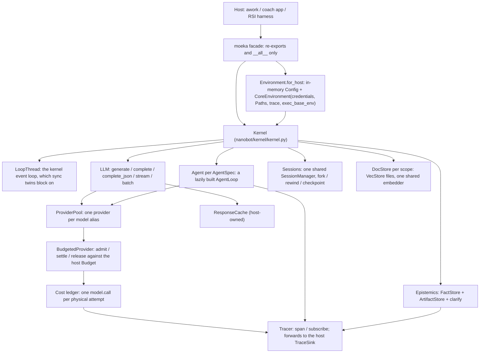

# Architecture: the `moeka` API and `nanobot/core/`

`moeka` is the embeddable, channel-free surface of the moeka kernel: one-shot
model calls, tool-using agents, branching sessions, document memory and
grounded facts, without the chat-bot gateway, channels or WebUI. The `moeka`
package only re-exports; the implementation lives in `nanobot/kernel/`, with
the agent loop in `nanobot/agent/` and the document store in `nanobot/core/`.

- Usage: [`docs/python-sdk.md`](python-sdk.md). Moving off the older surfaces:
  [`docs/migration-moeka-api.md`](migration-moeka-api.md).
- Design, invariants and the public-API mapping:
  [`.agent/moeka-kernel-design.md`](../.agent/moeka-kernel-design.md).
- `MoekaCore` (below) was the first embeddable facade, built in the 2026-06
  overhaul for awork. It and `nanobot.api.complete` / `open_vec_store` are now
  deprecated shims kept until awork migrates; new hosts use `moeka.Kernel`.

## Layering

- **Environment** (`nanobot/kernel/hostenv.py`): `for_host` builds the in-memory
  `Config` and the `CoreEnvironment` from explicit host inputs only; nothing is
  read from the process environment, `$HOME`, the working directory or
  `config.json` (I1). `from_config` wraps a legacy `Config` for migration.
- **Kernel** (`kernel.py`): owns the loop thread, the `Tracer`, and builds every
  member lazily. `kernel.core_env` is `env.core` with the `Tracer` as its trace,
  so every internal event reaches subscribers. `close()` shuts down agents, then
  stores, then providers, then the loop thread.
- **LLM** (`llm.py`): one provider per alias, built by the provider factory with
  the kernel's environment; host providers via `register_provider`. Every call
  gets a `call_id`, typed errors (`llm_errors.py`), a cache lookup and one budget
  admission before anything is sent.
- **Budget** (`budget.py`): `Metering` admits LLM-layer calls; `BudgetedProvider`
  wraps every pool provider and admits only calls that did not come through the
  LLM layer (the agent loop), so nothing is admitted twice. `CapBudget` is the
  reference budget.
- **Ledger** (`ledger.py`): prices each physical call from the `ModelSpec` and
  emits `model.call` with the call's attribution (alias, attempt, span tags).
- **Agents** (`agent.py`): an `AgentSpec` compiles into a scoped config and an
  `AgentLoop` on the kernel loop, with the kernel's session store, variant,
  policy (kernel ∩ spec ∩ offline) and plugin registry. Each run is an
  `agent.run` span with a `TraceHook` (`trace_hook.py`) and its own capture hook.
- **Sessions** (`sessions.py`): handles over the shared `SessionManager`; runs,
  appends, rewinds and forks on one key share one kernel-wide lock.
- **Memory** (`memory.py`): `DocStore` over `nanobot/core/vec_store.py`, one file
  per scope under `state_dir/memory/`, LRU-bounded, one embedder per kernel.
- **Epistemics** (`epistemics.py`, `facts.py`, `artifacts.py`, `clarify.py`):
  facts with provenance, artifacts whose committed leaves cite facts, and the
  minor-vs-semantic divergence decision.
- **Variants** (`variants.py`): per-kernel tool descriptions, templates, skills
  and bootstrap text, and the `Fingerprint` of what an agent's model sees.
- **Trace** (`trace.py`): span context variables, stamping, sinks, `EVENTS`.

## `nanobot/core/`: the legacy facade and the document store

`nanobot/core/` holds `VecStore` (used by `DocStore` and the agent loop's
memory), `FunctionTool` (used for host actions) and the deprecated `MoekaCore`
facade. The rest of this document describes those files; the `MoekaCore`
sections describe a surface that is kept only until awork migrates.

## Files

| File | Lines | Role |
|------|-------|------|
| `nanobot/core/__init__.py` | ~50 | Public export surface: `MoekaCore`, `Config`, `FunctionTool`, `RetrievedChunk`, `RunResult`, `open_vec_store`, and the one-shot `complete`/`acomplete`/`complete_json`/`acomplete_json` re-exports. All heavy imports are lazy. |
| `nanobot/core/core.py` | ~620 | `MoekaCore` — the facade class: construction, agent profiles/scoping, actions, documents (RAG), running the agent loop, one-shot completion. |
| `nanobot/core/vec_store.py` | ~900 | `VecStore` — the SQLite-backed hybrid FTS5 + vector store shared by memory, history, skills, and host documents. |
| `nanobot/core/vec.py` | ~57 | `RetrievedChunk` dataclass + `open_vec_store()` — a loop-less way to use `VecStore` as a standalone embeddings library, no `AgentLoop`/config involved. |
| `nanobot/core/function_tool.py` | ~156 | `FunctionTool` — adapts a plain Python callable into a moeka `Tool`, deriving a JSON Schema from its signature/type hints. |

## Import boundary

`from nanobot.core import MoekaCore` must never pull in the chat-bot runtime
(`nanobot.channels`, `nanobot.web`, `nanobot.gateway`, `nanobot.heartbeat`,
`nanobot.pairing`, `nanobot.cli`). This is enforced by a subprocess-based test,
`tests/core/test_import_boundary.py`, which imports `nanobot.core`,
`nanobot.core.vec`, `nanobot.core.vec_store`, and `nanobot.api.complete` in a
fresh interpreter and asserts none of the forbidden package prefixes appear in
`sys.modules`. Any new top-level import added to `core/` that reaches into the
runtime will fail this test — keep such imports lazy (inside functions/methods).

## `core.py` — the `MoekaCore` facade (deprecated)

`MoekaCore.create`, `scoped`, `scoped_async` and `from_config` emit a
`DeprecationWarning`; the replacement is `moeka.Kernel` with
`kernel.agent(AgentSpec(...))`. The description below is kept for maintaining
the shim.

`MoekaCore` wraps `nanobot.agent.loop.AgentLoop` (memory, sessions, semantic
retrieval batteries-included) and adds two host-facing capabilities the
chat-bot runtime never exposed on its own:

- **Actions** (`@core.action` / `register_action` / `unregister_action`) —
  register a plain Python callable as an agent tool. Delegates schema
  generation to `FunctionTool` (below).
- **Documents** (`ingest` / `ingest_text` / `retrieve` / `retrieve_documents`
  / `count_documents` / `clear_documents`) — index and search host-supplied
  text via the `documents` store in `VecStore`, independent of the agent's
  own memory/history stores.

### Construction paths

- `MoekaCore.create(...)` — the adapter/router. Accepts **at most one** config
  source (`config=` a built `Config`, `config_dict=` a dict, or `config_path=`
  a file); with none it discovers `~/.nanobot/config.json`. Resolves the
  workspace (explicit `workspace=` wins; otherwise an in-memory config with
  only the default `~/.nanobot` sentinel gets an **ephemeral** temp dir so
  embedding the core never pollutes a real workspace unasked). Applies an
  optional `profile=` via `_apply_profile()` (deep-copies the config and
  compiles the profile's `model_preset`/`tools_allow`/`tools_deny`/
  `skills_include`/`skills_exclude`/`memory_enabled`/`planning`/`limits` into
  `agents.defaults`). The persona is **not** written to disk: it is merged with
  the caller's `bootstrap=` sections by `_build_bootstrap_overrides()` and
  passed to the context builder in memory, so embedding a core never writes
  `AGENTS.md` into a host workspace. `_build_inline_skills()` does the same for
  the profile's `skills_inline` plus any `skills=` passed to `create()`.
- `MoekaCore.from_config(config, workspace=...)` — the pure data seam:
  `(Config, workspace) -> MoekaCore`, no file discovery. `create()` is a thin
  router in front of this.
- `MoekaCore.scoped(...)` / `scoped_async(...)` — context managers that
  guarantee workspace cleanup. When `workspace` is omitted, an owned temp dir
  is created and `shutil.rmtree`'d on exit (even on exception); a supplied
  workspace persists and only `core.cleanup()` runs. Wraps `create()`.
- `MoekaCore.from_loop(loop)` — wrap an already-constructed `AgentLoop`
  directly (advanced use, e.g. sharing a loop across multiple facades).

`from_config` also wires up the vector store via `_build_vec_store()`: when
`agents.defaults.vec.enable` is true it constructs a `VecStore` at
`<workspace>/memory/vec.db`; when disabled (or `moeka[vec]` extras are
missing) it returns `None`, and every document/retrieval method on `MoekaCore`
degrades to empty/`0`/no-op rather than raising.

### Running the loop

`core.run(message, *, session_key="core:default", media=None, hooks=None,
on_token=None)` runs one full agent turn (multi-step tool calling + RAG
context) through the wrapped `AgentLoop.process_direct()`, using an internal
`SDKCaptureHook` to collect `tools_used`/`messages` for the returned
`RunResult`. The loop's outbound message-bus queue is drained after each run
(`_drain_outbound`) since nothing else consumes it in embedded use.
`core.think(message, **kwargs)` is a convenience wrapper returning just
`result.content`.

### One-shot completion (no loop, deprecated)

Replaced by `kernel.llm` (`complete`, `complete_json`, `stream`, `batch`);
`nanobot.api.complete` emits a `DeprecationWarning` on every call.

`MoekaCore.complete()` / `complete_sync()` / `think_structured()` are static
methods that thinly delegate to `nanobot.api.complete` (`acomplete`,
`complete`, `acomplete_json`) — a single provider call through moeka's
model-preset/fallback layer with **no** agent loop, no tool calling, and no
workspace required. `nanobot/api/complete.py` also exposes
`acomplete_stream()` / `complete_stream()` for token-by-token streaming;
`complete_stream()` runs the async generator in a worker thread with its own
event loop so a synchronous host application can iterate it without managing
`asyncio` itself — this is what unblocks the awork pipeline mentioned above.
All of `complete`/`acomplete`/the streaming variants accept the same
`config=`/`config_dict=`/`config_path=` inputs as `MoekaCore.create()`, plus
`images=` for vision models (local paths, http(s)/data URLs, or raw bytes,
converted to OpenAI-style multimodal content parts).

## `vec_store.py` — hybrid FTS5 + vector RAG

`VecStore` is a SQLite database (`sqlite-vec` extension + FTS5) holding four
logical stores, all in one `vec.db` file:

- `memory_chunks` — `MEMORY.md`, chunked by markdown section headers
  (`upsert_memory_chunks` does a full replace; `search_memory` queries it)
- `history_entries` — `history.jsonl` entries, keyed by cursor
  (`upsert_history_entry` is idempotent per cursor; `search_history` queries)
- `skills` — skill definitions indexed at startup so a long skill list can be
  narrowed by semantic relevance (`upsert_skills` full-replace; `search_skills`)
- `documents` — host-supplied text via `MoekaCore.ingest()`, append-only,
  optionally split into named **collections** so one `vec.db` can hold several
  independent corpora (`add_documents`, `search_documents[_scored]`,
  `count_documents`, `clear_documents`)

### Retrieval modes

`search_documents` / `search_documents_scored` support three modes:

- **`vec`** — semantic KNN over sentence-transformer embeddings (`_vec_documents`)
- **`keyword`** — FTS5/BM25 over the raw text (`_keyword_documents`), works
  with stock `sqlite3` — no `sentence-transformers` or `sqlite-vec` needed
- **`hybrid`** — reciprocal-rank fusion of both (`_rrf_fuse`, standard RRF
  constant `k=60`), so a query benefits from both lexical and semantic
  matches; degrades to keyword-only automatically if vector search is
  unavailable

Document search also supports `tags` (metadata filter), `since` (ISO
timestamp filter), `collection` (`None` searches all collections), and
`caller` (labels the entry in the optional retrieval-audit log).

### Chunking

`_chunk_markdown` (memory) splits on `#`/`##`/`###` headers, capping each
chunk at 500 chars (`_MAX_CHUNK_CHARS`) and dropping overflow — fine for a
curated `MEMORY.md`. `_chunk_document` (host documents) is lossless: it
prefers markdown-section boundaries when present, otherwise packs
blank-line-separated paragraphs into size-bounded groups
(`_split_paragraphs`), and hard-splits any single paragraph that still
overflows — no host document content is silently dropped.

### Schema, migrations, degradation

- Schema version is tracked via `PRAGMA user_version` (`_SCHEMA_VERSION = 2`);
  `_ensure_schema` handles first-run creation and version upgrades.
- A `meta` table records the active embedding model name + dimension. If the
  configured `embeddingModel` changes, `_check_embedding_dim` /
  `_rebuild_vec_tables` detect the mismatch and automatically re-embed all
  four stores from their stored text rows — no manual migration step.
- `available` (bool property) reflects whether semantic/vector search is
  usable (requires `sqlite-vec` + `sentence-transformers`, i.e. the
  `moeka[vec]` extra); `keyword_available` reflects whether FTS5 keyword
  search works (stock `sqlite3`, effectively always true). Every public
  method checks these and returns an empty/inert result instead of raising
  when the corresponding backend is missing — `vec_store.py` "never raises at
  import time" and degrades gracefully at call time too.
- `recent_retrievals(limit=20)` reads back the optional `retrieval_log` table
  (populated only when `log_retrievals=True`) for observability/debugging.

## `vec.py` — loop-less embeddings library (deprecated)

`open_vec_store` emits a `DeprecationWarning`; the replacement is
`kernel.memory(path=db_path)`, a `DocStore` over the same file format.

`open_vec_store(db_path, model=None, log_retrievals=False)` returns a bare
`VecStore` with no `AgentLoop`, provider, or config involved — usable as a
standalone local-embeddings library independent of the rest of moeka. No API
keys are required; in a keyless or extras-less environment the store degrades
to `available=False` (keyword search may still work) rather than raising.
`RetrievedChunk` (a frozen dataclass: `text`, `source`, `score` — cosine
distance, lower is closer) is the structured result type returned by
`MoekaCore.retrieve_documents()` and usable directly against a raw `VecStore`.

## `function_tool.py` — callables as tools

`FunctionTool` adapts a sync or async Python callable into a moeka `Tool`
(the interface the agent loop's tool-calling machinery expects). Its JSON
Schema `parameters` are derived from the callable's type hints via
`_schema_from_signature` / `_json_type_for`:

- Bare builtins (`str`, `int`, `float`, `bool`, `list`, `dict`) map directly.
- `Optional[X]` / `X | None` becomes a nullable fragment of the non-`None` arm.
- Parameterized `list[T]` emits an `items` fragment; `dict[K, V]` becomes a
  plain `"object"`.
- `Enum` subclasses become a JSON Schema `enum` of member values.
- Unknown/unannotated types fall back to an unconstrained schema (the LLM may
  pass anything).
- Parameters without a default are marked `required`; `self`/`cls` and
  `*args`/`**kwargs` are skipped.

`FunctionTool._plugin_discoverable = False` — unlike moeka's built-in tools,
instances are created dynamically by a host at runtime (agent actions, or the
legacy `core.action` / `register_action`), not auto-discovered by the `pkgutil` tool-registry scan.
The kernel wraps every callable host action (`AgentSpec.actions`,
`Agent.add_action`) in a `FunctionTool`, adding declared `capabilities` (checked
against the agent's policy) and an optional `output_model` that validates the
result. `execute()` calls the wrapped function (awaiting it if it returns an
awaitable) and coerces the result to `str` unless it's already a `str` or
`list` (content blocks).

## Tests

`tests/core/` mirrors this package: `test_import_boundary.py` (the boundary
guard above), `test_moeka_core.py`, `test_agent_profiles.py`,
`test_function_tool.py`, `test_vec.py`, `test_vec_store.py`,
`test_vec_store_hybrid.py`, and `test_integration_real.py`.

The kernel and the `moeka` facade are tested in `tests/kernel/` (one module per
member: `test_llm_engine.py`, `test_batch.py`, `test_budget.py`, `test_cache.py`,
`test_trace_spans.py`, `test_agent.py`, `test_agent_tools.py`, `test_sessions.py`,
`test_memory.py`, `test_epistemics.py`, `test_variants.py`, ...), and
`tests/examples/test_examples.py` runs `examples/*.py` and the quick start in
`docs/python-sdk.md` offline.
