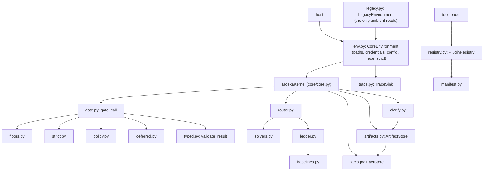
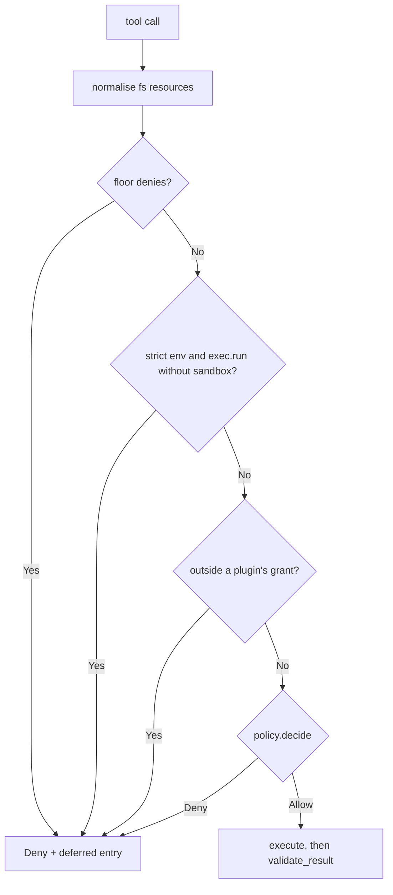
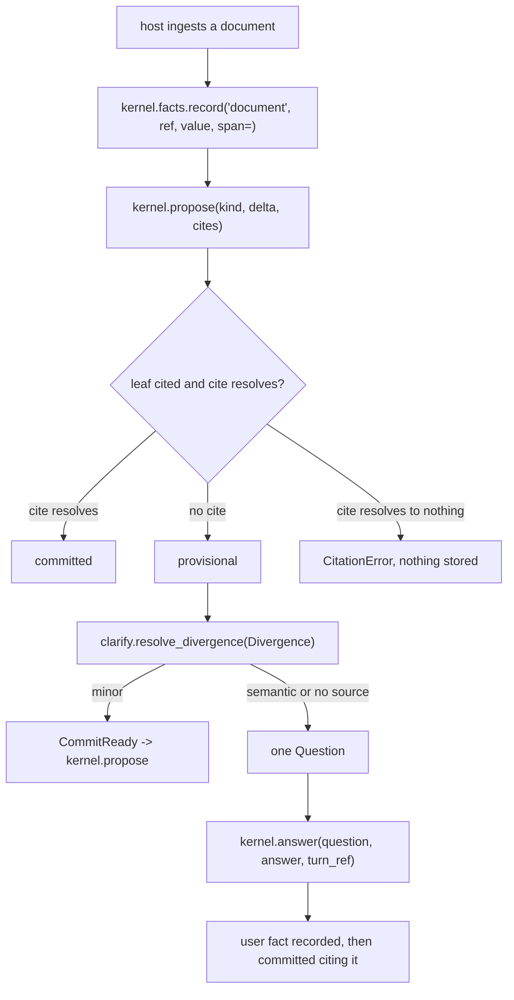

# 05 - Kernel modules (`nanobot/kernel/`)

Audience: a harness author embedding `MoekaKernel`, and a self-improvement agent that must know which kernel
files it may never touch. Read from source on the `core-slim` branch after the kernel plan's P1-P5 (Tasks 0-25).
Citations are `path:line` relative to `nanobot/` unless they start with `tests/` or `.agent/`. The design and
invariants (I1-I6) are in `.agent/moeka-kernel-design.md`; this page maps them to code.

- Every file in `nanobot/kernel/` is tier 3 or tier 4 (design section 9): human-reviewed code only, never an
  automated edit.
- Kernel modules import only stdlib, pydantic, loguru, `nanobot.config.paths` and `nanobot.llm_usage` at module
  level; agent modules are imported lazily inside functions (Ruling C).

---

## 1. Module map

| Module | Invariant | One line |
|---|---|---|
| `env.py` | I1, I2 | `Paths`, `CredentialResolver`, `ConfigSource`, `CoreEnvironment` (kernel/env.py:21,91,118,123) |
| `legacy.py` | I1 | builds a `CoreEnvironment` from a legacy `Config` (kernel/legacy.py:352-354) |
| `trace.py` | all | `TraceSink`, `NullTraceSink`, `LoguruTraceSink`, `safe_emit` (kernel/trace.py:11,17,24,31) |
| `policy.py` | I4 | principals, requests, `DefaultPolicy`, `IntersectionPolicy` (kernel/policy.py:27,35,104,186) |
| `floors.py` | I2 (mechanism) | non-removable floors, checked before any policy; the fs floor keeps agents out of `state_dir` (kernel/floors.py:73) |
| `strict.py` | I2 | strict mode: exec needs a sandbox; fully denied tools dropped (kernel/strict.py:34-73) |
| `gate.py` | I4, I5 | `gate_call`: floors -> strict -> plugin grant -> policy (kernel/gate.py:256) |
| `deferred.py` | mechanism (design 5a) | scratchpad and deferred-action log; its writes never count toward I5 (kernel/deferred.py:125,193) |
| `solvers.py` | I6 | deterministic-solver registry (kernel/solvers.py:64,150) |
| `router.py` | I6 | solver -> fast tier -> verify -> escalate (kernel/router.py:277) |
| `ledger.py` | I6 | per-call cost events (kernel/ledger.py:200) |
| `baselines.py` | I6 | cost ratio against a declared baseline (kernel/baselines.py:91,117) |
| `manifest.py` | tiers | `PluginManifest`, `Operation`, version hash (kernel/manifest.py:116,150,277) |
| `registry.py` | tiers | host-owned plugin lifecycle (kernel/registry.py:184) |
| `typed.py` | I3 | tool result checked against `output_schema` (kernel/typed.py:143) |
| `facts.py` | I3 | append-only facts with provenance (kernel/facts.py:140) |
| `artifacts.py` | I3 | typed artifacts; a committed leaf cites a fact (kernel/artifacts.py:348) |
| `clarify.py` | I3 | minor vs semantic divergence, one question per ambiguity (kernel/clarify.py:225,248) |

## 2. Host seams (P1)

- `CoreEnvironment` carries `config`, `credentials`, `paths`, `trace`, `exec_base_env` and `strict`
  (kernel/env.py:123-129). A strict env refuses overlapping `work_dir`/`state_dir` (kernel/env.py:131-139).
- `MoekaKernel.create(env=...)` passes it to the loop; without one the loop builds
  `LegacyEnvironment.from_config(config)` (agent/loop.py:573), the flat layout where `state_dir` is the workspace.
- `MoekaKernel.env` returns that environment (core/core.py:412). Doc 04 section 4.1 covers the env in detail.
- Ambient reads (`os.environ`, `Path.home()`, `load_config`) are allowed only in `nanobot/cli/`,
  `nanobot/config/`, `kernel/legacy.py` and `utils/restart.py`; `tests/kernel/test_no_ambient_reads.py` enforces
  it.

## 3. Gate and budgets (P2)

- Order and rules: kernel/gate.py:1-28. Call sites: `AgentRunner._run_tool` (agent/runner.py:1717),
  `ToolRegistry` (agent/tools/registry.py:67) and `agent/tools/execution.py:177`.
- Every deny appends one deferred entry and the error text ends with `DEFERRED_NOTE` (kernel/deferred.py:41).
- The turn ends after `max_policy_denials` counted denials, stop reason `policy_denials`
  (agent/runner.py:146,205-207). Counted: gate policy-layer denials (including plugin-grant denials) and
  exec-guard `allowPatterns`/`denyPatterns` denials (agent/runner.py:140-143). Not counted: floors, strict-mode
  sandbox refusals, SSRF and workspace violations, result-schema failures and router denials. Each sub-agent
  run gets its own fresh budget. The full list is the design doc's I5 status.
- Policy and plugin grants check an `fs.*` path both as named and symlink-resolved (a deny on either denies),
  and a directory root (grep, find_files, list_dir) is a subtree request: a deny rule that could match anything
  beneath it denies the call (kernel/gate.py `_fs_views`, kernel/policy.py `resource_matches`).
- Floors are policy-free and mode-free (kernel/floors.py:1-18). The file floor also covers `facts.db` and
  `artifacts.db` with their SQLite sidecars (security/protected_paths.py:115-123).

## 4. Cost ledger and router (P3)

- `MoekaKernel.think_structured(slot=, verify=, tier=)` goes through `router.route` (core/core.py, the
  `think_structured` method; kernel/router.py:277). Without those arguments it is unchanged.
- Cascade and ceiling rules: kernel/router.py:1-28.
- The ledger measures only; it never gates (kernel/ledger.py:1-5). A missing price is unknown, never free.

## 5. Plugins and typed calls (P4)

- In kernel mode, a kernel plugin loads only when the host activated it at the on-disk hash
  (kernel/registry.py:408). This is not proof against an exec-capable agent: `exec` can write its own package
  plus a matching `kernel-plugins.json` entry (hashed with the public `compute_version_hash`), and it then
  loads. Strict mode plus a sandbox that does not bind `state_dir` read-write closes this gap.
- Trust boundary: kernel plugin code runs in-process and unsandboxed, with full ambient Python authority. The
  grant (`policy ∩ capabilities_requested`) binds only the requests the plugin declares in `capabilities()`;
  an undeclared action is not contained at all (kernel/gate.py:12-19).
- Kernel mode has zero callers outside `agent/tools/loader.py` itself. `AgentLoop` (agent/loop.py:746) and
  `SubagentManager._build_tools` (agent/subagent.py:274) both build a bare `ToolLoader()` with no
  `plugin_registry`, so no documented entry point reaches it. A host that wants kernel-mode plugin gating must
  wire a `ToolLoader(plugin_registry=...)` in by hand.
- I4 and sub-agents: sub-agents always use legacy plugin loading, even under a kernel-mode parent. A plugin
  kernel mode would quarantine or refuse is still importable and usable inside every sub-agent (design doc,
  I4 status).
- A tool with `output_schema` has its result validated on all three call paths (agent/runner.py:1763,
  agent/tools/registry.py:318, agent/tools/execution.py:215). A failure is a tool error with the marker
  `result failed schema`, not a gate denial (kernel/typed.py:1-28).

## 6. Epistemic stores and clarification (P5)

- `kernel.facts` is a `FactStore` at `<state_dir>/facts.db`, built on first access with
  `FactStore.from_env(kernel.env)` (core/core.py:425; kernel/facts.py:156).
- `kernel.artifacts` is an `ArtifactStore` at `<state_dir>/artifacts.db` over the same fact store
  (core/core.py:457; kernel/artifacts.py:369). The host registers kinds on it:
  `kernel.artifacts.register_kind(name, model)` (kernel/artifacts.py:387).
- `kernel.propose(kind, delta, cites=None, *, artifact_id=None)` passes through to `ArtifactStore.propose`
  (core/core.py:500; kernel/artifacts.py:525).
- `kernel.answer(question, answer, turn_ref)` passes through to `clarify.record_answer`: it records a `user`
  fact, then commits the leaf citing it (core/core.py:517; kernel/clarify.py:248).
- Neither store is created on disk until first access. Without a `CoreEnvironment` both are `None`, and
  `propose`/`answer` raise `RuntimeError`.
- A host may assign its own stores (`kernel.facts = ...`, `kernel.artifacts = ...`). An artifact store must
  resolve cites against `kernel.facts`, or the assignment raises `ValueError`. `cleanup()` closes only the stores
  the kernel built (core/core.py:389).
- Fact values never go on the trace: `fact.recorded`, `artifact.proposed` and `artifact.rejected` carry paths and
  trace IDs only (kernel/facts.py:268-274).
- What "committed" means: the cite resolved to a real fact when it was proposed. It does not mean the fact
  supports the value; that audit is the caller's (`clarify`). It is not proof against an exec-capable agent:
  `exec` is not stopped by the file floor and can write `facts.db` directly. The same holds for the cost
  ledger's `llm_usage.sqlite3`, which in the legacy flat layout is not even floor-protected from the file
  tools (design doc, I3 status).
- Store location in practice: `create()` without an explicit env uses `LegacyEnvironment`, whose `state_dir` is
  the live legacy workspace, so the stores land there on first access.
- Not automatic: the gateway, `AgentLoop` and built-in tools never record facts or propose artifacts. A host
  does it, or a host action the agent calls. The live question loop (ask, wait for the turn, answer) is the
  host's job.
- End-to-end proof: `tests/kernel/test_p5_integration.py` (strict env, fake provider, a real agent turn that
  drafts through `kernel.propose`, then audit and answers).

## 7. Tests to run after touching the kernel

- `scripts/test-docker.sh pytest tests/kernel tests/core -q`
- Store-specific: `tests/kernel/test_facts.py`, `test_artifact_store.py`, `test_clarify.py`,
  `test_p5_integration.py`, `tests/core/test_kernel_facade.py`.
- Then the full suite and `scripts/test-docker.sh ruff check nanobot/ tests/`.
