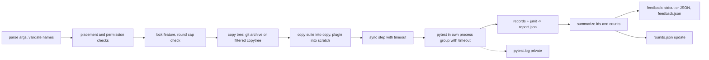

# Implementation Plan: Held-out Runner (`heldout-run`)

**Branch**: `007-heldout-runner` | **Date**: 2026-10-01 | **Spec**: [spec.md](spec.md)

**Input**: `specs/007-heldout-runner/spec.md`; `specs/004-rsi-harness/spec.md` FR-016, SC-007; `004` tasks
T013-T015.

## Summary

A single stdlib-only file, `scripts/heldout_run.py`, that is both the CLI and the pytest plugin it injects into the
hidden run. It copies the tree under test, places the suite in the copy, runs pytest under a process-group timeout,
collects per-test records through its own plugin hooks, maps them to requirement ids (markers, `SPEC-MAP.json` or
an `fr_report.py` `MAP` literal), writes everything to a private report, and prints a feedback object built only
from ids and counts. awork-resume vendors the file byte for byte.

## Technical Context (as of 2026-10-01)

**Language/Version**: Python 3.11+ stdlib only (`argparse`, `ast`, `fcntl`, `hashlib`, `json`, `os`, `re`, `shutil`,
`signal`, `subprocess`, `tarfile`, `tempfile`, `xml.etree`). **Dependencies**: none; `git` and `uv` as external
commands. **Testing**: pytest, with fixture repos and suites built in temp dirs. **Target**: Linux (process groups,
`fcntl`). **Scale**: about 600-900 lines plus tests.

Facts the design builds on (verified 2026-10-01):

- moeka `scripts/run-heldout.sh` (`consolidate/new-main` `cd03700e`): `git archive <ref> | tar -x`, `uv sync --extra
  dev -q`, pytest from a separate scratch cwd with `PYTHONPATH=<copy>`, `timeout 5400`, `-p no:cacheprovider`. Runs
  accepted suites in `tests/heldout/<feature>` only.
- moeka `tests/heldout/005-multi-instance/conftest.py`: ids from `@pytest.mark.fr(...)`, its own terminal summary
  and optional `HELDOUT_REPORT` JSON; `UNMAPPED` label; outcome rule "setup/teardown failure = error". The runner
  reimplements this mapping in its own plugin so a suite need not carry the summary code.
- awork-resume `scripts/run-heldout.sh` (`b9bf421`): `git archive`, cwd = copy, `PYTHONPATH=<copy>/src:<copy>`,
  `timeout 1800`, `--junitxml`, then `tests/heldout/<feature>/fr_report.py <junit>`; `fr_report.py` keys `MAP` by
  testcase name with `[...]` stripped and prints `FR-007: 3 failing of 9`.
- awork-resume constitution VII: imports nothing from moeka. Hence vendoring, not a package dependency.
- moeka constitution I and the AST guard (`tests/kernel/test_no_ambient_reads.py`) cover the `nanobot`/`moeka`
  packages; `scripts/` is outside them.
- Held-out layout used so far: `~/projects/.heldout/<repo>/<feature>/` (005 RUN.md; `004` FR-016).

## Design



- Records: the plugin (`pytest_collection_modifyitems`, `pytest_runtest_logreport`, `pytest_sessionfinish`) appends
  one JSON line per collected item and per final result to `HELDOUT_RUN_RECORDS`. Collected-but-unfinished items
  become `failed` on timeout. The junit file is kept for awork-resume parity checks (SC-005).
- Redaction is constructive: `summarize()` sees only ids, outcomes and counts; `format_feedback()` sees only that
  object. No code path copies pytest text into the feedback. A final guard re-checks every id against `ID_PATTERN`.
- Errors: one exception type carrying an `E_*` code; `main()` maps it to the stderr line and exit code;
  `argparse` subclass whose `error()` raises `E_USAGE` instead of printing usage.
- Locking: `fcntl.flock` on `<report root>/.lock`, non-blocking (`E_BUSY`).
- Cleanup: `try/finally` plus SIGINT/SIGTERM handlers that kill the pytest process group and remove scratch dirs.

## Constitution Check

- **I Zero ambient reads**: the runner is host-side tooling in `scripts/`, outside the kernel packages; it reads
  `HOME`/`HELDOUT_ROOT`/`TMPDIR` by design. Kernel unaffected. PASS.
- **II Path separation / stated limits**: the runner states it is not a sandbox (FR-039); no claim beyond the
  process boundary. PASS.
- **VIII Verification independence**: implements tester != implementer and redacted feedback (`004` FR-016). PASS.
- **IX / awork-resume VII**: no import across repos; a byte-identical vendored file. PASS.
- **Pins resolve from origin**: the vendored copy records a moeka commit on `origin` (FR-003). GATE: push the moeka
  commit (owner) before awork-resume records it.
- **Live service protection**: never runs in `~/projects/moeka`; the moeka profile's copy is a temp dir. PASS.

## Project Structure

### Documentation (this feature)

```text
specs/007-heldout-runner/
├── spec.md
├── plan.md
└── tasks.md
```

### Source Code

```text
moeka:        scripts/heldout_run.py, scripts/heldout-run, tests/scripts/test_heldout_run.py
awork-resume: scripts/heldout_run.py, scripts/heldout-run (byte-identical), scripts/heldout_run.SOURCE,
              tests/test_heldout_run_vendored.py (hash equals SOURCE-recorded moeka file)
unchanged:    scripts/run-heldout.sh (both repos)
```

**Structure Decision**: standalone vendored script (spec, "Decision: where it lives").

## Complexity Tracking

| Violation | Why Needed | Simpler Alternative Rejected Because |
|---|---|---|
| Vendored copy in a second repo | awork-resume may not import moeka | a `moeka.heldout` module breaks awork-resume VII and puts ambient reads in the kernel package |
| Own pytest plugin instead of the suite's conftest summary | suites differ (005 has a summary, 007 has none) | parsing a suite's printed summary would make the suite author's output format the redaction boundary |
